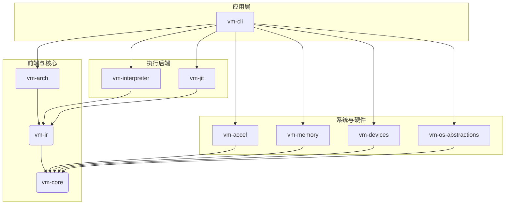

# 高性能跨架构虚拟机（Rust）实现计划

**版本**: 1.0
**日期**: 2025年11月26日
**架构师**: Manus AI

## 摘要

本文档旨在为基于Rust的高性能、跨架构虚拟机（VM）项目提供一个全面的设计、开发、测试与交付计划。该计划的核心目标是创建一个模块化、可扩展且性能卓越的虚拟机，能够在多种宿主操作系统（Windows, Linux, macOS, HarmonyOS, Android, iOS, iPadOS）上高效运行，并支持多种客户机架构（ARM64, x86_64, RISC-V64）。为了实现极致性能，本项目将集成解释执行、即时编译（JIT）、硬件虚拟化加速以及针对主流芯片（Intel, AMD, Apple M系列, 华为海思麒麟, 高通, 联发科）的SIMD和特有指令集优化。

该计划遵循敏捷开发原则，首先构建一个最小可用产品（MVP），然后通过增量迭代逐步扩展功能、优化性能和扩大平台覆盖范围。每个阶段都包含明确的交付成果、风险评估和应对策略，以确保项目稳健推进。

---

## 1. 项目初始化与模块设计

此阶段的目标是建立坚实的项目基础，定义清晰的模块化结构（Crate），并确保核心组件具备跨平台和嵌入式环境的兼容性。

### 1.1. Crate工作空间结构

项目将采用Cargo Workspace进行管理，以促进模块化和代码复用。根目录的`Cargo.toml`将定义工作空间成员，各个模块作为独立的Crate存在。

```toml
[workspace]
members = [
    "crates/vm-core",      # 核心数据结构与常量
    "crates/vm-ir",        # 统一中间表示（IR）
    "crates/vm-arch",      # 架构相关实现（解码器、指令语义）
    "crates/vm-interpreter", # 解释执行引擎
    "crates/vm-jit",       # JIT编译引擎
    "crates/vm-accel",     # 硬件加速抽象与实现
    "crates/vm-memory",    # 内存管理单元（MMU, TLB）
    "crates/vm-devices",   # VirtIO设备模型
    "crates/vm-os-abstractions", # 操作系统抽象层（OSAL）
    "crates/vm-cli"        # 命令行前端与主程序
]
```

### 1.2. 核心模块接口定义

- **`vm-core`**: 定义基础数据类型、错误处理、常量和全局配置。此Crate必须是`#![no_std]`兼容的，以确保其在受限环境（如固件）中的可用性。
- **`vm-ir`**: 定义架构无关的中间表示（Micro-Operations）。这是连接前端解码器和后端执行引擎的关键枢纽。
- **`vm-arch`**: 包含特定于客户机架构的子模块（如`vm-arch-x86_64`, `vm-arch-arm64`）。每个子模块负责指令解码，并将其转换为`vm-ir`中的微指令。

### 1.3. 模块依赖关系

模块间的依赖关系将严格控制，以避免循环依赖并保持清晰的架构层次。下图展示了核心模块的依赖关系。



### 1.4. 风险与应对

- **风险**: 模块接口设计不当导致后期重构成本高。
- **应对**: 在编码前进行详细的API评审。采用Trait-based设计，优先定义接口而非实现，确保模块间的松耦合。

---

## 2. 核心IR和前端实现

此阶段专注于构建一个表达能力足够强大且与架构无关的中间表示（IR），并为所有目标Guest架构实现高效的前端解码器。

### 2.1. 统一IR定义

IR将以微指令（Micro-Operations）的形式存在，每个微指令代表一个简单的、原子性的操作。这将极大简化后续执行引擎的设计。

```rust
// In vm-ir/src/lib.rs

/// 代表一个架构无关的微指令
pub enum MicroOp {
    // 算术与逻辑操作
    Add { dest: Reg, src1: Operand, src2: Operand },
    Sub { dest: Reg, src1: Operand, src2: Operand },
    And { dest: Reg, src1: Operand, src2: Operand },

    // 内存访问
    Load { dest: Reg, addr: Address, size: MemSize },
    Store { addr: Address, src: Operand, size: MemSize },

    // 控制流
    Jump { target: Address },
    JumpCond { target: Address, cond: Condition },

    // 系统调用与异常
    Syscall { id: u64 },
    Exception { code: u32, info: u64 },
}

// ... 其他相关数据结构 (Reg, Operand, Address, etc.)
```

### 2.2. 架构前端解码器

为每种Guest架构（ARM64, x86_64, RISC-V64）实现一个解码器，将原生指令流转换为上述IR序列。

- **x86_64**: 需要特别处理复杂的前缀（如REX, VEX）、ModR/M寻址以及分组指令。将使用成熟的解码库（如`iced-x86`）作为基础。
- **ARM64**: 处理定长指令格式，重点关注条件执行、多样的寻址模式和SIMD/FP指令的解码。
- **RISC-V64**: 实现对基础指令集（RV64I）和标准扩展（M, A, F, D, C）的解码。

### 2.3. 语义抽象

- **条件码与标志位**: IR将提供抽象的条件码（如`Zero`, `Carry`, `Overflow`），架构前端负责将原生的标志位（如x86的EFLAGS, ARM的PSTATE）映射到此抽象。
- **系统调用与异常**: 定义统一的`Syscall`和`Exception`微指令，由执行引擎捕获并委托给相应的模块处理。

### 2.4. 风险与应对

- **风险**: IR的表达能力不足以覆盖所有架构的特殊指令或语义。
- **应对**: 设计可扩展的IR，允许通过`CustomOp`等形式添加架构特定的微指令。在开发过程中，持续通过对SPEC等基准测试程序的反汇编来验证IR的完备性。

---

## 3. 执行引擎开发

此阶段将构建解释器和JIT编译器两个执行引擎，并实现两者之间的动态切换机制，以平衡启动速度和峰值性能。

### 3.1. 解释执行器

在`vm-interpreter`中，实现一个简单的循环，逐条执行IR微指令。解释器是功能正确性的基准，也是冷代码路径和调试的首选执行方式。

```rust
// 伪代码示例
fn interpreter_loop(vcpu: &mut Vcpu) {
    loop {
        let micro_op = vcpu.fetch_ir();
        match micro_op {
            MicroOp::Add { ... } => { /* ... */ },
            MicroOp::Load { ... } => { /* ... */ },
            // ...
        }
        // 更新执行计数并检查热点
        vcpu.update_hotspot_counter();
    }
}
```

### 3.2. JIT编译引擎

`vm-jit`将基于`cranelift`库实现。当解释器检测到“热点”代码块（通过执行计数阈值判断）时，JIT引擎会将对应的IR序列编译为宿主机原生代码。

- **热点追踪**: 在IR代码块级别维护执行计数器。
- **编译流程**: `IR -> Cranelift IR -> Host Machine Code`。
- **基础优化**: 实现死代码消除（DCE）、常量折叠和简单的函数内联。

### 3.3. 双引擎协同

设计一个统一的`ExecutionEngine` Trait，解释器和JIT都实现此接口。vCPU在执行时，根据代码块的“热度”动态选择使用哪个引擎。此设计必须支持从JIT编译的代码安全地回退（de-optimize）到解释器执行，以处理调试、异常或不支持的指令。

### 3.4. 风险与应对

- **风险**: JIT编译的开销过大，或与解释器切换的逻辑过于复杂，导致性能不升反降。
- **应对**: 精细调整热点判断的阈值。在JIT中优先实现轻量级优化。通过基准测试（如启动时间、SPEC CPU）来量化双引擎协同带来的实际收益。

---

## 4. 硬件加速集成

为了在同构（Guest/Host架构相同）场景下获得接近原生的性能，必须深度集成特定于平台的硬件虚拟化技术。

### 4.1. 统一加速接口（`Accel` Trait）

在`vm-accel`中定义一个统一的硬件加速接口，以解耦核心逻辑与平台相关的实现。

```rust
// In vm-accel/src/lib.rs

pub trait Accel {
    fn init() -> Result<Self, AccelError>;
    fn create_vcpu(&self, id: usize) -> Result<Box<dyn Vcpu>, AccelError>;
    fn map_memory(&self, gpa: u64, hva: u64, size: usize, flags: MemFlags) -> Result<(), AccelError>;
    fn run(&self, vcpu: &dyn Vcpu) -> Result<VmExitReason, AccelError>;
    fn inject_interrupt(&self, vcpu: &dyn Vcpu, irq: u32) -> Result<(), AccelError>;
    // ... 其他方法，如获取/设置寄存器
}
```

### 4.2. 平台后端实现

为各主流操作系统实现`Accel` Trait：

| 宿主操作系统 | 加速框架 | Crate/Binding | 目标芯片 | 
| :--- | :--- | :--- | :--- |
| Linux | KVM | `kvm-ioctls` | Intel, AMD, ARM | 
| macOS (Intel/Apple Silicon) | Hypervisor.framework | `hypervisor-framework` | Intel, Apple M系列 |
| Windows | Windows Hypervisor Platform (WHPX) | `winapi` / `windows-sys` | Intel, AMD |
| Android | KVM (需要特权) | `kvm-ioctls` | ARM (高通, 联发科, 麒麟) |
| iOS/iPadOS | Virtualization.framework | (需自定义绑定) | Apple M系列 |

### 4.3. 运行时特征检测与策略选择

`vm-accel`模块将包含一个仲裁器，在启动时探测系统能力：
1.  **架构检查**: 判断Guest和Host架构是否同构。
2.  **框架可用性**: 检查`/dev/kvm`、HVF、WHPX等接口是否存在且可用。
3.  **CPU能力探测**: 使用`cpuid`（x86）或`ID_AA64*`寄存器（ARM）检测SIMD支持（AVX2, AVX-512, NEON, SVE）和其他特性。
4.  **芯片特有能力**: 针对Apple AMX、高通Hexagon DSP、华为达芬奇NPU等，通过OS特定API或设备文件探测其存在，并加载相应的加速后端。

**执行策略**:
- **同构**: 优先使用硬件加速（`Accel` Trait）。
- **异构**: 使用JIT + 解释器组合。
- **混合执行**: 允许在vCPU级别混合执行路径，例如，主vCPU使用硬件加速，而某些I/O密集型或特殊任务的vCPU使用JIT。

### 4.4. 风险与应对

- **风险**: 移动平台（Android, iOS）的虚拟化权限限制严格，可能无法使用KVM或Virtualization.framework。
- **应对**: 制定降级策略。在权限不足的移动设备上，默认回退到JIT+解释器模式，并向用户明确提示性能限制。

---

## 5. 内存和设备管理

构建高效、安全的内存和I/O子系统是虚拟机性能的关键。

### 5.1. 内存管理（SoftMMU）

- **两级地址转换**: 实现GVA (Guest Virtual Address) -> GPA (Guest Physical Address) -> HVA (Host Virtual Address)的软件MMU。这包括Guest页表的遍历和缓存。
- **TLB (Translation Lookaside Buffer)**: 实现一个软件TLB来缓存地址翻译结果，降低页表遍历开销。设计高效的TLB失效策略（如`invlpg`指令处理）。
- **大页支持**: 在支持的宿主（如Linux的HugePages/THP）上，使用大页映射Guest内存，以减少TLB Miss。

### 5.2. I/O性能优化

- **Zero-copy I/O**: 在Linux上利用`io_uring`实现磁盘和网络I/O的零拷贝路径。在其他平台上，使用共享内存环形缓冲区（Shared Memory Ring Buffer）来最小化数据复制。

### 5.3. VirtIO设备族

实现一套完整的VirtIO设备模型，这是实现高性能I/O和跨平台兼容性的标准。

- **核心设备**: `virtio-block`, `virtio-net`, `virtio-input`, `virtio-gpu`。
- **高级特性**: 支持多队列以提升并行处理能力，使用事件索引（Event Index）减少中断通知开销。
- **总线集成**: 将VirtIO设备抽象并挂载到MMIO或PCI总线上。

### 5.4. 图形与网络

- **图形栈**: `virtio-gpu`将利用VirGL协议将Guest的3D渲染命令转发到Host。在Host端，使用`wgpu`作为统一的图形后端（支持Vulkan, Metal, DX12），并用`winit`创建跨平台窗口，处理高DPI和输入事件。
- **网络栈**: `virtio-net`将支持两种模式：
    - **NAT模式**: 使用纯Rust网络栈`smoltcp`，简单易用。
    - **桥接模式**: 使用`TAP/TUN`设备与宿主机物理网络桥接，性能更高。

### 5.5. 风险与应对

- **风险**: `virtio-gpu`和`wgpu`的集成复杂，驱动兼容性问题多。
- **应对**: 初期目标是实现基本的2D加速和显示。3D加速作为长期目标，并依赖社区成熟的`virglrenderer`或`wgpu`生态。优先在主流平台（Linux, Windows, macOS）上进行测试。

---

## 6. 跨平台适配

为确保虚拟机在所有目标宿主操作系统上无缝运行，需要一个强大的操作系统抽象层（OSAL）。

### 6.1. OS抽象层（OSAL）

在`vm-os-abstractions` Crate中，定义一套统一的Trait来封装平台相关的操作。

- **`OsFile`**: 文件I/O。
- **`OsMemory`**: 内存映射（`mmap`）。
- **`OsThread`**: 线程创建、同步原语。
- **`OsTimer`**: 高精度定时器。

然后为每个目标OS（Windows, macOS, Linux, Android等）提供具体实现，利用条件编译（`#[cfg(...)]`）在编译时选择正确的后端。

### 6.2. 线程亲和性与资源调度

实现高级调度策略以最大化利用异构计算资源。

- **ARM big.LITTLE**: 将vCPU线程绑定到大核（performance cores），将I/O线程（如`virtio`设备线程）绑定到小核（efficiency cores）。
- **芯片特定优化**: 针对Intel的P-core/E-core、Apple M系列的性能/能效核、以及华为麒麟等芯片的调度特性，通过OSAL的线程API设置线程亲和性（affinity）和优先级。

### 6.3. 风险与应对

- **风险**: HarmonyOS、iOS等新兴或封闭系统的API与POSIX差异巨大，适配成本高。
- **应对**: 优先确保在主流桌面系统（Windows, macOS, Linux）上的功能完整性。对于移动平台，初期可依赖通用的POSIX兼容层（如Android NDK），并逐步替换为原生API以优化性能。

---

## 7. 测试与优化

建立一个全面、自动化的测试框架是保证项目质量和性能的基石。

### 7.1. 测试体系

- **单元测试**: 覆盖`vm-ir`、`vm-arch`中的指令解码和语义，以及`vm-memory`中的MMU逻辑。
- **集成测试**: 启动一个微型Guest OS（如Linux Kernel + BusyBox），测试核心VM循环、设备交互和系统调用。
- **基准测试**: 使用`criterion.rs`框架，运行行业标准基准测试：
    - **CPU**: SPEC CPU 2017, Geekbench。
    - **I/O**: `fio`（磁盘），`iperf`（网络）。
    - **指标**: 记录JIT编译开销、TLB命中率、I/O吞吐量、VM启动时间等。

### 7.2. 兼容性测试

在CI/CD流水线中，自动化在所有目标宿主平台（物理机或云实例）上运行兼容性测试套件。测试目标包括启动和基本使用常见的Guest操作系统，如Ubuntu Server, Windows 10, Android-x86。

### 7.3. 性能优化

- **持续剖析**: 使用`perf`（Linux）、`Instruments`（macOS）、`VTune`（Intel）等工具定期对VM进行性能剖析。
- **优化策略**: 根据剖析结果，应用高级优化技术，如JIT中的块链接（Block Chaining）、更优的寄存器分配算法、以及针对特定芯片SIMD指令的手动优化（Intrinsic）。

### 7.4. 风险与应对

- **风险**: 缺乏多样化的物理硬件导致测试覆盖不足，特别是对于各种移动芯片。
- **应对**: 建立一个硬件测试实验室，或利用云服务提供商（如AWS aarch64实例）来扩大硬件覆盖范围。积极与社区合作，鼓励用户在不同硬件上运行测试并提交报告。

---

## 8. 交付和文档

最后阶段的目标是提供一个用户友好、功能完备的虚拟机产品，并附有清晰的文档。

### 8.1. 命令行工具（`vm-cli`）

提供一个功能强大的CLI，允许用户精细控制VM的运行。

```bash
# 示例用法
./vm-cli \
    --guest-arch arm64 \
    --accel kvm \
    --memory 4G \
    --disk path/to/ubuntu.qcow2 \
    --iso path/to/install.iso \
    --net-mode bridge --net-if eth0 \
    --display wgpu
```

### 8.2. 运行时控制与启动流程

- **快速启动**: 优化固件（UEFI/BIOS）加载路径，实现从`virtio-block`设备直接引导，以加速Guest OS启动。
- **动态管理**: 通过IPC或信号，实现VM的暂停、恢复、安全关闭。未来版本将支持动态快照（Snapshot）和设备热插拔。

### 8.3. 性能与兼容性报告

发布每个版本时，附带一份详细的性能报告和兼容性矩阵。

- **性能报告**: 展示在不同Host平台和芯片上运行标准基准测试的结果，并与前一版本及其他虚拟机（如QEMU）进行对比。
- **兼容性矩阵**: 以表格形式清晰展示在各种“Host OS + 芯片”组合下，支持哪些Guest OS及其版本。

### 8.4. 风险与应对

- **风险**: 文档更新滞后于功能开发。
- **应对**: 将文档编写作为开发流程的一部分（Docs-as-Code）。CLI参数、API等变更必须同步更新相关文档，并将其纳入代码审查流程。
