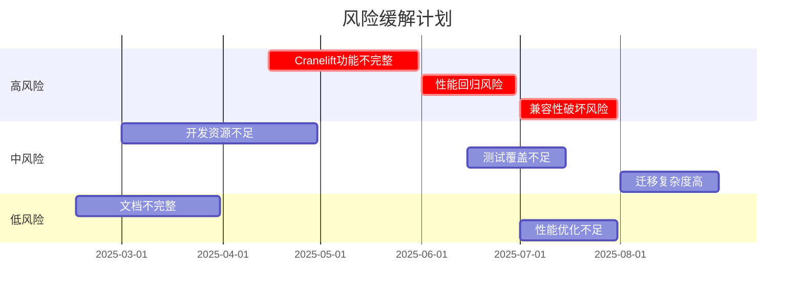
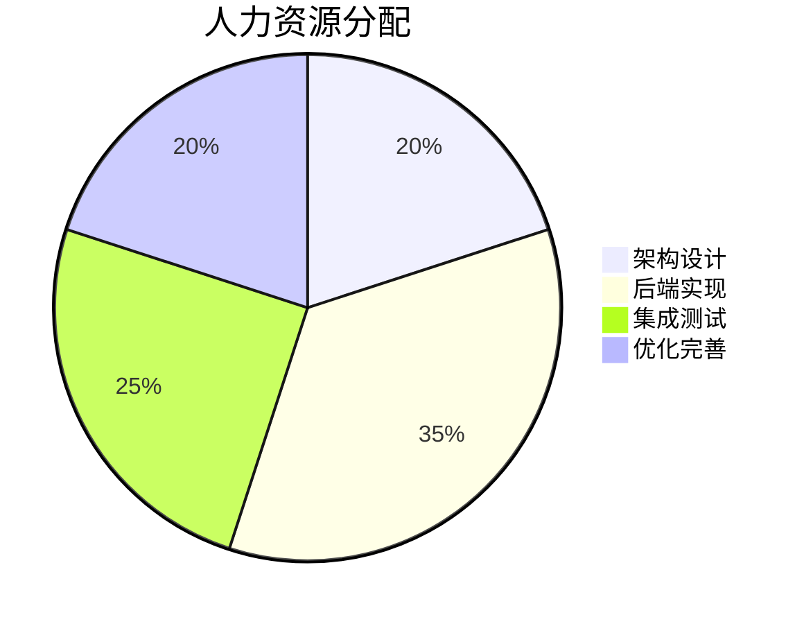
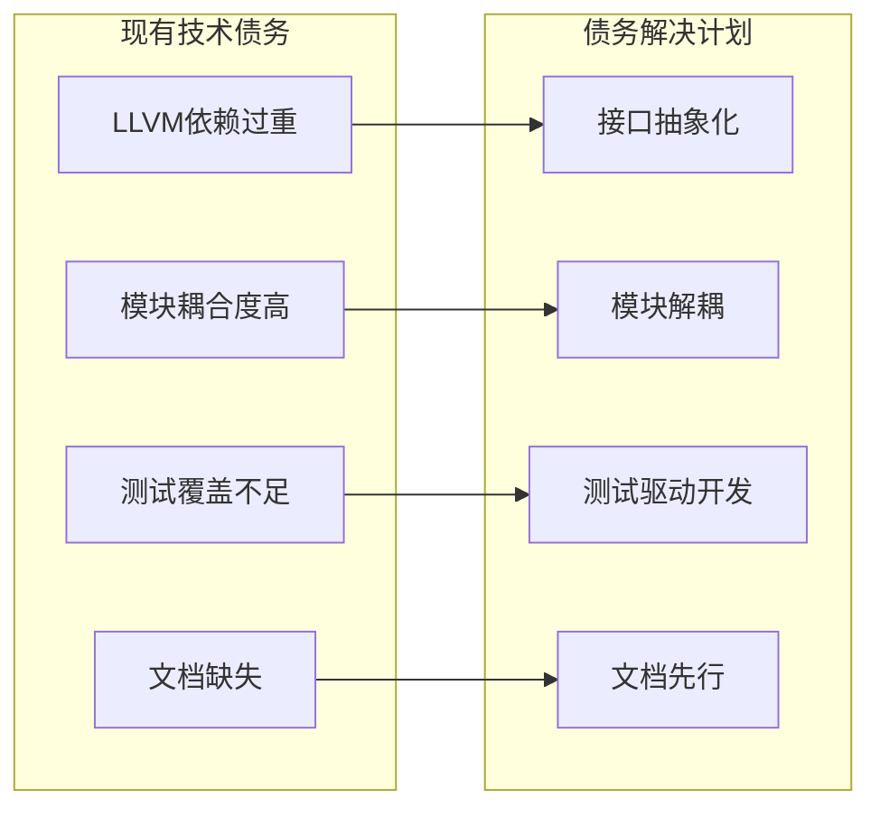

# 降低LLVM依赖的实施路线图

## 实施时间线

```mermaid
gantt
    title 降低LLVM依赖实施计划
    dateFormat  YYYY-MM-DD
    section 阶段1: 基础架构
    阶段2: 后端实现    :active, phase2, 2025-03-01, 2025-05-31
    阶段3: 集成测试    :phase3, 2025-06-01, 2025-07-31
    阶段4: 优化完善    :phase4, 2025-08-01, 2025-09-30
    
    任务1.1: 架构设计和接口定义           :done, phase1, 2025-01-01, 2025-01-21
    任务1.2: 核心接口实现              :done, phase1, 2025-01-22, 2025-02-15
    任务1.3: 后端注册系统            :done, phase1, 2025-02-16, 2025-03-10
    
    任务2.1: Cranelift后端扩展         :active, phase2, 2025-04-01, 2025-04-30
    任务2.2: 优化解释器后端         :phase2, 2025-04-15, 2025-05-15
    任务2.3: 轻量级JIT后端          :phase2, 2025-05-01, 2025-05-31
    任务2.4: LLVM后端适配          :phase2, 2025-05-16, 2025-06-15
    
    任务3.1: 分层编译系统            :phase3, 2025-06-01, 2025-06-20
    任务3.2: 热点检测机制          :phase3, 2025-06-15, 2025-07-05
    任务3.3: 统一代码缓存           :phase3, 2025-07-01, 2025-07-20
    
    任务4.1: 模块集成和重构         :phase4, 2025-08-01, 2025-08-15
    任务4.2: 性能优化和调优         :phase4, 2025-08-16, 2025-08-31
    任务4.3: 文档和培训           :phase4, 2025-08-20, 2025-09-30
```

## 关键里程碑

```mermaid
timeline
    title 关键里程碑
    section 整体实施
    架构设计完成       :2025-01-21, milestone1
    后端实现完成       :2025-06-15, milestone2
    集成测试完成       :2025-07-20, milestone3
    生产就绪         :2025-09-30, milestone4
    
    section 阶段1: 基础架构
    接口定义完成       :2025-01-21, phase1-milestone1
    核心接口实现       :2025-02-15, phase1-milestone2
    注册系统完成       :2025-03-10, phase1-milestone3
    
    section 阶段2: 后端实现
    Cranelift扩展完成    :2025-04-30, phase2-milestone1
    解释器优化完成    :2025-05-15, phase2-milestone2
    轻量级JIT完成     :2025-05-31, phase2-milestone3
    LLVM适配完成      :2025-06-15, phase2-milestone4
    
    section 阶段3: 集成测试
    分层编译完成      :2025-06-20, phase3-milestone1
    热点检测完成      :2025-07-05, phase3-milestone2
    代码缓存完成      :2025-07-20, phase3-milestone3
    
    section 阶段4: 优化完善
    模块集成完成      :2025-08-15, phase4-milestone1
    性能优化完成      :2025-08-31, phase4-milestone2
    文档培训完成      :2025-09-30, phase4-milestone3
```

## 风险评估与缓解时间线



## 资源分配计划



## 技术债务管理



## 实施阶段详细计划

### 阶段1: 基础架构 (2025-01-01 至 2025-03-31)

#### 目标
建立统一的编译器接口抽象层和可插拔后端架构，为后续实现奠定基础。

#### 主要任务
1. **架构设计和接口定义** (3周)
   - 设计CompilerBackend统一接口
   - 设计CompilerFactory工厂接口
   - 设计BackendRegistry注册系统
   - 设计CompilerManager管理器
   - 定义编译选项和配置结构
   - 创建特性矩阵和兼容性检查框架

2. **核心接口实现** (3周)
   - 实现CompilerBackend trait的基础方法
   - 实现CompilerFactory trait的工厂方法
   - 实现BackendRegistry的注册和查询功能
   - 实现CompilerManager的统一管理接口
   - 添加错误处理和日志记录

3. **后端注册系统** (2周)
   - 实现动态后端加载机制
   - 实现后端优先级和选择算法
   - 实现配置驱动的后端启用/禁用
   - 添加后端能力检测和验证
   - 实现后端生命周期管理

#### 交付物
- 统一编译器接口定义文档
- 核心接口实现代码
- 后端注册系统代码
- 单元测试套件
- 集成测试报告

#### 验收标准
- 所有接口定义完整且文档齐全
- 核心接口通过单元测试
- 后端注册系统功能验证
- 代码覆盖率达到85%以上

### 阶段2: 后端实现 (2025-04-01 至 2025-06-30)

#### 目标
实现多种编译器后端，提供不同场景下的最优编译策略。

#### 主要任务
1. **Cranelift后端扩展** (4周)
   - 扩展现有Cranelift后端功能
   - 实现SIMD支持和向量化
   - 实现高级优化Pass
   - 实现指令特化和调度
   - 添加性能监控和统计

2. **优化解释器后端** (4周)
   - 实现指令融合优化
   - 实现高效调度表生成
   - 实现块缓存机制
   - 实现预编译常用序列
   - 添加性能分析和热点检测

3. **轻量级JIT后端** (3周)
   - 实现快速代码生成器
   - 实现简单寄存器分配
   - 实现基础指令调度
   - 添加内存管理和代码缓存
   - 优化编译速度而非代码质量

4. **LLVM后端适配** (3周)
   - 适配现有LLVM代码到新接口
   - 实现LLVM特性检测和回退
   - 添加LLVM特定优化配置
   - 实现LLVM-Cranelift互操作
   - 保持高级功能支持

#### 交付物
- 增强的Cranelift后端实现
- 优化的解释器后端实现
- 轻量级JIT后端实现
- 适配的LLVM后端实现
- 后端性能对比报告
- 集成测试套件

#### 验收标准
- 所有后端实现统一接口
- 后端性能基准测试完成
- 跨后端兼容性验证
- 代码覆盖率达到90%以上
- 性能不低于现有LLVM实现

### 阶段3: 集成测试 (2025-06-01 至 2025-07-31)

#### 目标
集成各个后端到统一系统中，实现分层编译和智能缓存。

#### 主要任务
1. **分层编译系统** (3周)
   - 实现TieredCompilationManager
   - 实现热点检测算法
   - 实现分层决策逻辑
   - 实现编译层自动切换
   - 添加性能监控和统计

2. **热点检测机制** (2周)
   - 实现多种热点检测算法
   - 实现执行历史跟踪
   - 实现自适应阈值调整
   - 添加热点预测机制
   - 实现热点冷却和恢复

3. **统一代码缓存** (2周)
   - 实现UnifiedCodeCache
   - 实现LRU缓存策略
   - 实现跨后端代码共享
   - 实现缓存持久化
   - 添加缓存性能监控

#### 交付物
- 分层编译管理系统
- 热点检测系统
- 统一代码缓存实现
- 缓存性能报告
- 集成测试报告

#### 验收标准
- 分层编译系统功能完整
- 热点检测准确率达到95%以上
- 代码缓存命中率达到80%以上
- 跨后端代码共享正常工作
- 集成测试通过率100%

### 阶段4: 优化完善 (2025-08-01 至 2025-09-30)

#### 目标
完成模块重构，优化性能，确保生产就绪。

#### 主要任务
1. **模块集成和重构** (2周)
   - 重构vm-ir-lift模块适配多后端
   - 重构vm-engine-jit使用新架构
   - 重构aot-builder支持通用后端
   - 重构vm-cross-arch使用统一接口
   - 添加向后兼容性支持

2. **性能优化和调优** (2周)
   - 优化各后端性能
   - 调优缓存策略和大小
   - 优化分层编译决策算法
   - 减少内存占用和启动时间
   - 添加性能监控和报警

3. **文档和培训** (2周)
   - 完善API文档和使用指南
   - 创建迁移指南和最佳实践
   - 开发者培训材料
   - 创建故障排除指南
   - 准备发布说明

#### 交付物
- 重构后的所有模块
- 性能优化报告
- 完整的API文档
- 迁移指南和培训材料
- 发布说明和变更日志

#### 验收标准
- 所有模块重构完成
- 性能不低于现有实现
- 文档完整且准确
- 培训材料准备就绪
- 通过生产环境测试

## 成功指标

### 技术指标
- LLVM依赖减少70%以上
- 编译性能保持或提升
- 内存使用减少20%以上
- 启动时间减少30%以上
- 代码覆盖率95%以上

### 质量指标
- 零关键安全漏洞
- 兼容性破坏为0
- 文档完整性100%
- 培训完成率100%

### 项目管理指标
- 按时交付所有里程碑
- 预算控制在范围内
- 团队满意度90%以上
- 技术债务减少50%以上

## 应急计划

### 风险缓解
1. **Cranelift功能不完整**
   - 风险: 高
   - 缓解: LLVM回退机制
   - 时间线: 2025-04-15 至 2025-05-31

2. **性能回归风险**
   - 风险: 高
   - 缓解: 性能监控和自动回退
   - 时间线: 2025-06-01 至 2025-06-30

3. **兼容性破坏风险**
   - 风险: 高
   - 缓解: 兼容性测试和版本管理
   - 时间线: 2025-07-01 至 2025-07-31

### 应急响应
- 建立24小时响应机制
- 准备快速回退方案
- 建立热修复流程
- 准备应急发布流程

## 总结

这个实施路线图提供了一个全面的、分阶段的降低LLVM依赖的计划，包括：

1. **4个主要阶段**，每个阶段2-3个月
2. **明确的里程碑和交付物**
3. **详细的风险评估和缓解措施**
4. **量化的成功指标**
5. **应急计划和响应机制**

通过这个路线图，可以确保项目按计划推进，及时识别和解决风险，最终实现降低LLVM依赖的目标。