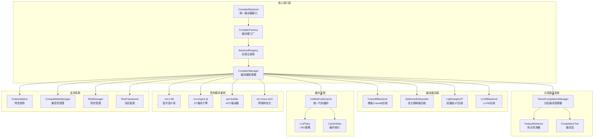
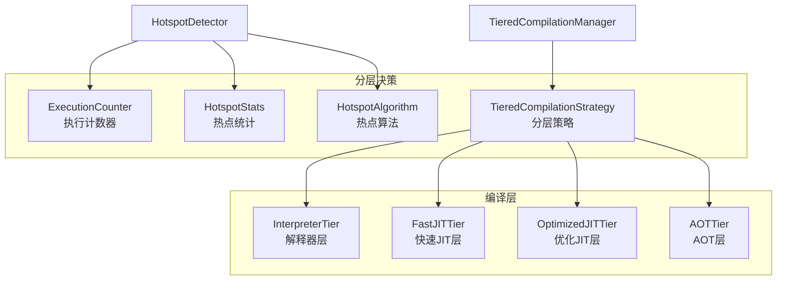
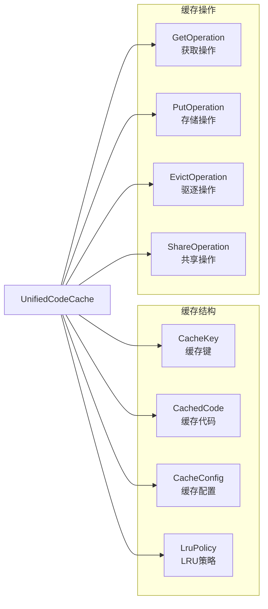
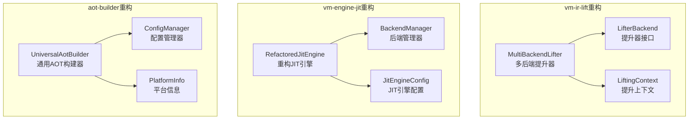
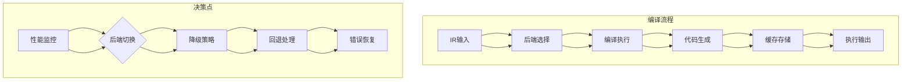
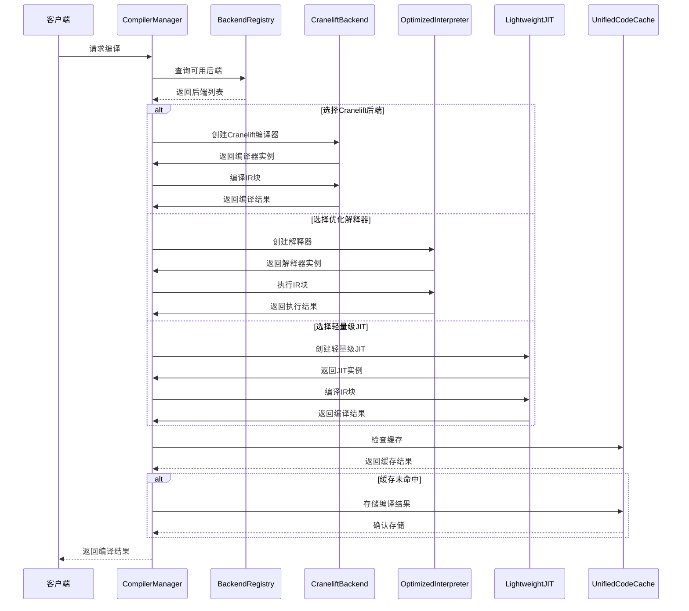
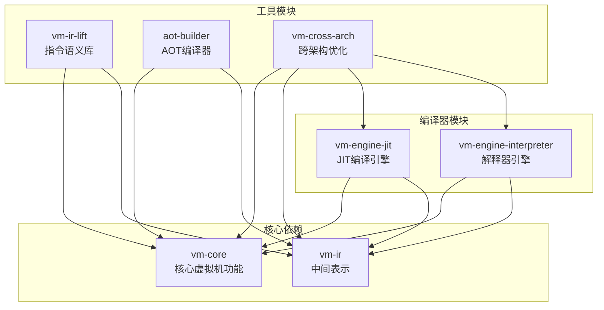
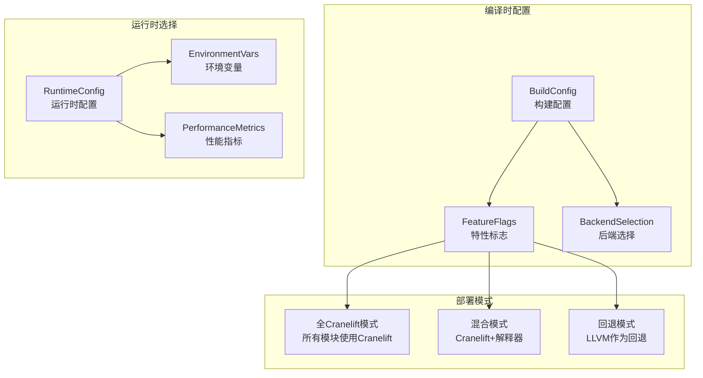

# 降低LLVM依赖的模块关系图

## 系统架构概览



## 核心接口层详细关系

```mermaid
graph LR
    subgraph "编译器接口"
        CompilerBackend[CompilerBackend<br/>compile方法]
        CompilerFeatures[CompilerFeatures<br/>supported_features方法]
        CompileOptions[CompileOptions<br/>编译选项]
        CompiledCode[CompiledCode<br/>编译结果]
        CompilerStats[CompilerStats<br/>编译统计]
    end
    
    subgraph "工厂接口"
        CompilerFactory[CompilerFactory<br/>create_compiler方法]
        CompilerConfig[CompilerConfig<br/>编译器配置]
        ResourceLimits[ResourceLimits<br/>资源限制]
    end
    
    %% 接口实现关系
    CompilerBackend --|实现| CompilerFeatures
    CompilerBackend --|使用| CompileOptions
    CompilerBackend --|返回| CompiledCode
    CompilerBackend --|提供| CompilerStats
    
    CompilerFactory --|使用| CompilerConfig
    CompilerFactory --|创建| CompilerBackend
    CompilerFactory --|检查| ResourceLimits
```

## 后端架构详细关系

```mermaid
graph TB
    subgraph "Cranelift后端"
        CraneliftOptimizer[CraneliftOptimizer<br/>优化器]
        SimdSupport[SimdSupport<br/>SIMD支持]
        Vectorizer[Vectorizer<br/>向量化器]
        InstructionSpecializer[InstructionSpecializer<br/>指令特化器]
    end
    
    subgraph "解释器后端"
        OptimizedExecutor[OptimizedExecutor<br/>优化执行器]
        InstructionFuser[InstructionFuser<br/>指令融合器]
        DispatchTable[DispatchTable<br/>调度表]
        BlockCache[BlockCache<br/>块缓存]
    end
    
    subgraph "轻量级JIT后端"
        CodeGenerator[CodeGenerator<br/>代码生成器]
        MemoryManager[CodeMemoryManager<br/>内存管理器]
        SimpleRegisterAllocator[SimpleRegisterAllocator<br/>简单寄存器分配器]
    end
    
    %% Cranelift后端关系
    CraneliftBackend --> CraneliftOptimizer
    CraneliftBackend --> SimdSupport
    CraneliftBackend --> Vectorizer
    CraneliftBackend --> InstructionSpecializer
    
    %% 解释器后端关系
    OptimizedInterpreter --> OptimizedExecutor
    OptimizedInterpreter --> InstructionFuser
    OptimizedInterpreter --> DispatchTable
    OptimizedInterpreter --> BlockCache
    
    %% 轻量级JIT后端关系
    LightweightJIT --> CodeGenerator
    LightweightJIT --> MemoryManager
    LightweightJIT --> SimpleRegisterAllocator
```



## 分层编译系统详细关系



## 缓存系统详细关系



## 现有模块重构关系



## 支持系统详细关系

```mermaid
graph TB
    subgraph "特性管理"
        BackendCapabilities[BackendCapabilities<br/>后端能力]
        SelectionCriteria[SelectionCriteria<br/>选择标准]
        FeatureDependencies[FeatureDependencies<br/>特性依赖]
    end
    
    subgraph "兼容性检查"
        ApiVersion[ApiVersion<br/>API版本]
        DeprecationInfo[DeprecationInfo<br/>弃用信息]
        MigrationGuide[MigrationGuide<br/>迁移指南]
    end
    
    subgraph "风险管理"
        Risk[Risk<br/>风险]
        MitigationStrategy[MitigationStrategy<br/>缓解策略]
        MonitoringPlan[MonitoringPlan<br/>监控计划]
    end
    
    subgraph "测试框架"
        TestSuite[TestSuite<br/>测试套件]
        PerformanceBenchmark[PerformanceBenchmark<br/>性能基准]
        CompatibilityTest[CompatibilityTest<br/>兼容性测试]
    end
    
    %% 特性管理关系
    FeatureMatrix --> BackendCapabilities
    FeatureMatrix --> SelectionCriteria
    FeatureMatrix --> FeatureDependencies
    
    %% 兼容性检查关系
    CompatibilityManager --> ApiVersion
    CompatibilityManager --> DeprecationInfo
    CompatibilityManager --> MigrationGuide
    
    %% 风险管理关系
    RiskManager --> Risk
    RiskManager --> MitigationStrategy
    RiskManager --> MonitoringPlan
    
    %% 测试框架关系
    TestFramework --> TestSuite
    TestFramework --> PerformanceBenchmark
    TestFramework --> CompatibilityTest
```



## 数据流图



## 组件交互序列图



## 模块依赖关系



## 部署架构图



## 总结

这个模块关系图展示了降低LLVM依赖的完整架构设计，包括：

1. **核心接口层** - 定义了统一的编译器接口和工厂模式
2. **多种后端实现** - Cranelift、优化解释器、轻量级JIT等
3. **分层编译系统** - 根据执行频率和性能需求动态选择后端
4. **缓存系统** - 统一的代码缓存机制，支持跨后端共享
5. **现有模块重构** - 各模块的适配和重构方案
6. **支持系统** - 特性管理、兼容性检查、风险管理等

通过这种模块化设计，可以逐步降低LLVM依赖，同时保持系统的灵活性和性能。