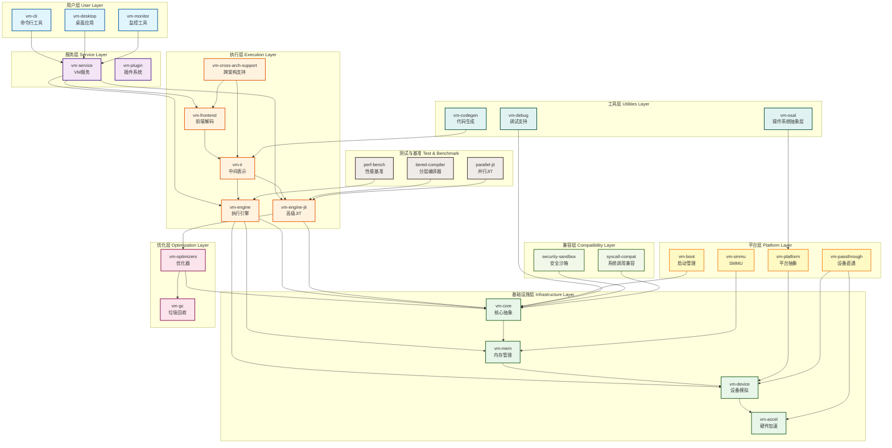

# 虚拟机项目总体架构图

**创建日期**: 2026-01-03
**版本**: 1.0
**工具**: Mermaid

---

## 📊 总体架构图



---

## 🔍 架构层次说明

### 1. 用户层 (User Layer)

面向最终用户的工具和应用程序。

| Crate | 功能 | 状态 |
|-------|------|------|
| **vm-cli** | 命令行工具，提供CLI界面 | ✅ 稳定 |
| **vm-desktop** | 桌面GUI应用 | ✅ 稳定 |
| **vm-monitor** | 性能监控和可视化工具 | ✅ 稳定 |

### 2. 服务层 (Service Layer)

提供虚拟机服务和管理功能。

| Crate | 功能 | 状态 |
|-------|------|------|
| **vm-service** | VM服务接口，生命周期管理 | ✅ 稳定 |
| **vm-plugin** | 插件系统，支持扩展 | ✅ 稳定 |

### 3. 执行层 (Execution Layer)

虚拟机的核心执行引擎。

| Crate | 功能 | 状态 |
|-------|------|------|
| **vm-engine** | 执行引擎（解释器+基础JIT） | ✅ 稳定 |
| **vm-engine-jit** | 高级JIT编译器 | ✅ 稳定 |
| **vm-frontend** | 多架构指令解码器 | ✅ 稳定 |
| **vm-ir** | 中间表示 | ✅ 稳定 |
| **vm-cross-arch-support** | 跨架构翻译支持 | ✅ 稳定 |

**关键特性**:
- 支持RISC-V 64、ARM64、x86-64
- 跨架构二进制翻译
- 分层JIT编译
- 异步执行支持

### 4. 基础设施层 (Infrastructure Layer)

提供核心抽象和基础服务。

| Crate | 功能 | 状态 |
|-------|------|------|
| **vm-core** | 核心类型定义和Trait抽象 | ✅ 稳定 |
| **vm-mem** | 内存管理（MMU、TLB） | ✅ 稳定 |
| **vm-device** | 设备模拟（VirtIO、中断等） | ✅ 稳定 |
| **vm-accel** | 硬件加速（KVM、HVF、WHP） | ✅ 稳定 |

**关键特性**:
- DDD充血模型设计
- 可插拔的MMU/TLB实现
- 统一的设备接口
- 多平台硬件加速

### 5. 优化层 (Optimization Layer)

提供性能优化功能。

| Crate | 功能 | 状态 |
|-------|------|------|
| **vm-optimizers** | JIT优化器 | ✅ 稳定 |
| **vm-gc** | 垃圾回收器 | ✅ 稳定 |

### 6. 平台层 (Platform Layer)

平台特定的抽象和实现。

| Crate | 功能 | 状态 |
|-------|------|------|
| **vm-boot** | 启动管理、快照 | ✅ 稳定 |
| **vm-platform** | 平台抽象 | ✅ 稳定 |
| **vm-smmu** | SMMU支持 | ✅ 稳定 |
| **vm-passthrough** | 设备直通（GPU/NPU） | ✅ 稳定 |

### 7. 工具层 (Utilities Layer)

开发和支持工具。

| Crate | 功能 | 状态 |
|-------|------|------|
| **vm-codegen** | 代码生成工具 | ✅ 稳定 |
| **vm-debug** | 调试支持（GDB） | ✅ 稳定 |
| **vm-osal** | 操作系统抽象层 | ✅ 稳定 |

### 8. 兼容层 (Compatibility Layer)

提供兼容性和安全功能。

| Crate | 功能 | 状态 |
|-------|------|------|
| **security-sandbox** | 安全沙箱 | ✅ 稳定 |
| **syscall-compat** | 系统调用兼容 | ✅ 稳定 |

### 9. 测试与基准 (Test & Benchmark)

性能测试和基准工具。

| Crate | 功能 | 状态 |
|-------|------|------|
| **perf-bench** | 性能基准测试 | ✅ 稳定 |
| **tiered-compiler** | 分层编译器研究 | ✅ 稳定 |
| **parallel-jit** | 并行JIT研究 | ✅ 稳定 |

---

## 📊 依赖关系矩阵

### 核心依赖

| Crate | 依赖的主要crate |
|-------|----------------|
| vm-engine | vm-core, vm-mem, vm-frontend, vm-ir |
| vm-engine-jit | vm-core, vm-optimizers, vm-ir |
| vm-frontend | vm-core |
| vm-mem | vm-core |
| vm-device | vm-core |
| vm-service | vm-engine, vm-engine-jit, vm-frontend |

### 依赖层次

```
Level 0: vm-core (核心抽象)
Level 1: vm-mem, vm-device, vm-frontend, vm-ir
Level 2: vm-engine, vm-optimizers, vm-accel
Level 3: vm-engine-jit, vm-service
Level 4: vm-cli, vm-desktop, vm-monitor
```

---

## 🎯 架构原则

### 1. 分层架构

- 清晰的层次划分
- 单向依赖（下层不依赖上层）
- 每层有明确的职责

### 2. 依赖倒置

- vm-core定义核心抽象
- 其他crate依赖抽象而非具体实现
- 通过trait实现可插拔

### 3. 模块化

- 每个crate职责单一
- 高内聚低耦合
- 支持独立开发和测试

### 4. 可扩展性

- 插件系统支持扩展
- trait抽象支持多种实现
- feature flags支持按需编译

---

## 📈 架构演进

### 当前状态 (v0.1.0)

- ✅ 完整的分层架构
- ✅ 清晰的依赖关系
- ✅ 良好的模块化
- ✅ DDD充血模型

### 未来计划 (v0.2.0+)

- 🔄 Crate合并优化 (vm-engine + vm-engine-jit)
- 📈 性能持续优化
- 🔧 API稳定性提升
- 🌐 生态系统扩展

---

*架构图版本: 1.0*
*创建日期: 2026-01-03*
*状态: ✅ 最新*
