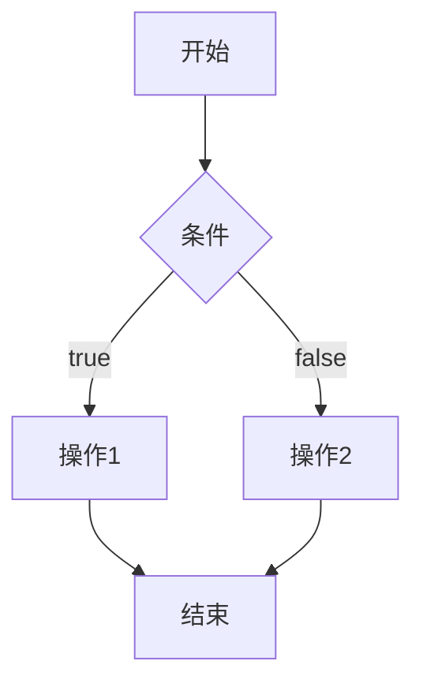
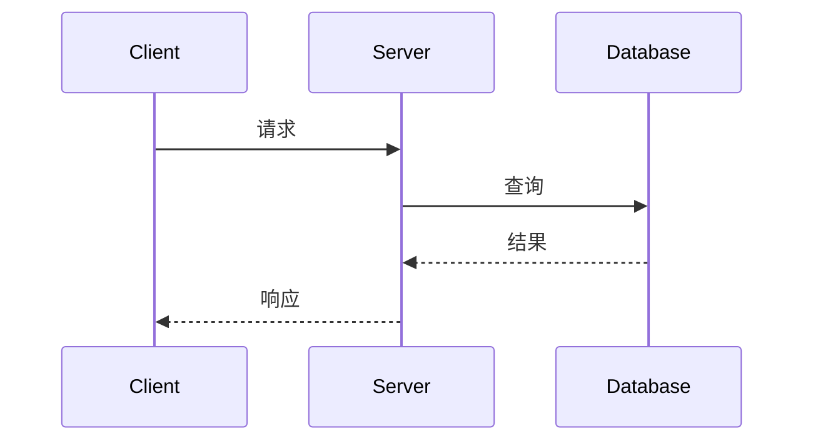
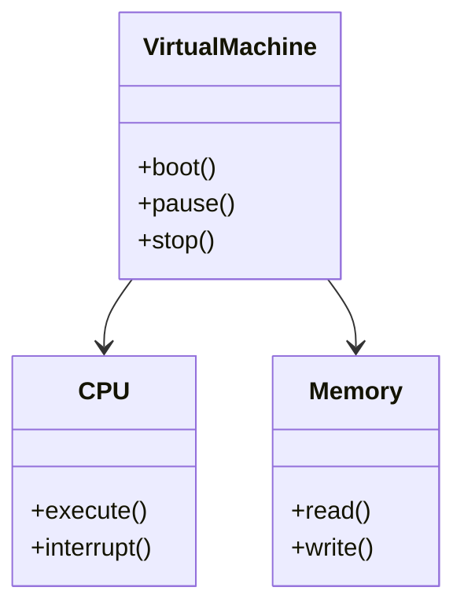

# 文档作者指南

本指南为VM项目的文档作者提供写作规范、格式要求和最佳实践。

## 目录

- [写作原则](#写作原则)
- [文档类型](#文档类型)
- [写作风格](#写作风格)
- [格式规范](#格式规范)
- [代码示例](#代码示例)
- [图表使用](#图表使用)
- [文档审查](#文档审查)
- [工具和资源](#工具和资源)

## 写作原则

### 核心原则

1. **清晰优先**：让读者容易理解是首要目标
2. **简洁明了**：避免冗余，每句话都有价值
3. **准确完整**：信息准确，覆盖必要的内容
4. **面向读者**：考虑读者的背景和需求
5. **保持更新**：随着代码变更及时更新文档

### 读者导向

了解您的目标读者：

| 读者类型 | 特点 | 关注点 |
|---------|------|--------|
| **新手用户** | 刚接触项目 | 入门指南、快速开始、基础概念 |
| **开发者** | 使用API开发 | API文档、示例代码、最佳实践 |
| **贡献者** | 参与项目开发 | 架构设计、开发流程、编码规范 |
| **维护者** | 深入项目 | 内部实现、性能优化、故障排查 |

## 文档类型

### 1. 用户文档

面向使用VM项目的用户。

#### README.md

**目的**：项目概述和快速入门

**结构**：
```markdown
# 项目名称

简短的一句话描述项目

## 特性
- 特性1
- 特性2

## 快速开始
### 安装
### 基本使用

## 文档
- 链接到详细文档

## 社区
- 贡献指南
- 许可证
```

**最佳实践**：
- 以清晰的项目描述开始
- 提供快速开始示例
- 包含构建/安装说明
- 链接到详细文档

#### 用户指南

**目的**：详细的使用说明

**章节组织**：
1. 介绍和概念
2. 安装和配置
3. 基础用法
4. 高级功能
5. 故障排查
6. FAQ

### 2. API文档

#### Rust文档注释

**公公共API必须有文档**：

```rust
/// 虚拟机内存管理单元
///
/// MMU负责虚拟地址到物理地址的转换。
///
/// # 构造函数
///
/// 创建具有指定大小的MMU：
///
/// ```
/// use vm_mem::MMU;
///
/// let mmu = MMU::new(1024 * 1024); // 1MB
/// ```
///
/// # 示例
///
/// ```
/// # use vm_mem::MMU;
/// let mut mmu = MMU::new(4096);
/// mmu.map_page(0x1000, 0x2000)?;
/// # Ok::<(), Box<dyn std::error::Error>>(())
/// ```
///
/// # 错误处理
///
/// - `MemoryError::OutOfMemory` - 内存不足
/// - `MemoryError::InvalidAddress` - 无效地址
///
/// # Panics
///
/// - 页面大小不是4096时panic
///
/// # Safety
///
/// 调用者必须确保提供的物理地址有效
pub struct MMU {
    // ...
}
```

**文档注释要点**：

1. **简洁描述**：第一行简短描述
2. **详细说明**：详细解释功能和行为
3. **示例**：提供可运行的示例
4. **错误**：列出可能返回的错误
5. **Panics**：说明可能panic的情况
6. **Safety**：对于unsafe代码，说明安全条件

### 3. 开发者文档

#### 架构文档

**目的**：解释系统架构和设计决策

**结构**：
```markdown
# 组件名称架构

## 概述
该组件的职责和目的

## 设计目标
- 目标1
- 目标2

## 架构图


## 关键组件
### 组件1
描述...

### 组件2
描述...

## 数据流
描述数据如何流动

## 设计决策
### 为什么选择方案A而不是B？
解释...

## 扩展点
描述如何扩展...
```

#### 指南和教程

**步骤式教程**：

1. **前置要求**：列出必要的知识
2. **学习目标**：明确学习目标
3. **逐步说明**：清晰的操作步骤
4. **验证检查**：提供检查点
5. **故障排查**：常见问题和解决方案

## 写作风格

### 语言风格

#### 中文写作

**原则**：
- 使用现代、规范的中文
- 避免口语化
- 术语一致

**示例**：

| 差 | 好 |
|-----|-----|
| 这个玩意儿能让你... | 此工具可以... |
| 把数据存进去 | 存储数据 |
| 搞一个函数出来 | 创建函数 |
| 特别快 | 性能优异/高效 |

#### 英文写作

如果文档使用英文：

- 使用简洁、主动的语态
- 现在时态描述事实
- 避免复杂的句子结构

### 语气和态度

**积极友好**：
✅ "您可以..."
✅ "让我们..."
✅ "建议..."

**避免命令式**：
❌ "你必须..."
❌ "不要..."

### 术语使用

**一致性**：

| 中文术语 | 英文术语 | 缩写 |
|---------|---------|------|
| 虚拟机 | Virtual Machine | VM |
| 内存管理单元 | Memory Management Unit | MMU |
| 翻译后备缓冲器 | Translation Lookaside Buffer | TLB |
| 中央处理器 | Central Processing Unit | CPU |

首次出现时使用全称和缩写：
```
内存管理单元（Memory Management Unit, MMU）负责...
后续可以直接使用MMU。
```

## 格式规范

### Markdown规范

#### 标题层级

```markdown
# 一级标题（文档标题）
## 二级标题（主要章节）
### 三级标题（子章节）
#### 四级标题（小节）
```

**注意**：
- 每个文档只有一个一级标题
- 标题层级不要跳跃
- 标题要描述性强

#### 列表

**无序列表**：
```markdown
- 项目1
- 项目2
  - 子项目2.1
  - 子项目2.2
```

**有序列表**：
```markdown
1. 第一步
2. 第二步
3. 第三步
```

**任务列表**：
```markdown
- [ ] 待完成任务
- [x] 已完成任务
```

#### 强调

```markdown
**粗体强调重要内容**
*斜体用于术语*
`代码`使用反引号
~~删除线~~表示删除
```

#### 链接

```markdown
[链接文字](url)
[相对链接](../other-file.md)
[锚点链接](#section-name)

[带标题的链接](url "鼠标悬停显示")
```

#### 表格

```markdown
| 列1 | 列2 | 列3 |
|-----|-----|-----|
| 数据1 | 数据2 | 数据3 |
| 数据4 | 数据5 | 数据6 |

对齐：
| 左对齐 | 居中 | 右对齐 |
|:-------|:----:|-------:|
| 数据   | 数据 | 数据   |
```

#### 代码块

**语法高亮**：
````markdown
```rust
fn main() {
    println!("Hello");
}
```

```bash
cargo build
```
````

**无高亮**：
````markdown
```
普通文本或输出
```
````

#### 引用

```markdown
> 普通引用
>
> 多行引用

>> 嵌套引用
```

#### 分隔线

```markdown
---
```

### 文档结构

#### 标准头部

```markdown
# 文档标题

> **重要提示**：简短的提示信息

**作者**：姓名
**创建日期**：2024-12-31
**最后更新**：2024-12-31
**状态**：草稿/审查中/正式发布

## 目录
- [章节1](#章节1)
- [章节2](#章节2)

---

## 章节1

内容...

---

## 章节2

内容...

---

## 相关文档

- [相关文档1](link1.md)
- [相关文档2](link2.md)

## 更新日志

- 2024-12-31: 初始版本
- 2024-12-31: 添加X章节
```

## 代码示例

### 示例原则

1. **完整性**：代码可以独立运行
2. **简洁性**：聚焦核心概念
3. **注释性**：关键步骤添加注释
4. **验证性**：实际测试过

### 示例格式

#### 基本示例

````markdown
**示例：创建虚拟机**

```rust
use vm_core::{VirtualMachine, Config};

// 创建配置
let config = Config::default();

// 创建虚拟机
let vm = VirtualMachine::new(config)?;

// 启动
vm.boot()?;

# Ok::<(), Box<dyn std::error::Error>>(())
```
````

#### 带注释的示例

````markdown
```rust
use vm_core::VirtualMachine;

fn main() -> Result<(), Box<dyn std::error::Error>> {
    // 1. 创建虚拟机配置
    let config = Config::builder()
        .memory_size(1024 * 1024) // 1MB内存
        .cpu_count(1)
        .build()?;

    // 2. 初始化虚拟机
    let mut vm = VirtualMachine::new(config)?;

    // 3. 加载内核镜像
    vm.load_kernel("path/to/kernel.bin")?;

    // 4. 启动虚拟机
    vm.boot()?;

    Ok(())
}
```
````

#### 渐进式示例

从简单到复杂：

1. **基础示例**：最简单的使用方式
2. **完整示例**：包含更多选项
3. **高级示例**：展示高级特性

````markdown
### 基础用法

```rust
let vm = VirtualMachine::new()?;
```

### 完整配置

```rust
let config = Config::builder()
    .memory_size(1024 * 1024)
    .cpu_count(4)
    .enable_jit(true)
    .build()?;

let vm = VirtualMachine::new(config)?;
```

### 高级特性

```rust
let vm = VirtualMachine::builder()
    .config(config)
    .event_handler(MyHandler::new())
    .tracer(MyTracer::new())
    .build()?;
```
````

### 示例测试

确保文档中的示例可运行：

```bash
# 测试Rust文档示例
cargo test --doc

# 或使用doc-comment
cargo install doc-comment
```

## 图表使用

### Mermaid图表

#### 流程图



#### 时序图



#### 类图



### ASCII图表

简单情况使用ASCII图：

```
内存布局：

+-------------------+ 0x0000
|    代码段         |
+-------------------+ 0x1000
|    数据段         |
+-------------------+ 0x2000
|    堆             |
|         |         |
|         v         |
+-------------------+
|    栈     ^
|         | |
+-------------------+ 0xFFFF
```

### 截图和图像

**截图**：
- UI界面
- 配置界面
- 性能图表

**生成图像**：
```markdown


```

## 文档审查

### 审查清单

#### 内容质量

- [ ] 信息准确，无错误
- [ ] 覆盖完整，无遗漏
- [ ] 逻辑清晰，易于理解
- [ ] 示例可运行
- [ ] 链接有效

#### 语言质量

- [ ] 无拼写错误
- [ ] 无语法错误
- [ ] 术语一致
- [ ] 表达清晰

#### 格式规范

- [ ] Markdown格式正确
- [ ] 代码语法高亮正确
- [ ] 标题层级合理
- [ ] 表格格式正确

#### 更新及时

- [ ] 与代码同步
- [ ] 版本号正确
- [ ] 日期更新

### 审查流程

1. **自我审查**：
   - 完成初稿后自我审查
   - 使用检查清单

2. **同行审查**：
   - 邀请1-2位同事审查
   - 收集反馈意见

3. **用户测试**：
   - 让用户按文档操作
   - 收集使用反馈

4. **持续改进**：
   - 根据反馈修改
   - 定期更新维护

## 工具和资源

### Markdown编辑器

- **VS Code** + Markdown扩展
- **Typora**：所见即所得
- **Obsidian**：知识管理

### 图表工具

- **Mermaid Live Editor**：https://mermaid.live
- **Draw.io**：流程图
- **PlantUML**：UML图

### 文档生成

```bash
# 生成Rust文档
cargo doc --no-deps --open

# 生成Markdown到HTML
pandoc input.md -o output.html
```

### 拼写检查

```bash
# 安装markdown拼写检查
npm install -g markdown-spellcheck

# 检查文档
mdspell "**/*.md"
```

### 链接检查

```bash
# 检查Markdown中的链接
npm install -g markdown-link-check

markdown-link-check *.md
```

## 最佳实践

### DO's（推荐）

✅ **示例先行**：以示例开始，解释后说明
✅ **保持简洁**：删除冗余内容
✅ **使用列表**：列表比长段落易读
✅ **添加目录**：长文档添加目录
✅ **交叉引用**：链接到相关文档
✅ **版本标识**：标注适用版本
✅ **定期更新**：保持文档最新

### DON'Ts（避免）

❌ **避免冗长**：不要写太长
❌ **避免假设**：不要假设读者知识
❌ **避免过时**：不要让文档过期
❌ **避免模糊**：不要使用模糊语言
❌ **避免重复**：不要重复相同内容
❌ **避免过度**：不要过度使用格式

## 文档模板

### API文档模板

```markdown
# API名称

简要描述API的功能。

## 签名

```rust
pub fn api_name(param1: Type1, param2: Type2) -> Result<ReturnType>
```

## 参数

| 参数 | 类型 | 描述 |
|-----|------|------|
| param1 | Type1 | 参数1说明 |
| param2 | Type2 | 参数2说明 |

## 返回值

成功时返回`Ok(ReturnType)`，包含...

失败时返回`Err(Error)`，可能的错误：
- `Error::Type1` - 错误1描述
- `Error::Type2` - 错误2描述

## 示例

```rust
# use crate::api_name;

let result = api_name(arg1, arg2)?;
# Ok::<(), Box<dyn std::error::Error>>(())
```

## 注意事项

- 注意1
- 注意2

## 相关

- [相关API1](link1.md)
- [相关API2](link2.md)
```

### 指南模板

```markdown
# 标题

## 前置要求

- 要求1
- 要求2

## 目标

学完本指南，您将能够：

- 目标1
- 目标2

## 步骤1：标题

描述...

### 1.1 子步骤

详细说明...

```rust
// 代码示例
```

### 验证

检查点说明...

## 步骤2：标题

...

## 总结

总结内容...

## 下一步

- [ ] 任务1
- [ ] 任务2

## 相关资源

- [资源1](link1)
- [资源2](link2)
```

---

**文档版本**：1.0.0
**最后更新**：2024年12月31日
**维护者**：VM项目文档团队

感谢您为VM项目文档做出贡献！
