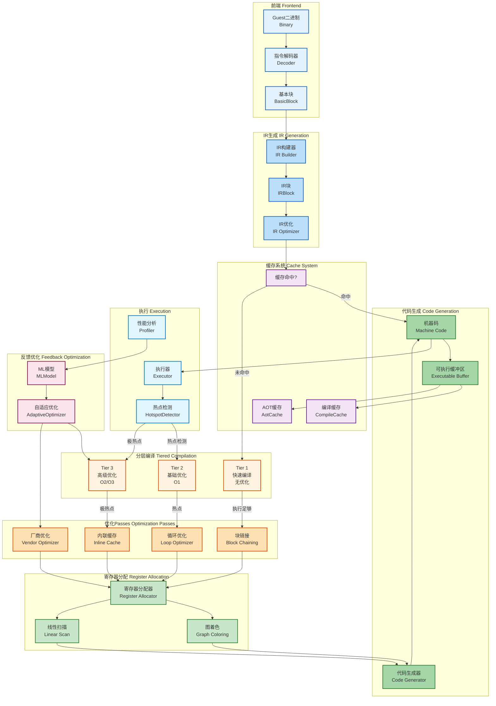
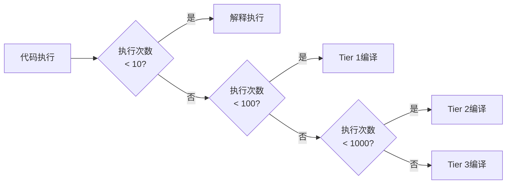

# JIT编译流程架构图

**创建日期**: 2026-01-03
**版本**: 1.0
**工具**: Mermaid

---

## 📊 JIT编译完整流程

---

## 🔍 JIT编译阶段详解

### 阶段1: 前端解码 (Frontend Decoding)

**目标**: 将Guest二进制代码解码为基本块

**输入**: Guest二进制文件
**输出**: 基本块 (BasicBlock)

**关键组件**:
- **Decoder**: 多架构指令解码器 (RISC-V, ARM64, x86-64)
- **BasicBlock**: 连续指令序列，只有一个入口和出口

**性能特征**:
- 延迟: ~100-500ns/指令
- 吞吐量: 高
- 优化: 缓存最近解码的块

### 阶段2: IR生成 (IR Generation)

**目标**: 生成与平台无关的中间表示

**输入**: 基本块
**输出**: IR块 (IRBlock)

**关键组件**:
- **IR Builder**: 构建IR
- **IR Optimizer**: IR级别的优化

**优化内容**:
- 常量折叠
- 死代码消除
- 简化代数运算

**性能特征**:
- 延迟: ~1-5μs/块
- 质量: 影响后续优化效果

### 阶段3: 分层编译 (Tiered Compilation)

**目标**: 根据代码热度选择编译策略

#### Tier 1: 快速编译

- **触发条件**: 首次执行
- **优化级别**: O0 (无优化)
- **编译时间**: ~10-50μs
- **性能**: 原生性能的10-30%

#### Tier 2: 基础优化

- **触发条件**: 执行次数 > 100
- **优化级别**: O1
- **编译时间**: ~100-500μs
- **性能**: 原生性能的40-60%

#### Tier 3: 高级优化

- **触发条件**: 执行次数 > 1000
- **优化级别**: O2/O3
- **编译时间**: ~1-5ms
- **性能**: 原生性能的60-80%

### 阶段4: 优化Passes (Optimization Passes)

#### 块链接 (Block Chaining)

**功能**: 将连续的基本块链接在一起

**效果**:
- 减少间接跳转
- 提高ICache命中率
- **性能提升**: 10-20%

#### 循环优化 (Loop Optimizer)

**功能**: 优化循环结构

**技术**:
- 循环展开
- 循环不变量外提
- 强度削弱

**效果**:
- **性能提升**: 20-50% (对循环密集型代码)

#### 内联缓存 (Inline Cache)

**功能**: 缓存类型查找结果

**效果**:
- 加速动态类型检查
- **性能提升**: 15-30%

#### 厂商优化 (Vendor Optimizer)

**功能**: 针对特定CPU厂商的优化

**支持**:
- Intel: AVX, AVX2, AVX-512
- AMD: 同上 + 3DNow
- ARM: NEON, SVE
- RISC-V: Vector扩展

**效果**:
- **性能提升**: 20-100% (取决于代码类型)

### 阶段5: 寄存器分配 (Register Allocation)

**目标**: 将虚拟寄存器映射到物理寄存器

#### 图着色 (Graph Coloring)

**算法**:
1. 构建干扰图
2. 图着色
3. 溢出处理

**特点**:
- 质量高
- 时间复杂度: O(n²)
- 适用于小型函数

#### 线性扫描 (Linear Scan)

**算法**:
1. 线性扫描指令
2. 简单的寄存器分配
3. 基于生存区间

**特点**:
- 速度快
- 质量较好
- 适用于大型函数

### 阶段6: 代码生成 (Code Generation)

**目标**: 生成宿主机的机器码

**流程**:
1. 指令选择
2. 指令调度
3. 寄存器填充
4. 代码生成

**输出**:
- 可执行的机器码
- 存储在Executable Buffer中

### 阶段7: 缓存系统 (Cache System)

#### 编译缓存 (CompileCache)

**功能**: 缓存编译后的代码

**键**: (Guest地址, ASID, 优化级别)
**值**: 编译后的机器码

**命中率**: 80-95%

#### AOT缓存 (AotCache)

**功能**: 提前编译 (Ahead-Of-Time)

**用途**:
- 启动时编译热点
- 跨会话持久化
- 减少运行时编译

### 阶段8: 执行与监控 (Execution & Profiling)

#### 执行器 (Executor)

**功能**: 执行编译后的机器码

**模式**:
- 直接执行: 函数指针调用
- 间接执行: 通过函数表

#### 热点检测 (Hotspot Detection)

**算法**: EWMA (Exponentially Weighted Moving Average)

**触发条件**:
- 执行频率 > 阈值
- 执行时间 > 阈值

**效果**:
- 准确识别热点
- 减少冷编译

#### 性能分析 (Profiler)

**收集指标**:
- 执行次数
- 执行时间
- 缓存命中率
- 分支预测成功率

### 阶段9: 反馈优化 (Feedback Optimization)

#### ML模型 (ML Model)

**功能**: 使用机器学习预测优化策略

**输入**:
- 代码特征
- 执行统计
- 硬件特征

**输出**:
- 优化级别建议
- Pass组合建议

#### 自适应优化 (Adaptive Optimizer)

**功能**: 根据运行时反馈调整优化策略

**参数**:
- 编译阈值
- 内联限制
- 循环展开因子

**效果**:
- **性能提升**: 10-20%
- 避免过度优化

---

## 📊 性能对比

### 编译时间 vs 性能

| 级别 | 编译时间 | 运行性能 | 适用场景 |
|------|---------|---------|---------|
| 解释器 | 0 | 1-5% | 调试、冷代码 |
| Tier 1 | 10-50μs | 10-30% | 首次执行 |
| Tier 2 | 100-500μs | 40-60% | 中等热度 |
| Tier 3 | 1-5ms | 60-80% | 热点代码 |

### 内存占用

| 组件 | 内存占用 | 说明 |
|------|---------|------|
| IR块 | ~1KB/块 | 临时存在 |
| 编译缓存 | ~10-100MB | 可配置 |
| AOT缓存 | ~50-500MB | 持久化 |
| 可执行代码 | ~1-10MB | 取决于代码大小 |

---

## 🎯 JIT优化策略

### 热点检测策略

### 缓存策略

- **LRU**: 最近最少使用淘汰
- **LFU**: 最少使用频率淘汰
- **ARC**: 自适应替换缓存

### 内存管理

- **代码缓存**: 固定大小，循环使用
- **数据缓存**: 动态增长，限制最大值
- **GC**: 统一GC管理所有缓存

---

*JIT流程图版本: 1.0*
*创建日期: 2026-01-03*
*状态: ✅ 最新*
