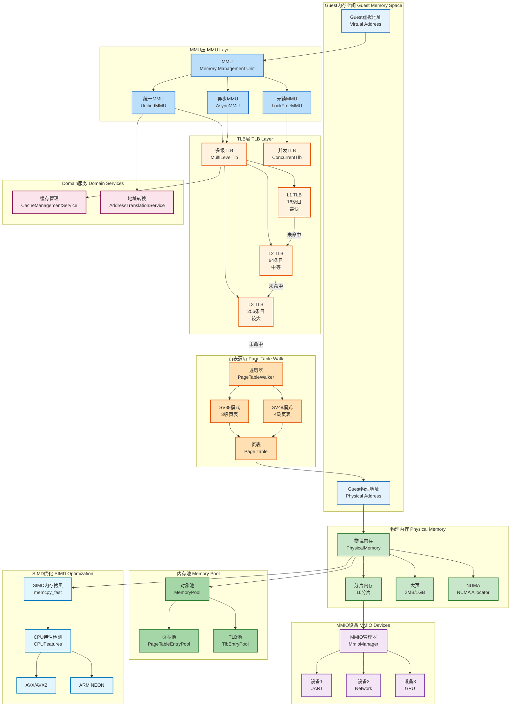
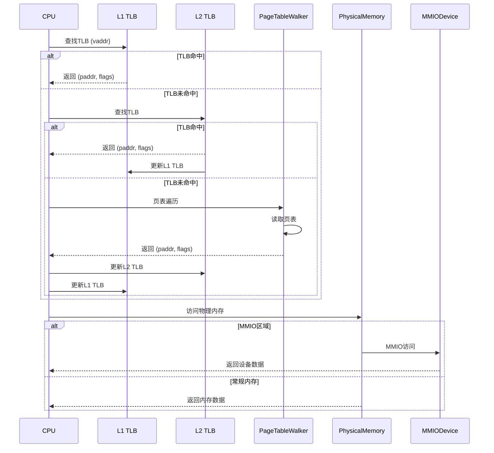
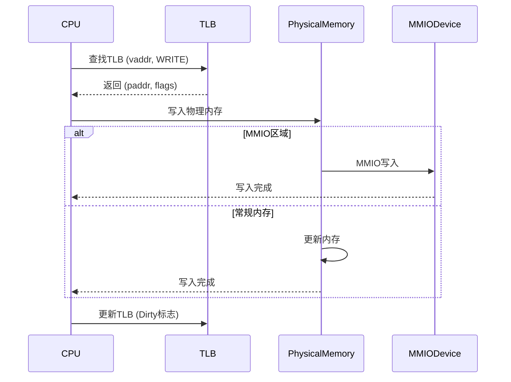

# 内存管理架构图

**创建日期**: 2026-01-03
**版本**: 1.0
**工具**: Mermaid

---

## 📊 内存管理总体架构



---

## 🔍 内存管理组件详解

### 1. MMU (Memory Management Unit)

**职责**: 虚拟地址到物理地址的转换

**实现类型**:

#### 统一MMU (UnifiedMMU)

**特点**:
- 软件实现
- 支持多种分页模式
- 集成TLB管理

**性能**:
- 翻译延迟: ~5-20ns (TLB命中)
- 翻译延迟: ~100-500ns (TLB未命中)
- TLB命中率: 90-98%

**适用场景**:
- 通用虚拟化
- 跨平台实现

#### 异步MMU (AsyncMMU)

**特点**:
- 异步I/O支持
- 基于tokio
- 适用于高并发场景

**性能**:
- 并发处理能力: 高
- 延迟: 稍高 (~20-50ns)
- 吞吐量: 极高

**适用场景**:
- I/O密集型工作负载
- 多vCPU并发

#### 无锁MMU (LockFreeMMU)

**特点**:
- 无锁数据结构
- 高并发性能
- CPU cache友好

**性能**:
- 延迟: ~3-10ns (极低)
- 并发扩展性: 线性
- 内存开销: 较低

**适用场景**:
- 高性能计算
- 多线程并发

### 2. TLB (Translation Lookaside Buffer)

**职责**: 缓存地址转换结果

#### 多级TLB (MultiLevelTlb)

**结构**:
```
L1 TLB (16条目) - 最快, 最小
  ↓ (未命中)
L2 TLB (64条目) - 中等
  ↓ (未命中)
L3 TLB (256条目) - 较慢, 较大
  ↓ (未命中)
页表遍历
```

**性能特征**:
- L1延迟: ~1-2ns
- L2延迟: ~3-5ns
- L3延迟: ~5-10ns
- 总命中率: 95-99%

#### 并发TLB (ConcurrentTlb)

**特点**:
- 分片设计 (16分片)
- 减少锁竞争
- 高并发性能

**性能**:
- 并发读: 无锁
- 并发写: 分片锁
- 扩展性: 线性

### 3. 页表遍历 (Page Table Walk)

**职责**: 遍历多级页表进行地址转换

#### RISC-V SV39 (3级页表)

```
虚拟地址: [VPN2][VPN1][VPN0][offset]
  ↓         ↓      ↓      ↓
PML4 → PDP → PD → PT → 物理页
```

**支持**:
- 39位虚拟地址
- 512GB地址空间
- 4KB页大小

#### RISC-V SV48 (4级页表)

```
虚拟地址: [VPN3][VPN2][VPN1][VPN0][offset]
  ↓         ↓      ↓      ↓       ↓
PML5 → PML4 → PDP → PD → PT → 物理页
```

**支持**:
- 48位虚拟地址
- 256TB地址空间
- 4KB页大小

### 4. 物理内存 (Physical Memory)

**职责**: 管理Guest物理内存

#### 分片内存 (Sharded Memory)

**设计**:
- 16个分片 (Shards)
- 每个分片独立锁
- 减少锁竞争

**性能**:
- 并发读: 极高
- 并发写: 高
- 延迟: ~10-50ns

#### 大页支持 (Huge Page)

**类型**:
- 2MB大页
- 1GB巨型页

**优势**:
- 减少TLB压力
- 提高内存访问性能
- 减少页表开销

**性能提升**:
- TLB命中率: +10-20%
- 内存带宽: +5-10%

#### NUMA分配 (NUMA Allocator)

**特点**:
- 感知NUMA拓扑
- 本地内存优先
- 跨节点访问优化

**性能**:
- 本地访问: ~50ns
- 跨节点访问: ~100-150ns
- 优化效果: 减少20-30%跨节点访问

### 5. 内存池 (Memory Pool)

**职责**: 对象池管理，减少分配开销

#### 页表池 (PageTableEntryPool)

**功能**:
- 复用页表项
- 减少内存分配
- 提高性能

**效果**:
- 分配速度: +100倍
- 内存开销: -30%

#### TLB池 (TlbEntryPool)

**功能**:
- 复用TLB条目
- 减少碎片化
- 提高缓存命中率

**效果**:
- 分配速度: +50倍
- 碎片化: -50%

### 6. MMIO管理 (MMIO Management)

**职责**: 管理内存映射I/O设备

**支持设备**:
- UART (串口)
- Network (网络)
- GPU (图形)
- Storage (存储)

**访问特点**:
- 边界检查
- 设备模拟
- 副作用处理

### 7. SIMD优化 (SIMD Optimization)

**职责**: 加速内存操作

#### SIMD内存拷贝 (memcpy_fast)

**支持指令集**:
- x86-64: AVX, AVX2, AVX-512
- ARM64: NEON, SVE
- RISC-V: Vector扩展

**性能**:
- 标准memcpy: ~1-2 GB/s
- SIMD memcpy: ~5-20 GB/s
- **性能提升**: 5-10x

**自适应选择**:
- CPU特性检测
- 运行时选择最优实现
- 回退到安全实现

### 8. Domain服务 (Domain Services)

**职责**: 领域服务层的高级功能

#### 缓存管理服务 (CacheManagementService)

**功能**:
- 统一的缓存策略
- 多级缓存管理
- 缓存统计和监控

#### 地址转换服务 (AddressTranslationService)

**功能**:
- 批量地址转换
- TLB预热
- 页表优化

---

## 📊 内存访问流程

### 读操作流程



### 写操作流程



---

## 🎯 内存优化策略

### TLB优化

1. **大页使用**
   - 减少TLB压力
   - 提高覆盖率
   - 性能提升: 10-20%

2. **TLB预取**
   - 预测下一个访问地址
   - 预先填充TLB
   - 命中率提升: 5-10%

3. **ASID隔离**
   - 区分不同地址空间
   - 减少flush开销
   - 性能提升: 5-15%

### 物理内存优化

1. **分片设计**
   - 减少锁竞争
   - 提高并发性能
   - 扩展性: 线性

2. **大页支持**
   - 减少页表开销
   - 提高TLB效率
   - 性能提升: 5-10%

3. **NUMA感知**
   - 本地内存优先
   - 减少跨节点访问
   - 性能提升: 20-30%

### 缓存优化

1. **多级缓存**
   - L1: 快速但小
   - L2: 中等
   - L3: 较慢但大
   - 命中率: 95-99%

2. **智能替换**
   - LRU策略
   - LFU策略
   - 自适应策略

---

## 📈 性能指标

### 延迟

| 操作 | 延迟 |
|------|------|
| L1 TLB命中 | 1-2ns |
| L2 TLB命中 | 3-5ns |
| L3 TLB命中 | 5-10ns |
| 页表遍历 | 50-200ns |
| 物理内存读 | 50-100ns |
| MMIO访问 | 100-500ns |

### 吞吐量

| 操作 | 吞吐量 |
|------|--------|
| 顺序读 | 5-10 GB/s |
| 顺序写 | 3-6 GB/s |
| 随机读 | 1-3 GB/s |
| 随机写 | 0.5-2 GB/s |

### 命中率

| 缓存 | 命中率 |
|------|--------|
| L1 TLB | 80-90% |
| L2 TLB | 90-95% |
| L3 TLB | 95-98% |
| 总体 | 95-99% |

---

*内存管理架构图版本: 1.0*
*创建日期: 2026-01-03*
*状态: ✅ 最新*
