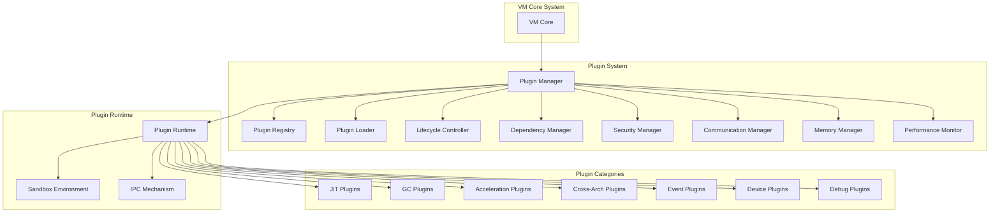

# VM项目插件系统设计文档

## 目录

1. [概述](#概述)
2. [项目分析与插件化模块识别](#项目分析与插件化模块识别)
3. [插件系统核心架构](#插件系统核心架构)
4. [插件接口和扩展点定义](#插件接口和扩展点定义)
5. [插件配置和管理机制](#插件配置和管理机制)
6. [性能影响和优化方案](#性能影响和优化方案)
7. [插件开发指南和最佳实践](#插件开发指南和最佳实践)
8. [安全考虑](#安全考虑)
9. [未来扩展计划](#未来扩展计划)

## 概述

本文档详细描述了VM项目的插件系统框架设计，该框架旨在提供一个灵活、可扩展的插件化解决方案，支持运行时加载和卸载插件，并提供丰富的扩展点。插件系统将使VM项目能够轻松扩展功能，同时保持核心系统的稳定性和性能。

### 设计目标

- **模块化**：将系统功能分解为可独立开发、测试和部署的插件
- **可扩展性**：支持第三方开发者创建和分发插件
- **运行时灵活性**：支持运行时加载、卸载和更新插件
- **性能优化**：最小化插件系统对核心系统性能的影响
- **安全性**：确保插件在受控环境中运行，防止恶意代码执行
- **易用性**：提供简单易用的插件开发API和管理工具

## 项目分析与插件化模块识别

通过对VM项目核心组件的深入分析，我们识别了以下可能需要插件化的模块和功能点：

### 核心模块插件化点

#### 1. JIT编译器扩展点

- **编译策略**：不同的编译策略（如解释执行、JIT编译、AOT编译）
- **代码生成**：针对不同架构的代码生成器
- **热点检测**：不同的热点检测算法
- **优化Pass**：自定义的优化Pass

#### 2. GC策略扩展点

- **GC算法**：不同的垃圾收集算法（如标记-清除、复制、分代等）
- **内存分配策略**：不同的内存分配策略
- **GC调优**：自适应的GC调优策略

#### 3. 硬件加速扩展点

- **虚拟化后端**：不同的虚拟化后端（如KVM、HVF、WHPX等）
- **SIMD优化**：针对不同SIMD指令集的优化
- **GPU加速**：GPU加速计算支持

#### 4. 跨架构支持扩展点

- **指令转换**：不同架构间的指令转换
- **二进制翻译**：动态二进制翻译
- **架构模拟**：特定架构的模拟器

#### 5. 事件处理扩展点

- **事件总线**：不同的事件总线实现
- **事件过滤**：自定义事件过滤逻辑
- **事件持久化**：事件持久化策略

#### 6. 设备模拟扩展点

- **虚拟设备**：自定义虚拟设备
- **设备驱动**：设备驱动程序
- **IO处理**：IO处理策略

#### 7. 调试和分析扩展点

- **性能分析**：性能分析工具
- **调试支持**：调试工具和接口
- **日志记录**：日志记录策略

### 插件化收益

1. **功能扩展**：无需修改核心代码即可扩展功能
2. **模块隔离**：插件故障不会影响核心系统
3. **第三方生态**：支持第三方开发者贡献功能
4. **灵活部署**：根据需求选择加载特定插件
5. **快速迭代**：插件可独立开发和部署

## 插件系统核心架构

### 架构概览



### 核心组件

#### 1. 插件管理器 (Plugin Manager)

插件管理器是整个插件系统的核心协调组件，负责：

- 插件的发现、加载、启动、停止和卸载
- 插件生命周期管理
- 插件依赖关系解析
- 插件配置管理
- 插件性能监控

```rust
/// 插件管理器
pub struct PluginManager {
    /// 插件注册表
    registry: Arc<RwLock<PluginRegistry>>,
    /// 插件加载器
    loader: Arc<PluginLoader>,
    /// 生命周期控制器
    lifecycle_controller: Arc<LifecycleController>,
    /// 依赖管理器
    dependency_manager: Arc<DependencyManager>,
    /// 安全管理器
    security_manager: Arc<SecurityManager>,
    /// 通信管理器
    communication_manager: Arc<CommunicationManager>,
    /// 内存管理器
    memory_manager: Arc<MemoryManager>,
    /// 性能监控器
    performance_monitor: Arc<PerformanceMonitor>,
    /// 插件运行时
    runtime: Arc<PluginRuntime>,
}

impl PluginManager {
    /// 创建新的插件管理器
    pub fn new(config: PluginManagerConfig) -> Result<Self, PluginManagerError> {
        // 初始化各个组件
        let registry = Arc::new(RwLock::new(PluginRegistry::new()));
        let loader = Arc::new(PluginLoader::new(config.loader_config)?);
        let lifecycle_controller = Arc::new(LifecycleController::new());
        let dependency_manager = Arc::new(DependencyManager::new());
        let security_manager = Arc::new(SecurityManager::new(config.security_config)?);
        let communication_manager = Arc::new(CommunicationManager::new(config.communication_config)?);
        let memory_manager = Arc::new(MemoryManager::new(config.memory_config)?);
        let performance_monitor = Arc::new(PerformanceMonitor::new(config.monitoring_config)?);
        let runtime = Arc::new(PluginRuntime::new(config.runtime_config)?);
        
        Ok(Self {
            registry,
            loader,
            lifecycle_controller,
            dependency_manager,
            security_manager,
            communication_manager,
            memory_manager,
            performance_monitor,
            runtime,
        })
    }
    
    /// 发现插件
    pub async fn discover_plugins(&self, paths: &[PathBuf]) -> Result<Vec<DiscoveredPlugin>, DiscoveryError> {
        let mut discovered_plugins = Vec::new();
        
        for path in paths {
            let plugins = self.loader.discover_plugins(path).await?;
            discovered_plugins.extend(plugins);
        }
        
        Ok(discovered_plugins)
    }
    
    /// 注册插件
    pub async fn register_plugin(&self, plugin: DiscoveredPlugin) -> Result<PluginId, RegistrationError> {
        // 验证插件
        self.security_manager.verify_plugin(&plugin).await?;
        
        // 解析依赖
        let dependencies = self.dependency_manager.resolve_dependencies(&plugin.metadata).await?;
        
        // 注册到注册表
        let plugin_id = self.registry.write().unwrap().register_plugin(plugin, dependencies)?;
        
        Ok(plugin_id)
    }
    
    /// 加载插件
    pub async fn load_plugin(&self, plugin_id: &PluginId) -> Result<(), LoadError> {
        // 检查依赖
        self.dependency_manager.check_dependencies(plugin_id).await?;
        
        // 加载插件
        let loaded_plugin = self.loader.load_plugin(plugin_id).await?;
        
        // 初始化插件
        self.lifecycle_controller.initialize_plugin(&loaded_plugin).await?;
        
        // 启动插件
        self.lifecycle_controller.start_plugin(&loaded_plugin).await?;
        
        // 注册到运行时
        self.runtime.register_plugin(loaded_plugin).await?;
        
        Ok(())
    }
    
    /// 卸载插件
    pub async fn unload_plugin(&self, plugin_id: &PluginId) -> Result<(), UnloadError> {
        // 从运行时注销
        self.runtime.unregister_plugin(plugin_id).await?;
        
        // 停止插件
        self.lifecycle_controller.stop_plugin(plugin_id).await?;
        
        // 清理插件
        self.lifecycle_controller.cleanup_plugin(plugin_id).await?;
        
        // 卸载插件
        self.loader.unload_plugin(plugin_id).await?;
        
        Ok(())
    }
    
    /// 获取插件
    pub async fn get_plugin(&self, plugin_id: &PluginId) -> Result<Option<LoadedPlugin>, GetPluginError> {
        self.runtime.get_plugin(plugin_id).await
    }
    
    /// 列出所有插件
    pub async fn list_plugins(&self) -> Result<Vec<PluginInfo>, ListPluginsError> {
        self.registry.read().unwrap().list_plugins()
    }
    
    /// 启用插件
    pub async fn enable_plugin(&self, plugin_id: &PluginId) -> Result<(), EnablePluginError> {
        self.lifecycle_controller.enable_plugin(plugin_id).await
    }
    
    /// 禁用插件
    pub async fn disable_plugin(&self, plugin_id: &PluginId) -> Result<(), DisablePluginError> {
        self.lifecycle_controller.disable_plugin(plugin_id).await
    }
    
    /// 更新插件
    pub async fn update_plugin(&self, plugin_id: &PluginId, new_plugin: DiscoveredPlugin) -> Result<(), UpdatePluginError> {
        // 卸载旧版本
        self.unload_plugin(plugin_id).await?;
        
        // 注销旧版本
        self.registry.write().unwrap().unregister_plugin(plugin_id)?;
        
        // 注册新版本
        let new_plugin_id = self.register_plugin(new_plugin).await?;
        
        // 加载新版本
        self.load_plugin(&new_plugin_id).await?;
        
        Ok(())
    }
    
    /// 获取插件性能指标
    pub async fn get_plugin_metrics(&self, plugin_id: &PluginId) -> Result<PluginPerformanceMetrics, GetMetricsError> {
        self.performance_monitor.get_plugin_metrics(plugin_id).await
    }
    
    /// 获取系统性能指标
    pub async fn get_system_metrics(&self) -> Result<SystemPerformanceMetrics, GetMetricsError> {
        self.performance_monitor.get_system_metrics().await
    }
}
```

#### 2. 插件生命周期管理

插件生命周期管理负责管理插件从加载到卸载的整个生命周期过程。

```rust
/// 插件生命周期控制器
pub struct LifecycleController {
    /// 生命周期事件监听器
    event_listeners: Arc<RwLock<Vec<Box<dyn LifecycleEventListener>>>>,
    /// 生命周期状态
    states: Arc<RwLock<HashMap<PluginId, PluginState>>>,
}

/// 插件状态
#[derive(Debug, Clone, Copy, PartialEq, Eq)]
pub enum PluginState {
    /// 未加载
    Unloaded,
    /// 已加载
    Loaded,
    /// 已初始化
    Initialized,
    /// 运行中
    Running,
    /// 已停止
    Stopped,
    /// 错误
    Error,
    /// 已禁用
    Disabled,
}

/// 生命周期事件
#[derive(Debug, Clone)]
pub enum LifecycleEvent {
    /// 插件加载
    Loaded { plugin_id: PluginId, timestamp: std::time::Instant },
    /// 插件初始化
    Initialized { plugin_id: PluginId, timestamp: std::time::Instant },
    /// 插件启动
    Started { plugin_id: PluginId, timestamp: std::time::Instant },
    /// 插件停止
    Stopped { plugin_id: PluginId, timestamp: std::time::Instant },
    /// 插件卸载
    Unloaded { plugin_id: PluginId, timestamp: std::time::Instant },
    /// 插件错误
    Error { plugin_id: PluginId, error: PluginError, timestamp: std::time::Instant },
    /// 插件启用
    Enabled { plugin_id: PluginId, timestamp: std::time::Instant },
    /// 插件禁用
    Disabled { plugin_id: PluginId, timestamp: std::time::Instant },
}

/// 生命周期事件监听器
pub trait LifecycleEventListener: Send + Sync {
    /// 处理生命周期事件
    fn on_event(&self, event: &LifecycleEvent);
}

impl LifecycleController {
    /// 初始化插件
    pub async fn initialize_plugin(&self, plugin: &LoadedPlugin) -> Result<(), InitializationError> {
        let plugin_id = &plugin.metadata.id;
        
        // 更新状态
        self.update_state(plugin_id, PluginState::Loaded, PluginState::Initialized).await?;
        
        // 调用插件初始化方法
        plugin.initialize().await?;
        
        // 发送事件
        self.emit_event(LifecycleEvent::Initialized {
            plugin_id: plugin_id.clone(),
            timestamp: std::time::Instant::now(),
        }).await;
        
        Ok(())
    }
    
    /// 启动插件
    pub async fn start_plugin(&self, plugin: &LoadedPlugin) -> Result<(), StartError> {
        let plugin_id = &plugin.metadata.id;
        
        // 更新状态
        self.update_state(plugin_id, PluginState::Initialized, PluginState::Running).await?;
        
        // 调用插件启动方法
        plugin.start().await?;
        
        // 发送事件
        self.emit_event(LifecycleEvent::Started {
            plugin_id: plugin_id.clone(),
            timestamp: std::time::Instant::now(),
        }).await;
        
        Ok(())
    }
    
    /// 停止插件
    pub async fn stop_plugin(&self, plugin_id: &PluginId) -> Result<(), StopError> {
        // 获取插件
        let plugin = self.get_plugin(plugin_id).await?;
        
        // 更新状态
        self.update_state(plugin_id, PluginState::Running, PluginState::Stopped).await?;
        
        // 调用插件停止方法
        plugin.stop().await?;
        
        // 发送事件
        self.emit_event(LifecycleEvent::Stopped {
            plugin_id: plugin_id.clone(),
            timestamp: std::time::Instant::now(),
        }).await;
        
        Ok(())
    }
    
    /// 清理插件
    pub async fn cleanup_plugin(&self, plugin_id: &PluginId) -> Result<(), CleanupError> {
        // 获取插件
        let plugin = self.get_plugin(plugin_id).await?;
        
        // 更新状态
        self.update_state(plugin_id, PluginState::Stopped, PluginState::Loaded).await?;
        
        // 调用插件清理方法
        plugin.cleanup().await?;
        
        Ok(())
    }
    
    /// 启用插件
    pub async fn enable_plugin(&self, plugin_id: &PluginId) -> Result<(), EnablePluginError> {
        // 获取插件
        let plugin = self.get_plugin(plugin_id).await?;
        
        // 更新状态
        self.update_state(plugin_id, PluginState::Disabled, PluginState::Running).await?;
        
        // 调用插件启用方法
        plugin.enable().await?;
        
        // 发送事件
        self.emit_event(LifecycleEvent::Enabled {
            plugin_id: plugin_id.clone(),
            timestamp: std::time::Instant::now(),
        }).await;
        
        Ok(())
    }
    
    /// 禁用插件
    pub async fn disable_plugin(&self, plugin_id: &PluginId) -> Result<(), DisablePluginError> {
        // 获取插件
        let plugin = self.get_plugin(plugin_id).await?;
        
        // 更新状态
        self.update_state(plugin_id, PluginState::Running, PluginState::Disabled).await?;
        
        // 调用插件禁用方法
        plugin.disable().await?;
        
        // 发送事件
        self.emit_event(LifecycleEvent::Disabled {
            plugin_id: plugin_id.clone(),
            timestamp: std::time::Instant::now(),
        }).await;
        
        Ok(())
    }
    
    /// 获取插件状态
    pub async fn get_plugin_state(&self, plugin_id: &PluginId) -> Option<PluginState> {
        self.states.read().unwrap().get(plugin_id).copied()
    }
    
    /// 添加生命周期事件监听器
    pub fn add_event_listener(&self, listener: Box<dyn LifecycleEventListener>) {
        self.event_listeners.write().unwrap().push(listener);
    }
    
    /// 更新插件状态
    async fn update_state(
        &self,
        plugin_id: &PluginId,
        from: PluginState,
        to: PluginState,
    ) -> Result<(), StateTransitionError> {
        let mut states = self.states.write().unwrap();
        
        // 检查当前状态
        let current_state = states.get(plugin_id).unwrap_or(&PluginState::Unloaded);
        if *current_state != from {
            return Err(StateTransitionError::InvalidStateTransition {
                plugin_id: plugin_id.clone(),
                from: *current_state,
                to,
            });
        }
        
        // 更新状态
        states.insert(plugin_id.clone(), to);
        
        Ok(())
    }
    
    /// 发送生命周期事件
    async fn emit_event(&self, event: LifecycleEvent) {
        let listeners = self.event_listeners.read().unwrap();
        for listener in listeners.iter() {
            listener.on_event(&event);
        }
    }
    
    /// 获取插件
    async fn get_plugin(&self, plugin_id: &PluginId) -> Result<LoadedPlugin, GetPluginError> {
        // 这里应该从插件运行时获取插件
        // 简化实现，实际应该调用插件运行时的方法
        Err(GetPluginError::PluginNotFound(plugin_id.clone()))
    }
}
```

#### 3. 插件注册和发现机制

插件注册和发现机制负责插件的发现、注册和管理。

```rust
/// 插件注册表
pub struct PluginRegistry {
    /// 已注册的插件
    plugins: HashMap<PluginId, RegisteredPlugin>,
    /// 按类型分组的插件
    plugins_by_type: HashMap<PluginType, Vec<PluginId>>,
    /// 按扩展点分组的插件
    plugins_by_extension_point: HashMap<String, Vec<PluginId>>,
}

/// 已注册的插件
#[derive(Debug, Clone)]
pub struct RegisteredPlugin {
    /// 插件元数据
    pub metadata: PluginMetadata,
    /// 插件依赖
    pub dependencies: Vec<PluginDependency>,
    /// 注册时间
    pub registered_at: std::time::Instant,
    /// 插件状态
    pub state: PluginState,
}

/// 插件元数据
#[derive(Debug, Clone)]
pub struct PluginMetadata {
    /// 插件ID
    pub id: PluginId,
    /// 插件名称
    pub name: String,
    /// 插件版本
    pub version: PluginVersion,
    /// 插件描述
    pub description: String,
    /// 插件作者
    pub author: String,
    /// 插件类型
    pub plugin_type: PluginType,
    /// 提供的扩展点
    pub extension_points: Vec<String>,
    /// 依赖的扩展点
    pub required_extensions: Vec<String>,
    /// 插件入口点
    pub entry_point: String,
    /// 插件配置
    pub config: Option<PluginConfig>,
    /// 插件签名
    pub signature: Option<PluginSignature>,
}

/// 插件版本
#[derive(Debug, Clone, PartialEq, Eq)]
pub struct PluginVersion {
    /// 主版本号
    pub major: u32,
    /// 次版本号
    pub minor: u32,
    /// 修订版本号
    pub patch: u32,
    /// 预发布标识
    pub pre_release: Option<String>,
    /// 构建元数据
    pub build_metadata: Option<String>,
}

impl PluginVersion {
    /// 创建新版本
    pub fn new(major: u32, minor: u32, patch: u32) -> Self {
        Self {
            major,
            minor,
            patch,
            pre_release: None,
            build_metadata: None,
        }
    }
    
    /// 创建预发布版本
    pub fn with_pre_release(mut self, pre_release: String) -> Self {
        self.pre_release = Some(pre_release);
        self
    }
    
    /// 添加构建元数据
    pub fn with_build_metadata(mut self, build_metadata: String) -> Self {
        self.build_metadata = Some(build_metadata);
        self
    }
}

impl std::fmt::Display for PluginVersion {
    fn fmt(&self, f: &mut std::fmt::Formatter<'_>) -> std::fmt::Result {
        write!(f, "{}.{}.{}", self.major, self.minor, self.patch)?;
        if let Some(pre_release) = &self.pre_release {
            write!(f, "-{}", pre_release)?;
        }
        if let Some(build_metadata) = &self.build_metadata {
            write!(f, "+{}", build_metadata)?;
        }
        Ok(())
    }
}

/// 插件类型
#[derive(Debug, Clone, PartialEq, Eq, Hash)]
pub enum PluginType {
    /// JIT编译器插件
    JitCompiler,
    /// GC插件
    GarbageCollector,
    /// 硬件加速插件
    HardwareAcceleration,
    /// 跨架构支持插件
    CrossArchitecture,
    /// 事件处理插件
    EventHandler,
    /// 设备模拟插件
    DeviceEmulation,
    /// 调试和分析插件
    Debugging,
    /// 其他类型
    Other(String),
}

/// 插件依赖
#[derive(Debug, Clone)]
pub struct PluginDependency {
    /// 依赖的插件ID
    pub plugin_id: PluginId,
    /// 版本要求
    pub version_requirement: VersionRequirement,
    /// 是否是可选依赖
    pub optional: bool,
}

/// 版本要求
#[derive(Debug, Clone)]
pub enum VersionRequirement {
    /// 精确版本
    Exact(PluginVersion),
    /// 最小版本
    Minimum(PluginVersion),
    /// 最大版本
    Maximum(PluginVersion),
    /// 版本范围
    Range(PluginVersion, PluginVersion),
    /// 任意版本
    Any,
}

/// 插件签名
#[derive(Debug, Clone)]
pub struct PluginSignature {
    /// 签名算法
    pub algorithm: String,
    /// 签名值
    pub value: Vec<u8>,
    /// 证书链
    pub certificate_chain: Vec<Vec<u8>>,
}

impl PluginRegistry {
    /// 创建新的插件注册表
    pub fn new() -> Self {
        Self {
            plugins: HashMap::new(),
            plugins_by_type: HashMap::new(),
            plugins_by_extension_point: HashMap::new(),
        }
    }
    
    /// 注册插件
    pub fn register_plugin(
        &mut self,
        discovered_plugin: DiscoveredPlugin,
        dependencies: Vec<PluginDependency>,
    ) -> Result<PluginId, RegistrationError> {
        let plugin_id = discovered_plugin.metadata.id.clone();
        
        // 检查插件是否已注册
        if self.plugins.contains_key(&plugin_id) {
            return Err(RegistrationError::AlreadyRegistered(plugin_id));
        }
        
        // 创建注册插件
        let registered_plugin = RegisteredPlugin {
            metadata: discovered_plugin.metadata,
            dependencies,
            registered_at: std::time::Instant::now(),
            state: PluginState::Unloaded,
        };
        
        // 按类型分组
        let plugin_type = registered_plugin.metadata.plugin_type.clone();
        self.plugins_by_type.entry(plugin_type).or_default().push(plugin_id.clone());
        
        // 按扩展点分组
        for extension_point in &registered_plugin.metadata.extension_points {
            self.plugins_by_extension_point
                .entry(extension_point.clone())
                .or_default()
                .push(plugin_id.clone());
        }
        
        // 注册插件
        self.plugins.insert(plugin_id.clone(), registered_plugin);
        
        Ok(plugin_id)
    }
    
    /// 注销插件
    pub fn unregister_plugin(&mut self, plugin_id: &PluginId) -> Result<(), UnregistrationError> {
        // 获取插件信息
        let plugin = self.plugins.get(plugin_id)
            .ok_or_else(|| UnregistrationError::NotFound(plugin_id.clone()))?;
        
        // 从按类型分组中移除
        if let Some(plugins) = self.plugins_by_type.get_mut(&plugin.metadata.plugin_type) {
            plugins.retain(|id| id != plugin_id);
            if plugins.is_empty() {
                self.plugins_by_type.remove(&plugin.metadata.plugin_type);
            }
        }
        
        // 从按扩展点分组中移除
        for extension_point in &plugin.metadata.extension_points {
            if let Some(plugins) = self.plugins_by_extension_point.get_mut(extension_point) {
                plugins.retain(|id| id != plugin_id);
                if plugins.is_empty() {
                    self.plugins_by_extension_point.remove(extension_point);
                }
            }
        }
        
        // 移除插件
        self.plugins.remove(plugin_id);
        
        Ok(())
    }
    
    /// 获取插件
    pub fn get_plugin(&self, plugin_id: &PluginId) -> Option<&RegisteredPlugin> {
        self.plugins.get(plugin_id)
    }
    
    /// 按类型获取插件
    pub fn get_plugins_by_type(&self, plugin_type: &PluginType) -> Vec<&RegisteredPlugin> {
        self.plugins_by_type
            .get(plugin_type)
            .map(|plugin_ids| {
                plugin_ids.iter()
                    .filter_map(|id| self.plugins.get(id))
                    .collect()
            })
            .unwrap_or_default()
    }
    
    /// 按扩展点获取插件
    pub fn get_plugins_by_extension_point(&self, extension_point: &str) -> Vec<&RegisteredPlugin> {
        self.plugins_by_extension_point
            .get(extension_point)
            .map(|plugin_ids| {
                plugin_ids.iter()
                    .filter_map(|id| self.plugins.get(id))
                    .collect()
            })
            .unwrap_or_default()
    }
    
    /// 列出所有插件
    pub fn list_plugins(&self) -> Result<Vec<PluginInfo>, ListPluginsError> {
        let plugins = self.plugins.values()
            .map(|plugin| PluginInfo {
                id: plugin.metadata.id.clone(),
                name: plugin.metadata.name.clone(),
                version: plugin.metadata.version.clone(),
                plugin_type: plugin.metadata.plugin_type.clone(),
                state: plugin.state,
                registered_at: plugin.registered_at,
            })
            .collect();
        
        Ok(plugins)
    }
    
    /// 获取插件依赖
    pub fn get_plugin_dependencies(&self, plugin_id: &PluginId) -> Option<&Vec<PluginDependency>> {
        self.plugins.get(plugin_id).map(|plugin| &plugin.dependencies)
    }
}

/// 插件信息
#[derive(Debug, Clone)]
pub struct PluginInfo {
    /// 插件ID
    pub id: PluginId,
    /// 插件名称
    pub name: String,
    /// 插件版本
    pub version: PluginVersion,
    /// 插件类型
    pub plugin_type: PluginType,
    /// 插件状态
    pub state: PluginState,
    /// 注册时间
    pub registered_at: std::time::Instant,
}

/// 发现的插件
#[derive(Debug, Clone)]
pub struct DiscoveredPlugin {
    /// 插件元数据
    pub metadata: PluginMetadata,
    /// 插件路径
    pub path: PathBuf,
    /// 插件字节码
    pub bytecode: Vec<u8>,
}
```

#### 4. 插件依赖管理

插件依赖管理负责解析和管理插件之间的依赖关系。

```rust
/// 插件依赖管理器
pub struct DependencyManager {
    /// 依赖图
    dependency_graph: Arc<RwLock<DependencyGraph>>,
    /// 版本解析器
    version_resolver: Arc<VersionResolver>,
}

/// 依赖图
#[derive(Debug)]
pub struct DependencyGraph {
    /// 节点（插件）
    nodes: HashMap<PluginId, DependencyNode>,
    /// 边（依赖关系）
    edges: HashMap<PluginId, Vec<DependencyEdge>>,
}

/// 依赖节点
#[derive(Debug, Clone)]
pub struct DependencyNode {
    /// 插件ID
    pub plugin_id: PluginId,
    /// 插件版本
    pub version: PluginVersion,
    /// 节点状态
    pub state: NodeState,
}

/// 节点状态
#[derive(Debug, Clone, Copy, PartialEq, Eq)]
pub enum NodeState {
    /// 未访问
    Unvisited,
    /// 访问中
    Visiting,
    /// 已访问
    Visited,
    /// 错误
    Error,
}

/// 依赖边
#[derive(Debug, Clone)]
pub struct DependencyEdge {
    /// 源插件ID
    pub from: PluginId,
    /// 目标插件ID
    pub to: PluginId,
    /// 版本要求
    pub version_requirement: VersionRequirement,
    /// 是否是可选依赖
    pub optional: bool,
}

/// 版本解析器
pub struct VersionResolver {
    /// 版本缓存
    version_cache: Arc<RwLock<HashMap<PluginId, Vec<PluginVersion>>>>,
}

impl DependencyManager {
    /// 创建新的依赖管理器
    pub fn new() -> Self {
        Self {
            dependency_graph: Arc::new(RwLock::new(DependencyGraph::new())),
            version_resolver: Arc::new(VersionResolver::new()),
        }
    }
    
    /// 解析依赖
    pub async fn resolve_dependencies(
        &self,
        metadata: &PluginMetadata,
    ) -> Result<Vec<PluginDependency>, DependencyError> {
        let mut dependencies = Vec::new();
        
        // 解析直接依赖
        for dependency in &metadata.required_extensions {
            let resolved_dependency = self.resolve_dependency(dependency).await?;
            dependencies.push(resolved_dependency);
        }
        
        // 解析可选依赖
        for dependency in &metadata.required_extensions {
            if let Ok(resolved_dependency) = self.resolve_dependency(dependency).await {
                dependencies.push(resolved_dependency);
            }
        }
        
        Ok(dependencies)
    }
    
    /// 解析单个依赖
    async fn resolve_dependency(
        &self,
        dependency: &str,
    ) -> Result<PluginDependency, DependencyError> {
        // 解析依赖字符串
        let (plugin_id, version_requirement) = self.parse_dependency_string(dependency)?;
        
        // 检查插件是否存在
        let available_versions = self.version_resolver.get_available_versions(&plugin_id).await?;
        
        // 选择合适的版本
        let selected_version = self.version_resolver.select_version(
            &available_versions,
            &version_requirement,
        )?;
        
        Ok(PluginDependency {
            plugin_id,
            version_requirement,
            optional: false,
        })
    }
    
    /// 解析依赖字符串
    fn parse_dependency_string(&self, dependency: &str) -> Result<(PluginId, VersionRequirement), DependencyError> {
        // 简化实现，实际应该解析更复杂的依赖字符串
        let parts: Vec<&str> = dependency.split('@').collect();
        if parts.len() != 2 {
            return Err(DependencyError::InvalidDependencyString(dependency.to_string()));
        }
        
        let plugin_id = PluginId::from(parts[0]);
        let version_requirement = self.parse_version_requirement(parts[1])?;
        
        Ok((plugin_id, version_requirement))
    }
    
    /// 解析版本要求
    fn parse_version_requirement(&self, requirement: &str) -> Result<VersionRequirement, DependencyError> {
        // 简化实现，实际应该解析更复杂的版本要求
        if requirement == "*" {
            Ok(VersionRequirement::Any)
        } else if requirement.starts_with(">=") {
            let version_str = &requirement[2..];
            let version = self.parse_version(version_str)?;
            Ok(VersionRequirement::Minimum(version))
        } else if requirement.starts_with("<=") {
            let version_str = &requirement[2..];
            let version = self.parse_version(version_str)?;
            Ok(VersionRequirement::Maximum(version))
        } else {
            let version = self.parse_version(requirement)?;
            Ok(VersionRequirement::Exact(version))
        }
    }
    
    /// 解析版本
    fn parse_version(&self, version_str: &str) -> Result<PluginVersion, DependencyError> {
        // 简化实现，实际应该解析更复杂的版本字符串
        let parts: Vec<&str> = version_str.split('.').collect();
        if parts.len() != 3 {
            return Err(DependencyError::InvalidVersion(version_str.to_string()));
        }
        
        let major = parts[0].parse().map_err(|_| DependencyError::InvalidVersion(version_str.to_string()))?;
        let minor = parts[1].parse().map_err(|_| DependencyError::InvalidVersion(version_str.to_string()))?;
        let patch = parts[2].parse().map_err(|_| DependencyError::InvalidVersion(version_str.to_string()))?;
        
        Ok(PluginVersion::new(major, minor, patch))
    }
    
    /// 检查依赖
    pub async fn check_dependencies(&self, plugin_id: &PluginId) -> Result<(), DependencyError> {
        let graph = self.dependency_graph.read().unwrap();
        
        // 检查循环依赖
        if self.has_circular_dependency(plugin_id, &graph)? {
            return Err(DependencyError::CircularDependency(plugin_id.clone()));
        }
        
        // 检查依赖是否满足
        let dependencies = graph.get_dependencies(plugin_id);
        for dependency in dependencies {
            if !self.is_dependency_satisfied(dependency, &graph)? {
                return Err(DependencyError::UnsatisfiedDependency {
                    plugin_id: plugin_id.clone(),
                    dependency: dependency.to.clone(),
                    requirement: dependency.version_requirement.clone(),
                });
            }
        }
        
        Ok(())
    }
    
    /// 检查循环依赖
    fn has_circular_dependency(
        &self,
        plugin_id: &PluginId,
        graph: &DependencyGraph,
    ) -> Result<bool, DependencyError> {
        let mut visited = HashSet::new();
        let mut visiting = HashSet::new();
        
        Ok(self.dfs_check_circular(plugin_id, &mut visited, &mut visiting, graph)?)
    }
    
    /// DFS检查循环依赖
    fn dfs_check_circular(
        &self,
        plugin_id: &PluginId,
        visited: &mut HashSet<PluginId>,
        visiting: &mut HashSet<PluginId>,
        graph: &DependencyGraph,
    ) -> Result<bool, DependencyError> {
        if visiting.contains(plugin_id) {
            return Ok(true); // 发现循环
        }
        
        if visited.contains(plugin_id) {
            return Ok(false); // 已访问过，无循环
        }
        
        visiting.insert(plugin_id.clone());
        
        let dependencies = graph.get_dependencies(plugin_id);
        for dependency in dependencies {
            if self.dfs_check_circular(&dependency.to, visited, visiting, graph)? {
                return Ok(true);
            }
        }
        
        visiting.remove(plugin_id);
        visited.insert(plugin_id.clone());
        
        Ok(false)
    }
    
    /// 检查依赖是否满足
    fn is_dependency_satisfied(
        &self,
        dependency: &DependencyEdge,
        graph: &DependencyGraph,
    ) -> Result<bool, DependencyError> {
        if let Some(node) = graph.get_node(&dependency.to) {
            Ok(self.version_resolver.is_version_satisfied(
                &node.version,
                &dependency.version_requirement,
            )?)
        } else {
            Ok(false)
        }
    }
    
    /// 计算加载顺序
    pub fn calculate_load_order(&self, plugin_ids: &[PluginId]) -> Result<Vec<PluginId>, DependencyError> {
        let graph = self.dependency_graph.read().unwrap();
        let mut load_order = Vec::new();
        let mut visited = HashSet::new();
        
        for plugin_id in plugin_ids {
            self.dfs_load_order(plugin_id, &mut visited, &mut load_order, &graph)?;
        }
        
        Ok(load_order)
    }
    
    /// DFS计算加载顺序
    fn dfs_load_order(
        &self,
        plugin_id: &PluginId,
        visited: &mut HashSet<PluginId>,
        load_order: &mut Vec<PluginId>,
        graph: &DependencyGraph,
    ) -> Result<(), DependencyError> {
        if visited.contains(plugin_id) {
            return Ok(());
        }
        
        visited.insert(plugin_id.clone());
        
        // 先处理依赖
        let dependencies = graph.get_dependencies(plugin_id);
        for dependency in dependencies {
            self.dfs_load_order(&dependency.to, visited, load_order, graph)?;
        }
        
        // 再处理自己
        load_order.push(plugin_id.clone());
        
        Ok(())
    }
}

impl DependencyGraph {
    /// 创建新的依赖图
    pub fn new() -> Self {
        Self {
            nodes: HashMap::new(),
            edges: HashMap::new(),
        }
    }
    
    /// 添加节点
    pub fn add_node(&mut self, node: DependencyNode) {
        self.nodes.insert(node.plugin_id.clone(), node);
    }
    
    /// 添加边
    pub fn add_edge(&mut self, edge: DependencyEdge) {
        self.edges.entry(edge.from.clone()).or_default().push(edge);
    }
    
    /// 获取节点
    pub fn get_node(&self, plugin_id: &PluginId) -> Option<&DependencyNode> {
        self.nodes.get(plugin_id)
    }
    
    /// 获取依赖
    pub fn get_dependencies(&self, plugin_id: &PluginId) -> &[DependencyEdge] {
        self.edges.get(plugin_id).map(|edges| edges.as_slice()).unwrap_or(&[])
    }
}

impl VersionResolver {
    /// 创建新的版本解析器
    pub fn new() -> Self {
        Self {
            version_cache: Arc::new(RwLock::new(HashMap::new())),
        }
    }
    
    /// 获取可用版本
    pub async fn get_available_versions(&self, plugin_id: &PluginId) -> Result<Vec<PluginVersion>, VersionError> {
        // 简化实现，实际应该从插件仓库获取版本
        let cache = self.version_cache.read().unwrap();
        Ok(cache.get(plugin_id).cloned().unwrap_or_default())
    }
    
    /// 选择版本
    pub fn select_version(
        &self,
        available_versions: &[PluginVersion],
        requirement: &VersionRequirement,
    ) -> Result<PluginVersion, VersionError> {
        match requirement {
            VersionRequirement::Exact(version) => {
                if available_versions.contains(version) {
                    Ok(version.clone())
                } else {
                    Err(VersionError::VersionNotFound(version.clone()))
                }
            }
            VersionRequirement::Minimum(min_version) => {
                let mut selected = None;
                for version in available_versions {
                    if version >= min_version {
                        match &selected {
                            None => selected = Some(version),
                            Some(current) => {
                                if version < current {
                                    selected = Some(version);
                                }
                            }
                        }
                    }
                }
                selected.cloned().ok_or_else(|| VersionError::NoCompatibleVersion)
            }
            VersionRequirement::Maximum(max_version) => {
                let mut selected = None;
                for version in available_versions {
                    if version <= max_version {
                        match &selected {
                            None => selected = Some(version),
                            Some(current) => {
                                if version > current {
                                    selected = Some(version);
                                }
                            }
                        }
                    }
                }
                selected.cloned().ok_or_else(|| VersionError::NoCompatibleVersion)
            }
            VersionRequirement::Range(min_version, max_version) => {
                let mut selected = None;
                for version in available_versions {
                    if version >= min_version && version <= max_version {
                        match &selected {
                            None => selected = Some(version),
                            Some(current) => {
                                if version < current {
                                    selected = Some(version);
                                }
                            }
                        }
                    }
                }
                selected.cloned().ok_or_else(|| VersionError::NoCompatibleVersion)
            }
            VersionRequirement::Any => {
                available_versions.first().cloned().ok_or_else(|| VersionError::NoAvailableVersions)
            }
        }
    }
    
    /// 检查版本是否满足要求
    pub fn is_version_satisfied(
        &self,
        version: &PluginVersion,
        requirement: &VersionRequirement,
    ) -> Result<bool, VersionError> {
        match requirement {
            VersionRequirement::Exact(req_version) => Ok(version == req_version),
            VersionRequirement::Minimum(min_version) => Ok(version >= min_version),
            VersionRequirement::Maximum(max_version) => Ok(version <= max_version),
            VersionRequirement::Range(min_version, max_version) => Ok(version >= min_version && version <= max_version),
            VersionRequirement::Any => Ok(true),
        }
    }
}
```

## 插件接口和扩展点定义

### 1. 核心插件接口

```rust
/// 插件基础接口
#[async_trait]
pub trait Plugin: Send + Sync {
    /// 获取插件元数据
    fn metadata(&self) -> &PluginMetadata;
    
    /// 初始化插件
    async fn initialize(&mut self) -> Result<(), PluginError>;
    
    /// 启动插件
    async fn start(&mut self) -> Result<(), PluginError>;
    
    /// 停止插件
    async fn stop(&mut self) -> Result<(), PluginError>;
    
    /// 清理插件
    async fn cleanup(&mut self) -> Result<(), PluginError>;
    
    /// 启用插件
    async fn enable(&mut self) -> Result<(), PluginError>;
    
    /// 禁用插件
    async fn disable(&mut self) -> Result<(), PluginError>;
    
    /// 获取插件状态
    fn state(&self) -> PluginState;
    
    /// 处理插件配置变更
    async fn handle_config_change(&mut self, config: PluginConfig) -> Result<(), PluginError>;
    
    /// 获取插件健康状态
    async fn health_check(&self) -> Result<HealthStatus, PluginError>;
}

/// 插件工厂接口
pub trait PluginFactory: Send + Sync {
    /// 创建插件实例
    fn create_plugin(&self, config: PluginConfig) -> Result<Box<dyn Plugin>, PluginError>;
    
    /// 获取插件元数据
    fn get_metadata(&self) -> PluginMetadata;
    
    /// 验证插件配置
    fn validate_config(&self, config: &PluginConfig) -> Result<(), PluginError>;
}

/// 插件错误
#[derive(Debug, thiserror::Error)]
pub enum PluginError {
    #[error("Initialization error: {0}")]
    InitializationError(String),
    
    #[error("Start error: {0}")]
    StartError(String),
    
    #[error("Stop error: {0}")]
    StopError(String),
    
    #[error("Cleanup error: {0}")]
    CleanupError(String),
    
    #[error("Configuration error: {0}")]
    ConfigurationError(String),
    
    #[error("Runtime error: {0}")]
    RuntimeError(String),
    
    #[error("Dependency error: {0}")]
    DependencyError(String),
    
    #[error("Security error: {0}")]
    SecurityError(String),
    
    #[error("Resource error: {0}")]
    ResourceError(String),
    
    #[error("Communication error: {0}")]
    CommunicationError(String),
}

/// 健康状态
#[derive(Debug, Clone)]
pub struct HealthStatus {
    /// 是否健康
    pub healthy: bool,
    /// 状态消息
    pub message: String,
    /// 详细信息
    pub details: HashMap<String, String>,
    /// 检查时间
    pub checked_at: std::time::Instant,
}
```

### 2. JIT编译器扩展点

```rust
/// JIT编译器插件接口
#[async_trait]
pub trait JitCompilerPlugin: Plugin {
    /// 编译方法
    async fn compile_method(
        &self,
        method_info: &MethodInfo,
        compilation_context: &CompilationContext,
    ) -> Result<CompiledMethod, CompilationError>;
    
    /// 优化编译结果
    async fn optimize_compiled_method(
        &self,
        compiled_method: CompiledMethod,
        optimization_context: &OptimizationContext,
    ) -> Result<CompiledMethod, OptimizationError>;
    
    /// 获取编译统计信息
    fn get_compilation_stats(&self) -> CompilationStats;
    
    /// 配置编译器
    async fn configure_compiler(&mut self, config: JitCompilerConfig) -> Result<(), ConfigurationError>;
}

/// JIT策略插件接口
#[async_trait]
pub trait JitStrategyPlugin: Plugin {
    /// 决定是否编译方法
    async fn should_compile_method(
        &self,
        method_info: &MethodInfo,
        execution_stats: &ExecutionStats,
    ) -> bool;
    
    /// 选择优化级别
    async fn select_optimization_level(
        &self,
        method_info: &MethodInfo,
        execution_stats: &ExecutionStats,
    ) -> OptimizationLevel;
    
    /// 获取策略配置
    fn get_strategy_config(&self) -> JitStrategyConfig;
}

/// 热点检测插件接口
#[async_trait]
pub trait HotspotDetectorPlugin: Plugin {
    /// 记录方法执行
    async fn record_method_execution(
        &mut self,
        method_id: MethodId,
        execution_time: std::time::Duration,
    );
    
    /// 获取热点方法
    async fn get_hotspot_methods(&self, limit: usize) -> Vec<HotspotMethod>;
    
    /// 重置热点统计
    async fn reset_hotspot_stats(&mut self);
    
    /// 配置热点检测
    async fn configure_hotspot_detection(&mut self, config: HotspotDetectionConfig);
}

/// 优化Pass插件接口
#[async_trait]
pub trait OptimizationPassPlugin: Plugin {
    /// 应用优化Pass
    async fn apply_optimization_pass(
        &self,
        ir: &mut IntermediateRepresentation,
        context: &OptimizationContext,
    ) -> Result<OptimizationResult, OptimizationError>;
    
    /// 获取Pass名称
    fn get_pass_name(&self) -> &str;
    
    /// 获取Pass描述
    fn get_pass_description(&self) -> &str;
    
    /// 获取Pass依赖
    fn get_pass_dependencies(&self) -> Vec<String>;
}

/// 方法信息
#[derive(Debug, Clone)]
pub struct MethodInfo {
    /// 方法ID
    pub id: MethodId,
    /// 方法名称
    pub name: String,
    /// 方法签名
    pub signature: MethodSignature,
    /// 方法字节码
    pub bytecode: Vec<u8>,
    /// 方法属性
    pub attributes: MethodAttributes,
}

/// 编译上下文
#[derive(Debug, Clone)]
pub struct CompilationContext {
    /// 目标架构
    pub target_arch: TargetArchitecture,
    /// 优化级别
    pub optimization_level: OptimizationLevel,
    /// 编译选项
    pub compilation_options: CompilationOptions,
    /// 运行时信息
    pub runtime_info: RuntimeInfo,
}

/// 编译方法
#[derive(Debug, Clone)]
pub struct CompiledMethod {
    /// 方法ID
    pub method_id: MethodId,
    /// 机器码
    pub machine_code: Vec<u8>,
    /// 元数据
    pub metadata: CompiledMethodMetadata,
    /// 编译时间
    pub compilation_time: std::time::Duration,
    /// 优化信息
    pub optimization_info: OptimizationInfo,
}

/// 编译统计信息
#[derive(Debug, Clone, Default)]
pub struct CompilationStats {
    /// 编译的方法数量
    pub compiled_methods: u64,
    /// 总编译时间
    pub total_compilation_time: std::time::Duration,
    /// 平均编译时间
    pub average_compilation_time: std::time::Duration,
    /// 编译缓存命中率
    pub cache_hit_rate: f64,
    /// 优化统计
    pub optimization_stats: OptimizationStats,
}

/// 热点方法
#[derive(Debug, Clone)]
pub struct HotspotMethod {
    /// 方法ID
    pub method_id: MethodId,
    /// 方法名称
    pub method_name: String,
    /// 执行次数
    pub execution_count: u64,
    /// 总执行时间
    pub total_execution_time: std::time::Duration,
    /// 平均执行时间
    pub average_execution_time: std::time::Duration,
    /// 热度分数
    pub hotspot_score: f64,
}

/// JIT编译器配置
#[derive(Debug, Clone)]
pub struct JitCompilerConfig {
    /// 编译器类型
    pub compiler_type: JitCompilerType,
    /// 默认优化级别
    pub default_optimization_level: OptimizationLevel,
    /// 编译缓存大小
    pub compilation_cache_size: usize,
    /// 并行编译线程数
    pub parallel_compilation_threads: usize,
    /// 编译超时时间
    pub compilation_timeout: std::time::Duration,
}

/// JIT策略配置
#[derive(Debug, Clone)]
pub struct JitStrategyConfig {
    /// 编译阈值
    pub compilation_threshold: u64,
    /// 优化策略
    pub optimization_strategy: OptimizationStrategy,
    /// 热点检测配置
    pub hotspot_detection_config: HotspotDetectionConfig,
}

/// 热点检测配置
#[derive(Debug, Clone)]
pub struct HotspotDetectionConfig {
    /// 检测窗口大小
    pub window_size: usize,
    /// 热点阈值
    pub hotspot_threshold: f64,
    /// 检测间隔
    pub detection_interval: std::time::Duration,
    /// 最大热点方法数量
    pub max_hotspot_methods: usize,
}
```

### 3. GC策略扩展点

```rust
/// GC算法插件接口
#[async_trait]
pub trait GcAlgorithmPlugin: Plugin {
    /// 执行垃圾回收
    async fn perform_gc(
        &mut self,
        heap: &mut Heap,
        gc_context: &GcContext,
    ) -> Result<GcResult, GcError>;
    
    /// 标记可达对象
    async fn mark_reachable_objects(
        &self,
        heap: &Heap,
        roots: &[GcRoot],
        marker: &mut ObjectMarker,
    ) -> Result<MarkingResult, GcError>;
    
    /// 回收不可达对象
    async fn collect_unreachable_objects(
        &self,
        heap: &mut Heap,
        marked_objects: &HashSet<ObjectId>,
    ) -> Result<CollectionResult, GcError>;
    
    /// 压缩堆
    async fn compact_heap(&mut self, heap: &mut Heap) -> Result<CompactionResult, GcError>;
    
    /// 获取GC统计信息
    fn get_gc_stats(&self) -> GcStats;
    
    /// 配置GC算法
    async fn configure_gc_algorithm(&mut self, config: GcAlgorithmConfig) -> Result<(), ConfigurationError>;
}

/// 内存分配策略插件接口
#[async_trait]
pub trait AllocationStrategyPlugin: Plugin {
    /// 分配内存
    async fn allocate_memory(
        &mut self,
        size: usize,
        allocation_type: AllocationType,
        heap: &mut Heap,
    ) -> Result<ObjectId, AllocationError>;
    
    /// 释放内存
    async fn deallocate_memory(
        &mut self,
        object_id: ObjectId,
        heap: &mut Heap,
    ) -> Result<(), AllocationError>;
    
    /// 重新分配内存
    async fn reallocate_memory(
        &mut self,
        object_id: ObjectId,
        new_size: usize,
        heap: &mut Heap,
    ) -> Result<ObjectId, AllocationError>;
    
    /// 获取分配统计信息
    fn get_allocation_stats(&self) -> AllocationStats;
    
    /// 配置分配策略
    async fn configure_allocation_strategy(&mut self, config: AllocationStrategyConfig) -> Result<(), ConfigurationError>;
}

/// 堆
#[derive(Debug)]
pub struct Heap {
    /// 堆大小
    pub size: usize,
    /// 已使用大小
    pub used_size: usize,
    /// 对象映射
    pub objects: HashMap<ObjectId, HeapObject>,
    /// 空闲块列表
    pub free_blocks: Vec<FreeBlock>,
    /// 堆统计信息
    pub stats: HeapStats,
}

/// 堆对象
#[derive(Debug, Clone)]
pub struct HeapObject {
    /// 对象ID
    pub id: ObjectId,
    /// 对象大小
    pub size: usize,
    /// 对象类型
    pub object_type: ObjectType,
    /// 对象数据
    pub data: Vec<u8>,
    /// 对象标记
    pub mark: bool,
    /// 对象年龄
    pub age: u8,
    /// 创建时间
    pub created_at: std::time::Instant,
}

/// GC上下文
#[derive(Debug, Clone)]
pub struct GcContext {
    /// GC触发原因
    pub trigger_reason: GcTriggerReason,
    /// GC类型
    pub gc_type: GcType,
    /// GC配置
    pub config: GcConfig,
    /// 运行时信息
    pub runtime_info: RuntimeInfo,
}

/// GC结果
#[derive(Debug, Clone)]
pub struct GcResult {
    /// 回收的对象数量
    pub collected_objects: u64,
    /// 回收的内存大小
    pub collected_memory: usize,
    /// GC时间
    pub gc_time: std::time::Duration,
    /// GC阶段结果
    pub phase_results: Vec<GcPhaseResult>,
}

/// GC统计信息
#[derive(Debug, Clone, Default)]
pub struct GcStats {
    /// 总GC次数
    pub total_gc_count: u64,
    /// 总GC时间
    pub total_gc_time: std::time::Duration,
    /// 平均GC时间
    pub average_gc_time: std::time::Duration,
    /// 回收的总对象数
    pub total_collected_objects: u64,
    /// 回收的总内存大小
    pub total_collected_memory: usize,
    /// 当前堆使用率
    pub current_heap_utilization: f64,
    /// GC频率
    pub gc_frequency: f64,
}

/// 分配统计信息
#[derive(Debug, Clone, Default)]
pub struct AllocationStats {
    /// 总分配次数
    pub total_allocations: u64,
    /// 总分配内存大小
    pub total_allocated_memory: usize,
    /// 总释放次数
    pub total_deallocations: u64,
    /// 总释放内存大小
    pub total_deallocated_memory: usize,
    /// 当前分配的对象数量
    pub current_allocated_objects: u64,
    /// 当前分配的内存大小
    pub current_allocated_memory: usize,
    /// 分配失败次数
    pub allocation_failures: u64,
}

/// GC算法配置
#[derive(Debug, Clone)]
pub struct GcAlgorithmConfig {
    /// GC算法类型
    pub algorithm_type: GcAlgorithmType,
    /// GC触发阈值
    pub gc_threshold: f64,
    /// 最大GC时间
    pub max_gc_time: std::time::Duration,
    /// 并行GC线程数
    pub parallel_gc_threads: usize,
    /// 分代GC配置
    pub generational_config: Option<GenerationalGcConfig>,
}

/// 分代GC配置
#[derive(Debug, Clone)]
pub struct GenerationalGcConfig {
    /// 年轻代大小
    pub young_generation_size: usize,
    /// 老年代大小
    pub old_generation_size: usize,
    /// 晋升阈值
    pub promotion_threshold: u8,
    /// 年轻代GC算法
    pub young_gc_algorithm: GcAlgorithmType,
    /// 老年代GC算法
    pub old_gc_algorithm: GcAlgorithmType,
}
```

### 4. 硬件加速扩展点

```rust
/// 虚拟化后端插件接口
#[async_trait]
pub trait VirtualizationBackendPlugin: Plugin {
    /// 初始化虚拟化后端
    async fn initialize_backend(&mut self, config: VirtualizationConfig) -> Result<(), VirtualizationError>;
    
    /// 创建虚拟CPU
    async fn create_virtual_cpu(
        &self,
        cpu_id: CpuId,
        config: VcpuConfig,
    ) -> Result<Box<dyn VirtualCpu>, VirtualizationError>;
    
    /// 创建虚拟内存
    async fn create_virtual_memory(
        &self,
        memory_size: usize,
        config: VmemoryConfig,
    ) -> Result<Box<dyn VirtualMemory>, VirtualizationError>;
    
    /// 创建虚拟设备
    async fn create_virtual_device(
        &self,
        device_type: DeviceType,
        config: VdeviceConfig,
    ) -> Result<Box<dyn VirtualDevice>, VirtualizationError>;
    
    /// 运行虚拟机
    async fn run_virtual_machine(
        &mut self,
        vm_config: VmConfig,
    ) -> Result<VmResult, VirtualizationError>;
    
    /// 停止虚拟机
    async fn stop_virtual_machine(&mut self) -> Result<(), VirtualizationError>;
    
    /// 获取后端能力
    fn get_backend_capabilities(&self) -> BackendCapabilities;
}

/// SIMD优化插件接口
#[async_trait]
pub trait SimdOptimizationPlugin: Plugin {
    /// 检测SIMD支持
    async fn detect_simd_support(&self) -> SimdSupport;
    
    /// 优化SIMD操作
    async fn optimize_simd_operations(
        &self,
        operations: &[SimdOperation],
        target_arch: TargetArchitecture,
    ) -> Result<Vec<OptimizedSimdOperation>, SimdOptimizationError>;
    
    /// 生成SIMD代码
    async fn generate_simd_code(
        &self,
        optimized_operations: &[OptimizedSimdOperation],
        codegen_context: &CodegenContext,
    ) -> Result<Vec<u8>, CodegenError>;
    
    /// 获取SIMD优化统计信息
    fn get_simd_optimization_stats(&self) -> SimdOptimizationStats;
}

/// GPU加速插件接口
#[async_trait]
pub trait GpuAccelerationPlugin: Plugin {
    /// 初始化GPU加速
    async fn initialize_gpu_acceleration(&mut self, config: GpuConfig) -> Result<(), GpuError>;
    
    /// 检测GPU支持
    async fn detect_gpu_support(&self) -> GpuSupport;
    
    /// 创建GPU上下文
    async fn create_gpu_context(
        &self,
        context_config: GpuContextConfig,
    ) -> Result<Box<dyn GpuContext>, GpuError>;
    
    /// 执行GPU计算
    async fn execute_gpu_computation(
        &self,
        computation: &GpuComputation,
        context: &mut dyn GpuContext,
    ) -> Result<GpuResult, GpuError>;
    
    /// 同步GPU操作
    async fn synchronize_gpu_operations(&self, context: &mut dyn GpuContext) -> Result<(), GpuError>;
    
    /// 获取GPU统计信息
    fn get_gpu_stats(&self) -> GpuStats;
}

/// 虚拟CPU接口
#[async_trait]
pub trait VirtualCpu: Send + Sync {
    /// 获取CPU状态
    async fn get_cpu_state(&self) -> CpuState;
    
    /// 设置CPU状态
    async fn set_cpu_state(&mut self, state: CpuState) -> Result<(), CpuError>;
    
    /// 执行指令
    async fn execute_instruction(&mut self) -> Result<ExecutionResult, CpuError>;
    
    /// 运行CPU
    async fn run(&mut self) -> Result<(), CpuError>;
    
    /// 暂停CPU
    async fn pause(&mut self) -> Result<(), CpuError>;
    
    /// 重置CPU
    async fn reset(&mut self) -> Result<(), CpuError>;
}

/// 虚拟内存接口
#[async_trait]
pub trait VirtualMemory: Send + Sync {
    /// 映射内存
    async fn map_memory(
        &mut self,
        guest_address: u64,
        host_address: u64,
        size: usize,
        permissions: MemoryPermissions,
    ) -> Result<(), MemoryError>;
    
    /// 取消映射内存
    async fn unmap_memory(&mut self, guest_address: u64, size: usize) -> Result<(), MemoryError>;
    
    /// 读取内存
    async fn read_memory(&self, guest_address: u64, buffer: &mut [u8]) -> Result<(), MemoryError>;
    
    /// 写入内存
    async fn write_memory(&mut self, guest_address: u64, data: &[u8]) -> Result<(), MemoryError>;
    
    /// 获取内存统计信息
    fn get_memory_stats(&self) -> MemoryStats;
}

/// 虚拟设备接口
#[async_trait]
pub trait VirtualDevice: Send + Sync {
    /// 获取设备类型
    fn get_device_type(&self) -> DeviceType;
    
    /// 初始化设备
    async fn initialize_device(&mut self) -> Result<(), DeviceError>;
    
    /// 处理IO请求
    async fn handle_io_request(&mut self, request: IoRequest) -> Result<IoResponse, DeviceError>;
    
    /// 处理中断
    async fn handle_interrupt(&mut self, interrupt: Interrupt) -> Result<(), DeviceError>;
    
    /// 获取设备状态
    fn get_device_state(&self) -> DeviceState;
}

/// GPU上下文接口
#[async_trait]
pub trait GpuContext: Send + Sync {
    /// 创建GPU缓冲区
    async fn create_buffer(&mut self, size: usize, buffer_type: BufferType) -> Result<BufferId, GpuError>;
    
    /// 销毁GPU缓冲区
    async fn destroy_buffer(&mut self, buffer_id: BufferId) -> Result<(), GpuError>;
    
    /// 写入缓冲区
    async fn write_buffer(&mut self, buffer_id: BufferId, data: &[u8]) -> Result<(), GpuError>;
    
    /// 读取缓冲区
    async fn read_buffer(&self, buffer_id: BufferId, buffer: &mut [u8]) -> Result<(), GpuError>;
    
    /// 创建着色器
    async fn create_shader(&mut self, shader_code: &[u8], shader_type: ShaderType) -> Result<ShaderId, GpuError>;
    
    /// 执行计算着色器
    async fn execute_compute_shader(
        &mut self,
        shader_id: ShaderId,
        work_group_size: (u32, u32, u32),
        parameters: &[ShaderParameter],
    ) -> Result<(), GpuError>;
}

/// 虚拟化配置
#[derive(Debug, Clone)]
pub struct VirtualizationConfig {
    /// 虚拟化类型
    pub virtualization_type: VirtualizationType,
    /// CPU数量
    pub cpu_count: u32,
    /// 内存大小
    pub memory_size: usize,
    /// 设备配置
    pub device_configs: Vec<VdeviceConfig>,
    /// 网络配置
    pub network_config: Option<NetworkConfig>,
}

/// SIMD支持
#[derive(Debug, Clone)]
pub struct SimdSupport {
    /// 支持的SIMD指令集
    pub supported_instruction_sets: Vec<SimdInstructionSet>,
    /// 最大向量宽度
    pub max_vector_width: usize,
    /// 对齐要求
    pub alignment_requirement: usize,
}

/// GPU支持
#[derive(Debug, Clone)]
pub struct GpuSupport {
    /// GPU设备信息
    pub gpu_devices: Vec<GpuDeviceInfo>,
    /// 支持的计算能力
    pub compute_capabilities: Vec<ComputeCapability>,
    /// 支持的API
    pub supported_apis: Vec<GpuApi>,
}

/// 后端能力
#[derive(Debug, Clone)]
pub struct BackendCapabilities {
    /// 支持的CPU架构
    pub supported_architectures: Vec<CpuArchitecture>,
    /// 支持的虚拟化特性
    pub supported_features: Vec<VirtualizationFeature>,
    /// 最大CPU数量
    pub max_cpu_count: u32,
    /// 最大内存大小
    pub max_memory_size: usize,
    /// 性能特性
    pub performance_features: PerformanceFeatures,
}
```

### 5. 跨架构支持扩展点

```rust
/// 指令转换插件接口
#[async_trait]
pub trait InstructionTranslationPlugin: Plugin {
    /// 转换指令
    async fn translate_instruction(
        &self,
        instruction: &Instruction,
        source_arch: CpuArchitecture,
        target_arch: CpuArchitecture,
    ) -> Result<TranslatedInstruction, TranslationError>;
    
    /// 转换基本块
    async fn translate_basic_block(
        &self,
        basic_block: &BasicBlock,
        source_arch: CpuArchitecture,
        target_arch: CpuArchitecture,
    ) -> Result<TranslatedBasicBlock, TranslationError>;
    
    /// 优化转换结果
    async fn optimize_translation(
        &self,
        translated_code: &TranslatedCode,
        optimization_context: &OptimizationContext,
    ) -> Result<OptimizedTranslation, OptimizationError>;
    
    /// 获取转换统计信息
    fn get_translation_stats(&self) -> TranslationStats;
    
    /// 配置转换器
    async fn configure_translator(&mut self, config: TranslationConfig) -> Result<(), ConfigurationError>;
}

/// 二进制翻译插件接口
#[async_trait]
pub trait BinaryTranslationPlugin: Plugin {
    /// 翻译二进制代码
    async fn translate_binary(
        &self,
        binary_data: &[u8],
        source_arch: CpuArchitecture,
        target_arch: CpuArchitecture,
    ) -> Result<TranslatedBinary, TranslationError>;
    
    /// 创建翻译缓存
    async fn create_translation_cache(&self, config: CacheConfig) -> Result<Box<dyn TranslationCache>, TranslationError>;
    
    /// 管理翻译缓存
    async fn manage_translation_cache(&mut self, cache: &mut dyn TranslationCache) -> Result<(), TranslationError>;
    
    /// 优化翻译性能
    async fn optimize_translation_performance(&mut self, config: PerformanceOptimizationConfig) -> Result<(), OptimizationError>;
    
    /// 获取翻译性能指标
    fn get_translation_performance_metrics(&self) -> TranslationPerformanceMetrics;
}

/// 架构模拟器插件接口
#[async_trait]
pub trait ArchitectureSimulatorPlugin: Plugin {
    /// 初始化架构模拟器
    async fn initialize_simulator(&mut self, config: SimulatorConfig) -> Result<(), SimulatorError>;
    
    /// 模拟CPU指令
    async fn simulate_cpu_instruction(
        &mut self,
        instruction: &Instruction,
        cpu_state: &mut CpuState,
    ) -> Result<SimulationResult, SimulationError>;
    
    /// 模拟内存访问
    async fn simulate_memory_access(
        &mut self,
        access_type: MemoryAccessType,
        address: u64,
        size: usize,
        data: Option<&[u8]>,
    ) -> Result<SimulationResult, SimulationError>;
    
    /// 模拟设备访问
    async fn simulate_device_access(
        &mut self,
        device_id: DeviceId,
        access_type: DeviceAccessType,
        data: &[u8],
    ) -> Result<SimulationResult, SimulationError>;
    
    /// 获取模拟器状态
    fn get_simulator_state(&self) -> SimulatorState;
    
    /// 获取模拟统计信息
    fn get_simulation_stats(&self) -> SimulationStats;
}

/// 指令
#[derive(Debug, Clone)]
pub struct Instruction {
    /// 指令地址
    pub address: u64,
    /// 指令字节码
    pub bytes: Vec<u8>,
    /// 指令类型
    pub instruction_type: InstructionType,
    /// 操作数
    pub operands: Vec<Operand>,
    /// 指令属性
    pub attributes: InstructionAttributes,
}

/// 基本块
#[derive(Debug, Clone)]
pub struct BasicBlock {
    /// 基本块地址
    pub address: u64,
    /// 指令列表
    pub instructions: Vec<Instruction>,
    /// 基本块属性
    pub attributes: BasicBlockAttributes,
}

/// 转换后的指令
#[derive(Debug, Clone)]
pub struct TranslatedInstruction {
    /// 原始指令
    pub original_instruction: Instruction,
    /// 转换后的指令
    pub translated_instruction: Instruction,
    /// 转换元数据
    pub metadata: TranslationMetadata,
}

/// 转换后的基本块
#[derive(Debug, Clone)]
pub struct TranslatedBasicBlock {
    /// 原始基本块
    pub original_basic_block: BasicBlock,
    /// 转换后的指令
    pub translated_instructions: Vec<TranslatedInstruction>,
    /// 转换元数据
    pub metadata: TranslationMetadata,
}

/// 转换后的二进制
#[derive(Debug, Clone)]
pub struct TranslatedBinary {
    /// 原始二进制信息
    pub original_binary_info: BinaryInfo,
    /// 转换后的代码
    pub translated_code: Vec<u8>,
    /// 转换元数据
    pub metadata: TranslationMetadata,
    /// 重定位信息
    pub relocations: Vec<RelocationInfo>,
}

/// 转换元数据
#[derive(Debug, Clone)]
pub struct TranslationMetadata {
    /// 源架构
    pub source_arch: CpuArchitecture,
    /// 目标架构
    pub target_arch: CpuArchitecture,
    /// 转换时间
    pub translation_time: std::time::Duration,
    /// 转换统计信息
    pub stats: TranslationStats,
    /// 优化信息
    pub optimization_info: OptimizationInfo,
}

/// 转换统计信息
#[derive(Debug, Clone, Default)]
pub struct TranslationStats {
    /// 转换的指令数量
    pub translated_instructions: u64,
    /// 转换的基本块数量
    pub translated_basic_blocks: u64,
    /// 总转换时间
    pub total_translation_time: std::time::Duration,
    /// 平均转换时间
    pub average_translation_time: std::time::Duration,
    /// 转换缓存命中率
    pub cache_hit_rate: f64,
    /// 优化统计信息
    pub optimization_stats: OptimizationStats,
}

/// 转换配置
#[derive(Debug, Clone)]
pub struct TranslationConfig {
    /// 源架构
    pub source_arch: CpuArchitecture,
    /// 目标架构
    pub target_arch: CpuArchitecture,
    /// 优化级别
    pub optimization_level: OptimizationLevel,
    /// 缓存配置
    pub cache_config: CacheConfig,
    /// 性能配置
    pub performance_config: PerformanceConfig,
}

/// 模拟器配置
#[derive(Debug, Clone)]
pub struct SimulatorConfig {
    /// 模拟的架构
    pub architecture: CpuArchitecture,
    /// CPU配置
    pub cpu_config: CpuConfig,
    /// 内存配置
    pub memory_config: MemoryConfig,
    /// 设备配置
    pub device_configs: Vec<DeviceConfig>,
    /// 性能配置
    pub performance_config: PerformanceConfig,
}

/// 模拟结果
#[derive(Debug, Clone)]
pub struct SimulationResult {
    /// 模拟是否成功
    pub success: bool,
    /// 模拟时间
    pub simulation_time: std::time::Duration,
    /// 执行的指令数量
    pub executed_instructions: u64,
    /// 内存访问次数
    pub memory_accesses: u64,
    /// 设备访问次数
    pub device_accesses: u64,
    /// 错误信息
    pub error_message: Option<String>,
}

/// 模拟器状态
#[derive(Debug, Clone)]
pub struct SimulatorState {
    /// CPU状态
    pub cpu_state: CpuState,
    /// 内存状态
    pub memory_state: MemoryState,
    /// 设备状态
    pub device_states: HashMap<DeviceId, DeviceState>,
    /// 模拟统计信息
    pub stats: SimulationStats,
}

/// 模拟统计信息
#[derive(Debug, Clone, Default)]
pub struct SimulationStats {
    /// 总模拟时间
    pub total_simulation_time: std::time::Duration,
    /// 模拟的指令数量
    pub simulated_instructions: u64,
    /// 模拟的内存访问次数
    pub simulated_memory_accesses: u64,
    /// 模拟的设备访问次数
    pub simulated_device_accesses: u64,
    /// 平均指令执行时间
    pub average_instruction_time: std::time::Duration,
    /// 模拟速度（MIPS）
    pub simulation_speed_mips: f64,
}
```

## 插件配置和管理机制

### 1. 配置管理器

```rust
/// 插件配置管理器
pub struct PluginConfigManager {
    /// 配置存储
    config_storage: Arc<dyn ConfigStorage>,
    /// 配置验证器
    config_validator: Arc<dyn ConfigValidator>,
    /// 配置变更监听器
    change_listeners: Arc<RwLock<Vec<Box<dyn ConfigChangeListener>>>>,
    /// 配置缓存
    config_cache: Arc<RwLock<HashMap<PluginId, PluginConfig>>>,
}

/// 配置存储接口
#[async_trait]
pub trait ConfigStorage: Send + Sync {
    /// 保存配置
    async fn save_config(&self, plugin_id: &PluginId, config: &PluginConfig) -> Result<(), ConfigStorageError>;
    
    /// 加载配置
    async fn load_config(&self, plugin_id: &PluginId) -> Result<Option<PluginConfig>, ConfigStorageError>;
    
    /// 删除配置
    async fn delete_config(&self, plugin_id: &PluginId) -> Result<(), ConfigStorageError>;
    
    /// 列出所有配置
    async fn list_configs(&self) -> Result<Vec<(PluginId, PluginConfig)>, ConfigStorageError>;
    
    /// 备份配置
    async fn backup_config(&self, plugin_id: &PluginId) -> Result<String, ConfigStorageError>;
    
    /// 恢复配置
    async fn restore_config(&self, plugin_id: &PluginId, backup_id: &str) -> Result<(), ConfigStorageError>;
}

/// 配置验证器接口
#[async_trait]
pub trait ConfigValidator: Send + Sync {
    /// 验证配置
    async fn validate_config(&self, plugin_id: &PluginId, config: &PluginConfig) -> Result<ValidationResult, ValidationError>;
    
    /// 获取配置模式
    fn get_config_schema(&self, plugin_id: &PluginId) -> Result<ConfigSchema, ValidationError>;
    
    /// 获取默认配置
    fn get_default_config(&self, plugin_id: &PluginId) -> Result<PluginConfig, ValidationError>;
}

/// 配置变更监听器接口
pub trait ConfigChangeListener: Send + Sync {
    /// 处理配置变更
    fn on_config_changed(&self, plugin_id: &PluginId, old_config: &PluginConfig, new_config: &PluginConfig);
}

/// 插件配置
#[derive(Debug, Clone, Serialize, Deserialize)]
pub struct PluginConfig {
    /// 插件ID
    pub plugin_id: PluginId,
    /// 配置版本
    pub version: u32,
    /// 配置数据
    pub data: HashMap<String, ConfigValue>,
    /// 配置元数据
    pub metadata: ConfigMetadata,
}

/// 配置值
#[derive(Debug, Clone, Serialize, Deserialize)]
#[serde(untagged)]
pub enum ConfigValue {
    /// 布尔值
    Bool(bool),
    /// 整数
    Integer(i64),
    /// 浮点数
    Float(f64),
    /// 字符串
    String(String),
    /// 数组
    Array(Vec<ConfigValue>),
    /// 对象
    Object(HashMap<String, ConfigValue>),
}

/// 配置元数据
#[derive(Debug, Clone, Serialize, Deserialize)]
pub struct ConfigMetadata {
    /// 创建时间
    pub created_at: std::time::SystemTime,
    /// 更新时间
    pub updated_at: std::time::SystemTime,
    /// 创建者
    pub created_by: String,
    /// 更新者
    pub updated_by: String,
    /// 配置描述
    pub description: Option<String>,
    /// 配置标签
    pub tags: Vec<String>,
}

/// 验证结果
#[derive(Debug, Clone)]
pub struct ValidationResult {
    /// 是否有效
    pub is_valid: bool,
    /// 错误信息
    pub errors: Vec<ValidationError>,
    /// 警告信息
    pub warnings: Vec<ValidationWarning>,
}

/// 配置模式
#[derive(Debug, Clone)]
pub struct ConfigSchema {
    /// 模式版本
    pub version: String,
    /// 模式定义
    pub definition: SchemaDefinition,
    /// 模式元数据
    pub metadata: SchemaMetadata,
}

/// 模式定义
#[derive(Debug, Clone)]
pub struct SchemaDefinition {
    /// 属性定义
    pub properties: HashMap<String, PropertyDefinition>,
    /// 必需属性
    pub required: Vec<String>,
    /// 模式类型
    pub schema_type: SchemaType,
}

/// 属性定义
#[derive(Debug, Clone)]
pub struct PropertyDefinition {
    /// 属性类型
    pub property_type: PropertyType,
    /// 是否必需
    pub required: bool,
    /// 默认值
    pub default_value: Option<ConfigValue>,
    /// 验证规则
    pub validation_rules: Vec<ValidationRule>,
    /// 属性描述
    pub description: Option<String>,
}

/// 验证规则
#[derive(Debug, Clone)]
pub enum ValidationRule {
    /// 最小值
    MinValue(f64),
    /// 最大值
    MaxValue(f64),
    /// 最小长度
    MinLength(usize),
    /// 最大长度
    MaxLength(usize),
    /// 正则表达式
    Regex(String),
    /// 枚举值
    Enum(Vec<ConfigValue>),
    /// 自定义验证
    Custom(String),
}

impl PluginConfigManager {
    /// 创建新的配置管理器
    pub fn new(
        config_storage: Arc<dyn ConfigStorage>,
        config_validator: Arc<dyn ConfigValidator>,
    ) -> Self {
        Self {
            config_storage,
            config_validator,
            change_listeners: Arc::new(RwLock::new(Vec::new())),
            config_cache: Arc::new(RwLock::new(HashMap::new())),
        }
    }
    
    /// 获取插件配置
    pub async fn get_plugin_config(&self, plugin_id: &PluginId) -> Result<PluginConfig, ConfigError> {
        // 先检查缓存
        {
            let cache = self.config_cache.read().unwrap();
            if let Some(config) = cache.get(plugin_id) {
                return Ok(config.clone());
            }
        }
        
        // 从存储加载
        let config = self.config_storage.load_config(plugin_id).await?
            .ok_or_else(|| ConfigError::ConfigNotFound(plugin_id.clone()))?;
        
        // 验证配置
        let validation_result = self.config_validator.validate_config(plugin_id, &config).await?;
        if !validation_result.is_valid {
            return Err(ConfigError::InvalidConfig {
                plugin_id: plugin_id.clone(),
                errors: validation_result.errors,
            });
        }
        
        // 更新缓存
        {
            let mut cache = self.config_cache.write().unwrap();
            cache.insert(plugin_id.clone(), config.clone());
        }
        
        Ok(config)
    }
    
    /// 设置插件配置
    pub async fn set_plugin_config(&self, plugin_id: &PluginId, new_config: PluginConfig) -> Result<(), ConfigError> {
        // 获取旧配置
        let old_config = self.get_plugin_config(plugin_id).await.ok();
        
        // 验证新配置
        let validation_result = self.config_validator.validate_config(plugin_id, &new_config).await?;
        if !validation_result.is_valid {
            return Err(ConfigError::InvalidConfig {
                plugin_id: plugin_id.clone(),
                errors: validation_result.errors,
            });
        }
        
        // 保存配置
        self.config_storage.save_config(plugin_id, &new_config).await?;
        
        // 更新缓存
        {
            let mut cache = self.config_cache.write().unwrap();
            cache.insert(plugin_id.clone(), new_config.clone());
        }
        
        // 通知变更监听器
        if let Some(old_config) = old_config {
            self.notify_config_changed(plugin_id, &old_config, &new_config);
        }
        
        Ok(())
    }
    
    /// 重置插件配置
    pub async fn reset_plugin_config(&self, plugin_id: &PluginId) -> Result<(), ConfigError> {
        // 获取默认配置
        let default_config = self.config_validator.get_default_config(plugin_id)?;
        
        // 设置默认配置
        self.set_plugin_config(plugin_id, default_config).await
    }
    
    /// 备份插件配置
    pub async fn backup_plugin_config(&self, plugin_id: &PluginId) -> Result<String, ConfigError> {
        self.config_storage.backup_config(plugin_id).await
            .map_err(ConfigError::StorageError)
    }
    
    /// 恢复插件配置
    pub async fn restore_plugin_config(&self, plugin_id: &PluginId, backup_id: &str) -> Result<(), ConfigError> {
        // 获取备份配置
        let backup_config = self.config_storage.load_config(plugin_id).await?
            .ok_or_else(|| ConfigError::ConfigNotFound(plugin_id.clone()))?;
        
        // 设置备份配置
        self.set_plugin_config(plugin_id, backup_config).await
    }
    
    /// 添加配置变更监听器
    pub fn add_config_change_listener(&self, listener: Box<dyn ConfigChangeListener>) {
        self.change_listeners.write().unwrap().push(listener);
    }
    
    /// 通知配置变更
    fn notify_config_changed(&self, plugin_id: &PluginId, old_config: &PluginConfig, new_config: &PluginConfig) {
        let listeners = self.change_listeners.read().unwrap();
        for listener in listeners.iter() {
            listener.on_config_changed(plugin_id, old_config, new_config);
        }
    }
    
    /// 清除配置缓存
    pub fn clear_config_cache(&self, plugin_id: &PluginId) {
        let mut cache = self.config_cache.write().unwrap();
        cache.remove(plugin_id);
    }
    
    /// 清除所有配置缓存
    pub fn clear_all_config_cache(&self) {
        let mut cache = self.config_cache.write().unwrap();
        cache.clear();
    }
}

/// 文件配置存储
pub struct FileConfigStorage {
    /// 配置目录
    config_dir: PathBuf,
    /// 配置格式
    config_format: ConfigFormat,
}

/// 配置格式
#[derive(Debug, Clone)]
pub enum ConfigFormat {
    /// JSON格式
    Json,
    /// TOML格式
    Toml,
    /// YAML格式
    Yaml,
    /// XML格式
    Xml,
}

#[async_trait]
impl ConfigStorage for FileConfigStorage {
    async fn save_config(&self, plugin_id: &PluginId, config: &PluginConfig) -> Result<(), ConfigStorageError> {
        let config_file = self.get_config_file_path(plugin_id);
        
        // 确保配置目录存在
        if let Some(parent) = config_file.parent() {
            tokio::fs::create_dir_all(parent).await?;
        }
        
        // 序列化配置
        let config_data = match self.config_format {
            ConfigFormat::Json => serde_json::to_string_pretty(config)?,
            ConfigFormat::Toml => toml::to_string_pretty(config)?,
            ConfigFormat::Yaml => serde_yaml::to_string(config)?,
            ConfigFormat::Xml => {
                // 简化实现，实际应该使用XML库
                return Err(ConfigStorageError::UnsupportedFormat("XML".to_string()));
            }
        };
        
        // 写入文件
        tokio::fs::write(config_file, config_data).await?;
        
        Ok(())
    }
    
    async fn load_config(&self, plugin_id: &PluginId) -> Result<Option<PluginConfig>, ConfigStorageError> {
        let config_file = self.get_config_file_path(plugin_id);
        
        // 检查文件是否存在
        if !tokio::fs::metadata(&config_file).await.is_ok() {
            return Ok(None);
        }
        
        // 读取文件
        let config_data = tokio::fs::read_to_string(config_file).await?;
        
        // 反序列化配置
        let config = match self.config_format {
            ConfigFormat::Json => serde_json::from_str(&config_data)?,
            ConfigFormat::Toml => toml::from_str(&config_data)?,
            ConfigFormat::Yaml => serde_yaml::from_str(&config_data)?,
            ConfigFormat::Xml => {
                // 简化实现，实际应该使用XML库
                return Err(ConfigStorageError::UnsupportedFormat("XML".to_string()));
            }
        };
        
        Ok(Some(config))
    }
    
    async fn delete_config(&self, plugin_id: &PluginId) -> Result<(), ConfigStorageError> {
        let config_file = self.get_config_file_path(plugin_id);
        
        // 检查文件是否存在
        if tokio::fs::metadata(&config_file).await.is_ok() {
            tokio::fs::remove_file(config_file).await?;
        }
        
        Ok(())
    }
    
    async fn list_configs(&self) -> Result<Vec<(PluginId, PluginConfig)>, ConfigStorageError> {
        let mut configs = Vec::new();
        
        // 读取配置目录
        let mut entries = tokio::fs::read_dir(&self.config_dir).await?;
        
        while let Some(entry) = entries.next_entry().await? {
            let path = entry.path();
            
            // 只处理文件
            if !path.is_file() {
                continue;
            }
            
            // 检查文件扩展名
            if !self.is_config_file(&path) {
                continue;
            }
            
            // 从文件名提取插件ID
            let plugin_id = self.extract_plugin_id_from_path(&path)?;
            
            // 加载配置
            if let Some(config) = self.load_config(&plugin_id).await? {
                configs.push((plugin_id, config));
            }
        }
        
        Ok(configs)
    }
    
    async fn backup_config(&self, plugin_id: &PluginId) -> Result<String, ConfigStorageError> {
        let config_file = self.get_config_file_path(plugin_id);
        let backup_dir = self.config_dir.join("backups");
        
        // 确保备份目录存在
        tokio::fs::create_dir_all(&backup_dir).await?;
        
        // 生成备份ID
        let backup_id = format!("{}-{}", plugin_id, chrono::Utc::now().timestamp());
        let backup_file = backup_dir.join(format!("{}.backup", backup_id));
        
        // 复制配置文件到备份目录
        tokio::fs::copy(config_file, backup_file).await?;
        
        Ok(backup_id)
    }
    
    async fn restore_config(&self, plugin_id: &PluginId, backup_id: &str) -> Result<(), ConfigStorageError> {
        let config_file = self.get_config_file_path(plugin_id);
        let backup_dir = self.config_dir.join("backups");
        let backup_file = backup_dir.join(format!("{}.backup", backup_id));
        
        // 检查备份文件是否存在
        if !tokio::fs::metadata(&backup_file).await.is_ok() {
            return Err(ConfigStorageError::BackupNotFound(backup_id.to_string()));
        }
        
        // 复制备份文件到配置文件
        tokio::fs::copy(backup_file, config_file).await?;
        
        Ok(())
    }
}

impl FileConfigStorage {
    /// 创建新的文件配置存储
    pub fn new(config_dir: PathBuf, config_format: ConfigFormat) -> Self {
        Self {
            config_dir,
            config_format,
        }
    }
    
    /// 获取配置文件路径
    fn get_config_file_path(&self, plugin_id: &PluginId) -> PathBuf {
        let extension = match self.config_format {
            ConfigFormat::Json => "json",
            ConfigFormat::Toml => "toml",
            ConfigFormat::Yaml => "yaml",
            ConfigFormat::Xml => "xml",
        };
        
        self.config_dir.join(format!("{}.{}", plugin_id, extension))
    }
    
    /// 检查是否是配置文件
    fn is_config_file(&self, path: &Path) -> bool {
        if let Some(extension) = path.extension() {
            let ext_str = extension.to_string_lossy();
            match self.config_format {
                ConfigFormat::Json => ext_str == "json",
                ConfigFormat::Toml => ext_str == "toml",
                ConfigFormat::Yaml => ext_str == "yaml",
                ConfigFormat::Xml => ext_str == "xml",
            }
        } else {
            false
        }
    }
    
    /// 从路径提取插件ID
    fn extract_plugin_id_from_path(&self, path: &Path) -> Result<PluginId, ConfigStorageError> {
        if let Some(file_name) = path.file_stem() {
            let plugin_id_str = file_name.to_string_lossy();
            Ok(PluginId::from(plugin_id_str.as_ref()))
        } else {
            Err(ConfigStorageError::InvalidPath(path.to_path_buf()))
        }
    }
}
```

### 2. 管理界面

```rust
/// 插件管理CLI
pub struct PluginCli {
    /// 插件管理器
    plugin_manager: Arc<PluginManager>,
    /// 配置管理器
    config_manager: Arc<PluginConfigManager>,
}

impl PluginCli {
    /// 创建新的插件管理CLI
    pub fn new(
        plugin_manager: Arc<PluginManager>,
        config_manager: Arc<PluginConfigManager>,
    ) -> Self {
        Self {
            plugin_manager,
            config_manager,
        }
    }
    
    /// 运行CLI
    pub async fn run(&self, args: Vec<String>) -> Result<(), CliError> {
        let matches = self.parse_args(args)?;
        
        match matches.subcommand() {
            Some(("list", sub_matches)) => {
                self.list_plugins(sub_matches).await?;
            }
            Some(("install", sub_matches)) => {
                self.install_plugin(sub_matches).await?;
            }
            Some(("uninstall", sub_matches)) => {
                self.uninstall_plugin(sub_matches).await?;
            }
            Some(("enable", sub_matches)) => {
                self.enable_plugin(sub_matches).await?;
            }
            Some(("disable", sub_matches)) => {
                self.disable_plugin(sub_matches).await?;
            }
            Some(("config", sub_matches)) => {
                self.handle_config_command(sub_matches).await?;
            }
            Some(("info", sub_matches)) => {
                self.show_plugin_info(sub_matches).await?;
            }
            Some(("status", sub_matches)) => {
                self.show_plugin_status(sub_matches).await?;
            }
            Some(("update", sub_matches)) => {
                self.update_plugin(sub_matches).await?;
            }
            _ => {
                self.show_help();
            }
        }
        
        Ok(())
    }
    
    /// 解析命令行参数
    fn parse_args(&self, args: Vec<String>) -> Result<clap::ArgMatches, CliError> {
        let app = clap::Command::new("vm-plugin")
            .version("1.0")
            .about("VM Plugin Manager CLI")
            .subcommand(
                clap::Command::new("list")
                    .about("List all plugins")
                    .arg(
                        clap::Arg::new("type")
                            .long("type")
                            .short('t')
                            .value_name("TYPE")
                            .help("Filter by plugin type")
                    )
                    .arg(
                        clap::Arg::new("state")
                            .long("state")
                            .short('s')
                            .value_name("STATE")
                            .help("Filter by plugin state")
                    )
            )
            .subcommand(
                clap::Command::new("install")
                    .about("Install a plugin")
                    .arg(
                        clap::Arg::new("path")
                            .required(true)
                            .value_name("PATH")
                            .help("Path to plugin file")
                    )
                    .arg(
                        clap::Arg::new("config")
                            .long("config")
                            .short('c')
                            .value_name("CONFIG")
                            .help("Plugin configuration file")
                    )
            )
            .subcommand(
                clap::Command::new("uninstall")
                    .about("Uninstall a plugin")
                    .arg(
                        clap::Arg::new("plugin-id")
                            .required(true)
                            .value_name("ID")
                            .help("Plugin ID")
                    )
            )
            .subcommand(
                clap::Command::new("enable")
                    .about("Enable a plugin")
                    .arg(
                        clap::Arg::new("plugin-id")
                            .required(true)
                            .value_name("ID")
                            .help("Plugin ID")
                    )
            )
            .subcommand(
                clap::Command::new("disable")
                    .about("Disable a plugin")
                    .arg(
                        clap::Arg::new("plugin-id")
                            .required(true)
                            .value_name("ID")
                            .help("Plugin ID")
                    )
            )
            .subcommand(
                clap::Command::new("config")
                    .about("Manage plugin configuration")
                    .subcommand(
                        clap::Command::new("get")
                            .about("Get plugin configuration")
                            .arg(
                                clap::Arg::new("plugin-id")
                                    .required(true)
                                    .value_name("ID")
                                    .help("Plugin ID")
                            )
                    )
                    .subcommand(
                        clap::Command::new("set")
                            .about("Set plugin configuration")
                            .arg(
                                clap::Arg::new("plugin-id")
                                    .required(true)
                                    .value_name("ID")
                                    .help("Plugin ID")
                            )
                            .arg(
                                clap::Arg::new("config-file")
                                    .required(true)
                                    .value_name("FILE")
                                    .help("Configuration file")
                            )
                    )
                    .subcommand(
                        clap::Command::new("reset")
                            .about("Reset plugin configuration")
                            .arg(
                                clap::Arg::new("plugin-id")
                                    .required(true)
                                    .value_name("ID")
                                    .help("Plugin ID")
                            )
                    )
            )
            .subcommand(
                clap::Command::new("info")
                    .about("Show plugin information")
                    .arg(
                        clap::Arg::new("plugin-id")
                            .required(true)
                            .value_name("ID")
                            .help("Plugin ID")
                    )
            )
            .subcommand(
                clap::Command::new("status")
                    .about("Show plugin status")
                    .arg(
                        clap::Arg::new("plugin-id")
                            .value_name("ID")
                            .help("Plugin ID (optional, shows all if not provided)")
                    )
            )
            .subcommand(
                clap::Command::new("update")
                    .about("Update a plugin")
                    .arg(
                        clap::Arg::new("plugin-id")
                            .required(true)
                            .value_name("ID")
                            .help("Plugin ID")
                    )
                    .arg(
                        clap::Arg::new("path")
                            .required(true)
                            .value_name("PATH")
                            .help("Path to new plugin file")
                    )
            );
        
        Ok(app.try_get_matches_from(args)?)
    }
    
    /// 列出插件
    async fn list_plugins(&self, matches: &clap::ArgMatches) -> Result<(), CliError> {
        let plugins = self.plugin_manager.list_plugins().await?;
        
        // 过滤插件
        let filtered_plugins = self.filter_plugins(&plugins, matches)?;
        
        // 显示插件列表
        self.display_plugin_list(&filtered_plugins);
        
        Ok(())
    }
    
    /// 安装插件
    async fn install_plugin(&self, matches: &clap::ArgMatches) -> Result<(), CliError> {
        let path = PathBuf::from(matches.get_one::<String>("path").unwrap());
        
        // 发现插件
        let discovered_plugins = self.plugin_manager.discover_plugins(&[path]).await?;
        if discovered_plugins.is_empty() {
            return Err(CliError::PluginNotFound(path));
        }
        
        for discovered_plugin in discovered_plugins {
            // 注册插件
            let plugin_id = self.plugin_manager.register_plugin(discovered_plugin).await?;
            
            // 加载插件
            self.plugin_manager.load_plugin(&plugin_id).await?;
            
            println!("Plugin {} installed successfully", plugin_id);
        }
        
        Ok(())
    }
    
    /// 卸载插件
    async fn uninstall_plugin(&self, matches: &clap::ArgMatches) -> Result<(), CliError> {
        let plugin_id = PluginId::from(matches.get_one::<String>("plugin-id").unwrap());
        
        // 卸载插件
        self.plugin_manager.unload_plugin(&plugin_id).await?;
        
        println!("Plugin {} uninstalled successfully", plugin_id);
        
        Ok(())
    }
    
    /// 启用插件
    async fn enable_plugin(&self, matches: &clap::ArgMatches) -> Result<(), CliError> {
        let plugin_id = PluginId::from(matches.get_one::<String>("plugin-id").unwrap());
        
        // 启用插件
        self.plugin_manager.enable_plugin(&plugin_id).await?;
        
        println!("Plugin {} enabled successfully", plugin_id);
        
        Ok(())
    }
    
    /// 禁用插件
    async fn disable_plugin(&self, matches: &clap::ArgMatches) -> Result<(), CliError> {
        let plugin_id = PluginId::from(matches.get_one::<String>("plugin-id").unwrap());
        
        // 禁用插件
        self.plugin_manager.disable_plugin(&plugin_id).await?;
        
        println!("Plugin {} disabled successfully", plugin_id);
        
        Ok(())
    }
    
    /// 处理配置命令
    async fn handle_config_command(&self, matches: &clap::ArgMatches) -> Result<(), CliError> {
        match matches.subcommand() {
            Some(("get", sub_matches)) => {
                self.get_plugin_config(sub_matches).await?;
            }
            Some(("set", sub_matches)) => {
                self.set_plugin_config(sub_matches).await?;
            }
            Some(("reset", sub_matches)) => {
                self.reset_plugin_config(sub_matches).await?;
            }
            _ => {
                self.show_config_help();
            }
        }
        
        Ok(())
    }
    
    /// 获取插件配置
    async fn get_plugin_config(&self, matches: &clap::ArgMatches) -> Result<(), CliError> {
        let plugin_id = PluginId::from(matches.get_one::<String>("plugin-id").unwrap());
        
        // 获取配置
        let config = self.config_manager.get_plugin_config(&plugin_id).await?;
        
        // 显示配置
        let config_json = serde_json::to_string_pretty(&config)?;
        println!("{}", config_json);
        
        Ok(())
    }
    
    /// 设置插件配置
    async fn set_plugin_config(&self, matches: &clap::ArgMatches) -> Result<(), CliError> {
        let plugin_id = PluginId::from(matches.get_one::<String>("plugin-id").unwrap());
        let config_file = PathBuf::from(matches.get_one::<String>("config-file").unwrap());
        
        // 读取配置文件
        let config_data = tokio::fs::read_to_string(config_file).await?;
        let config: PluginConfig = serde_json::from_str(&config_data)?;
        
        // 设置配置
        self.config_manager.set_plugin_config(&plugin_id, config).await?;
        
        println!("Configuration for plugin {} updated successfully", plugin_id);
        
        Ok(())
    }
    
    /// 重置插件配置
    async fn reset_plugin_config(&self, matches: &clap::ArgMatches) -> Result<(), CliError> {
        let plugin_id = PluginId::from(matches.get_one::<String>("plugin-id").unwrap());
        
        // 重置配置
        self.config_manager.reset_plugin_config(&plugin_id).await?;
        
        println!("Configuration for plugin {} reset to default", plugin_id);
        
        Ok(())
    }
    
    /// 显示插件信息
    async fn show_plugin_info(&self, matches: &clap::ArgMatches) -> Result<(), CliError> {
        let plugin_id = PluginId::from(matches.get_one::<String>("plugin-id").unwrap());
        
        // 获取插件信息
        let plugin = self.plugin_manager.get_plugin(&plugin_id).await?;
        if let Some(plugin) = plugin {
            // 显示插件信息
            self.display_plugin_info(&plugin);
        } else {
            return Err(CliError::PluginNotFound(PathBuf::from(plugin_id.to_string())));
        }
        
        Ok(())
    }
    
    /// 显示插件状态
    async fn show_plugin_status(&self, matches: &clap::ArgMatches) -> Result<(), CliError> {
        if let Some(plugin_id_str) = matches.get_one::<String>("plugin-id") {
            let plugin_id = PluginId::from(plugin_id_str);
            
            // 获取特定插件状态
            let plugin = self.plugin_manager.get_plugin(&plugin_id).await?;
            if let Some(plugin) = plugin {
                self.display_plugin_status(&plugin);
            } else {
                return Err(CliError::PluginNotFound(PathBuf::from(plugin_id.to_string())));
            }
        } else {
            // 显示所有插件状态
            let plugins = self.plugin_manager.list_plugins().await?;
            self.display_all_plugins_status(&plugins);
        }
        
        Ok(())
    }
    
    /// 更新插件
    async fn update_plugin(&self, matches: &clap::ArgMatches) -> Result<(), CliError> {
        let plugin_id = PluginId::from(matches.get_one::<String>("plugin-id").unwrap());
        let path = PathBuf::from(matches.get_one::<String>("path").unwrap());
        
        // 发现新插件
        let discovered_plugins = self.plugin_manager.discover_plugins(&[path]).await?;
        if discovered_plugins.is_empty() {
            return Err(CliError::PluginNotFound(path));
        }
        
        let new_plugin = discovered_plugins.into_iter().next().unwrap();
        
        // 更新插件
        self.plugin_manager.update_plugin(&plugin_id, new_plugin).await?;
        
        println!("Plugin {} updated successfully", plugin_id);
        
        Ok(())
    }
    
    // 其他辅助方法...
}
```

## 性能影响和优化方案

### 1. 性能影响分析

插件系统对VM性能的影响主要体现在以下几个方面：

1. **插件加载和卸载开销**：插件的动态加载和卸载会引入额外的性能开销
2. **插件间通信延迟**：插件之间的通信会增加系统延迟
3. **内存使用增加**：每个插件都会占用额外的内存空间
4. **CPU使用增加**：插件执行会消耗CPU资源
5. **缓存效率降低**：插件可能会影响核心系统的缓存效率

### 2. 性能优化策略

#### 2.1 插件加载优化

- **懒加载**：只在需要时加载插件，减少启动时间
- **预加载**：提前加载常用插件，减少运行时延迟
- **并行加载**：并行加载多个插件，提高加载效率
- **缓存机制**：缓存已加载的插件，避免重复加载

#### 2.2 插件调用优化

- **调用缓存**：缓存频繁调用的结果，减少计算开销
- **调用池化**：使用对象池管理插件实例，减少创建销毁开销
- **批处理**：批量处理插件调用，减少上下文切换
- **异步调用**：使用异步调用提高并发性能

#### 2.3 内存优化

- **内存池**：使用内存池管理插件内存分配
- **内存压缩**：压缩不常用的插件内存
- **垃圾回收优化**：优化插件的垃圾回收策略
- **内存共享**：共享插件间的只读数据

#### 2.4 CPU优化

- **JIT编译**：对热点插件代码进行JIT编译
- **SIMD优化**：使用SIMD指令加速插件计算
- **多线程**：并行执行插件任务
- **CPU亲和性**：绑定插件到特定CPU核心

#### 2.5 通信优化

- **零拷贝通信**：使用零拷贝技术减少数据复制
- **共享内存**：使用共享内存进行插件间通信
- **消息队列**：使用高效的消息队列机制
- **事件驱动**：使用事件驱动模型减少轮询

### 3. 性能监控和调优

#### 3.1 性能指标

- **插件加载时间**：插件从加载到就绪的时间
- **插件调用延迟**：插件方法调用的平均延迟
- **插件内存使用**：插件占用的内存大小
- **插件CPU使用**：插件消耗的CPU资源
- **插件错误率**：插件执行失败的比例

#### 3.2 性能调优

- **动态调整**：根据性能指标动态调整插件配置
- **自动优化**：使用机器学习算法自动优化插件性能
- **资源限制**：限制插件资源使用防止性能下降
- **负载均衡**：在多个插件实例间进行负载均衡

## 插件开发指南和最佳实践

### 1. 插件开发环境搭建

#### 1.1 开发工具

- **Rust工具链**：使用Rust官方工具链进行插件开发
- **插件SDK**：使用官方提供的插件SDK简化开发
- **调试工具**：使用插件调试工具进行调试
- **测试框架**：使用插件测试框架进行单元测试和集成测试

#### 1.2 项目结构

```
my-plugin/
├── Cargo.toml          # 项目配置文件
├── src/
│   ├── lib.rs          # 插件入口
│   ├── plugin.rs       # 插件实现
│   └── config.rs       # 插件配置
├── tests/
│   ├── integration.rs  # 集成测试
│   └── unit.rs         # 单元测试
├── examples/
│   └── usage.rs       # 使用示例
└── README.md           # 插件文档
```

### 2. 插件开发示例

#### 2.1 JIT编译器插件示例

```rust
use vm_plugin_sdk::prelude::*;
use async_trait::async_trait;

/// 示例JIT编译器插件
pub struct ExampleJitPlugin {
    metadata: PluginMetadata,
    state: PluginState,
    config: ExampleJitConfig,
    stats: CompilationStats,
}

/// 示例JIT配置
#[derive(Debug, Clone, Serialize, Deserialize)]
pub struct ExampleJitConfig {
    /// 优化级别
    pub optimization_level: u32,
    /// 是否启用内联优化
    pub enable_inline_optimization: bool,
    /// 编译缓存大小
    pub compilation_cache_size: usize,
}

impl Default for ExampleJitConfig {
    fn default() -> Self {
        Self {
            optimization_level: 2,
            enable_inline_optimization: true,
            compilation_cache_size: 1024 * 1024, // 1MB
        }
    }
}

#[async_trait]
impl Plugin for ExampleJitPlugin {
    fn metadata(&self) -> &PluginMetadata {
        &self.metadata
    }
    
    async fn initialize(&mut self) -> Result<(), PluginError> {
        // 初始化插件
        println!("Initializing Example JIT Plugin");
        
        // 验证配置
        self.validate_config()?;
        
        // 初始化编译器
        self.initialize_compiler().await?;
        
        // 更新状态
        self.state = PluginState::Initialized;
        
        Ok(())
    }
    
    async fn start(&mut self) -> Result<(), PluginError> {
        // 启动插件
        println!("Starting Example JIT Plugin");
        
        // 启动编译器
        self.start_compiler().await?;
        
        // 更新状态
        self.state = PluginState::Running;
        
        Ok(())
    }
    
    async fn stop(&mut self) -> Result<(), PluginError> {
        // 停止插件
        println!("Stopping Example JIT Plugin");
        
        // 停止编译器
        self.stop_compiler().await?;
        
        // 更新状态
        self.state = PluginState::Stopped;
        
        Ok(())
    }
    
    async fn cleanup(&mut self) -> Result<(), PluginError> {
        // 清理插件
        println!("Cleaning up Example JIT Plugin");
        
        // 清理编译器
        self.cleanup_compiler().await?;
        
        // 更新状态
        self.state = PluginState::Loaded;
        
        Ok(())
    }
    
    async fn enable(&mut self) -> Result<(), PluginError> {
        // 启用插件
        println!("Enabling Example JIT Plugin");
        
        // 更新状态
        self.state = PluginState::Running;
        
        Ok(())
    }
    
    async fn disable(&mut self) -> Result<(), PluginError> {
        // 禁用插件
        println!("Disabling Example JIT Plugin");
        
        // 更新状态
        self.state = PluginState::Disabled;
        
        Ok(())
    }
    
    fn state(&self) -> PluginState {
        self.state
    }
    
    async fn handle_config_change(&mut self, config: PluginConfig) -> Result<(), PluginError> {
        // 处理配置变更
        println!("Handling config change for Example JIT Plugin");
        
        // 解析新配置
        let new_config: ExampleJitConfig = serde_json::from_value(
            config.data.get("jit_config").cloned().unwrap_or_default()
        ).map_err(|e| PluginError::ConfigurationError(e.to_string()))?;
        
        // 验证新配置
        self.validate_jit_config(&new_config)?;
        
        // 应用新配置
        self.apply_config(new_config).await?;
        
        Ok(())
    }
    
    async fn health_check(&self) -> Result<HealthStatus, PluginError> {
        // 健康检查
        let mut details = HashMap::new();
        details.insert("compilation_cache_size".to_string(), 
                      format!("{}", self.get_compilation_cache_size()));
        details.insert("compiled_methods".to_string(), 
                      format!("{}", self.stats.compiled_methods));
        
        Ok(HealthStatus {
            healthy: self.state == PluginState::Running,
            message: "Example JIT Plugin is healthy".to_string(),
            details,
            checked_at: std::time::Instant::now(),
        })
    }
}

#[async_trait]
impl JitCompilerPlugin for ExampleJitPlugin {
    async fn compile_method(
        &self,
        method_info: &MethodInfo,
        compilation_context: &CompilationContext,
    ) -> Result<CompiledMethod, CompilationError> {
        // 编译方法
        println!("Compiling method: {}", method_info.name);
        
        // 检查缓存
        if let Some(cached_method) = self.check_compilation_cache(method_info) {
            return Ok(cached_method);
        }
        
        // 生成中间表示
        let ir = self.generate_ir(method_info).await?;
        
        // 优化中间表示
        let optimized_ir = self.optimize_ir(ir, compilation_context).await?;
        
        // 生成机器码
        let machine_code = self.generate_machine_code(&optimized_ir, compilation_context).await?;
        
        // 创建编译方法
        let compiled_method = CompiledMethod {
            method_id: method_info.id,
            machine_code,
            metadata: CompiledMethodMetadata::default(),
            compilation_time: std::time::Duration::from_millis(10),
            optimization_info: OptimizationInfo::default(),
        };
        
        // 缓存编译结果
        self.cache_compiled_method(&compiled_method).await?;
        
        // 更新统计信息
        self.update_compilation_stats(&compiled_method);
        
        Ok(compiled_method)
    }
    
    async fn optimize_compiled_method(
        &self,
        compiled_method: CompiledMethod,
        optimization_context: &OptimizationContext,
    ) -> Result<CompiledMethod, OptimizationError> {
        // 优化编译方法
        println!("Optimizing compiled method");
        
        // 应用内联优化
        let optimized_method = if self.config.enable_inline_optimization {
            self.apply_inline_optimization(compiled_method, optimization_context).await?
        } else {
            compiled_method
        };
        
        Ok(optimized_method)
    }
    
    fn get_compilation_stats(&self) -> CompilationStats {
        self.stats.clone()
    }
    
    async fn configure_compiler(&mut self, config: JitCompilerConfig) -> Result<(), ConfigurationError> {
        // 配置编译器
        println!("Configuring compiler");
        
        // 更新配置
        self.config.optimization_level = config.default_optimization_level as u32;
        self.config.compilation_cache_size = config.compilation_cache_size;
        
        // 重新初始化编译器
        self.reinitialize_compiler().await?;
        
        Ok(())
    }
}

impl ExampleJitPlugin {
    /// 创建新的示例JIT插件
    pub fn new(config: ExampleJitConfig) -> Self {
        let metadata = PluginMetadata {
            id: PluginId::from("example-jit-plugin"),
            name: "Example JIT Plugin".to_string(),
            version: PluginVersion::new(1, 0, 0),
            description: "An example JIT compiler plugin".to_string(),
            author: "VM Team".to_string(),
            plugin_type: PluginType::JitCompiler,
            extension_points: vec!["jit.compiler".to_string()],
            required_extensions: vec![],
            entry_point: "example_jit_plugin".to_string(),
            config: Some(PluginConfig {
                plugin_id: PluginId::from("example-jit-plugin"),
                version: 1,
                data: HashMap::new(),
                metadata: ConfigMetadata::default(),
            }),
            signature: None,
        };
        
        Self {
            metadata,
            state: PluginState::Unloaded,
            config,
            stats: CompilationStats::default(),
        }
    }
    
    /// 验证配置
    fn validate_config(&self) -> Result<(), PluginError> {
        if self.config.optimization_level > 3 {
            return Err(PluginError::ConfigurationError(
                "Optimization level must be between 0 and 3".to_string()
            ));
        }
        
        if self.config.compilation_cache_size == 0 {
            return Err(PluginError::ConfigurationError(
                "Compilation cache size must be greater than 0".to_string()
            ));
        }
        
        Ok(())
    }
    
    /// 验证JIT配置
    fn validate_jit_config(&self, config: &ExampleJitConfig) -> Result<(), PluginError> {
        if config.optimization_level > 3 {
            return Err(PluginError::ConfigurationError(
                "Optimization level must be between 0 and 3".to_string()
            ));
        }
        
        Ok(())
    }
    
    /// 初始化编译器
    async fn initialize_compiler(&mut self) -> Result<(), PluginError> {
        // 初始化编译器组件
        println!("Initializing compiler components");
        
        // 初始化编译缓存
        self.initialize_compilation_cache().await?;
        
        Ok(())
    }
    
    /// 启动编译器
    async fn start_compiler(&mut self) -> Result<(), PluginError> {
        // 启动编译器组件
        println!("Starting compiler components");
        
        Ok(())
    }
    
    /// 停止编译器
    async fn stop_compiler(&mut self) -> Result<(), PluginError> {
        // 停止编译器组件
        println!("Stopping compiler components");
        
        Ok(())
    }
    
    /// 清理编译器
    async fn cleanup_compiler(&mut self) -> Result<(), PluginError> {
        // 清理编译器组件
        println!("Cleaning up compiler components");
        
        // 清理编译缓存
        self.cleanup_compilation_cache().await?;
        
        Ok(())
    }
    
    /// 重新初始化编译器
    async fn reinitialize_compiler(&mut self) -> Result<(), PluginError> {
        // 清理编译器
        self.cleanup_compiler().await?;
        
        // 初始化编译器
        self.initialize_compiler().await?;
        
        Ok(())
    }
    
    /// 应用配置
    async fn apply_config(&mut self, config: ExampleJitConfig) -> Result<(), PluginError> {
        self.config = config;
        self.reinitialize_compiler().await?;
        Ok(())
    }
    
    /// 检查编译缓存
    fn check_compilation_cache(&self, method_info: &MethodInfo) -> Option<CompiledMethod> {
        // 简化实现，实际应该检查缓存
        None
    }
    
    /// 生成中间表示
    async fn generate_ir(&self, method_info: &MethodInfo) -> Result<IntermediateRepresentation, CompilationError> {
        // 简化实现，实际应该生成IR
        Ok(IntermediateRepresentation::default())
    }
    
    /// 优化中间表示
    async fn optimize_ir(
        &self,
        ir: IntermediateRepresentation,
        compilation_context: &CompilationContext,
    ) -> Result<IntermediateRepresentation, CompilationError> {
        // 简化实现，实际应该优化IR
        Ok(ir)
    }
    
    /// 生成机器码
    async fn generate_machine_code(
        &self,
        ir: &IntermediateRepresentation,
        compilation_context: &CompilationContext,
    ) -> Result<Vec<u8>, CompilationError> {
        // 简化实现，实际应该生成机器码
        Ok(vec![0x90, 0x90, 0x90]) // NOP指令
    }
    
    /// 缓存编译方法
    async fn cache_compiled_method(&self, _compiled_method: &CompiledMethod) -> Result<(), CompilationError> {
        // 简化实现，实际应该缓存编译结果
        Ok(())
    }
    
    /// 更新编译统计信息
    fn update_compilation_stats(&mut self, compiled_method: &CompiledMethod) {
        self.stats.compiled_methods += 1;
        self.stats.total_compilation_time += compiled_method.compilation_time;
        self.stats.average_compilation_time = self.stats.total_compilation_time / self.stats.compiled_methods as u32;
    }
    
    /// 应用内联优化
    async fn apply_inline_optimization(
        &self,
        compiled_method: CompiledMethod,
        _optimization_context: &OptimizationContext,
    ) -> Result<CompiledMethod, OptimizationError> {
        // 简化实现，实际应该应用内联优化
        Ok(compiled_method)
    }
    
    /// 获取编译缓存大小
    fn get_compilation_cache_size(&self) -> usize {
        self.config.compilation_cache_size
    }
    
    /// 初始化编译缓存
    async fn initialize_compilation_cache(&mut self) -> Result<(), PluginError> {
        // 简化实现，实际应该初始化编译缓存
        Ok(())
    }
    
    /// 清理编译缓存
    async fn cleanup_compilation_cache(&mut self) -> Result<(), PluginError> {
        // 简化实现，实际应该清理编译缓存
        Ok(())
    }
}

/// 插件工厂
pub struct ExampleJitPluginFactory;

impl PluginFactory for ExampleJitPluginFactory {
    fn create_plugin(&self, config: PluginConfig) -> Result<Box<dyn Plugin>, PluginError> {
        // 解析配置
        let jit_config: ExampleJitConfig = serde_json::from_value(
            config.data.get("jit_config").cloned().unwrap_or_default()
        ).map_err(|e| PluginError::ConfigurationError(e.to_string()))?;
        
        // 创建插件
        let plugin = ExampleJitPlugin::new(jit_config);
        
        Ok(Box::new(plugin))
    }
    
    fn get_metadata(&self) -> PluginMetadata {
        PluginMetadata {
            id: PluginId::from("example-jit-plugin"),
            name: "Example JIT Plugin".to_string(),
            version: PluginVersion::new(1, 0, 0),
            description: "An example JIT compiler plugin".to_string(),
            author: "VM Team".to_string(),
            plugin_type: PluginType::JitCompiler,
            extension_points: vec!["jit.compiler".to_string()],
            required_extensions: vec![],
            entry_point: "example_jit_plugin".to_string(),
            config: None,
            signature: None,
        }
    }
    
    fn validate_config(&self, config: &PluginConfig) -> Result<(), PluginError> {
        // 验证配置
        let _: ExampleJitConfig = serde_json::from_value(
            config.data.get("jit_config").cloned().unwrap_or_default()
        ).map_err(|e| PluginError::ConfigurationError(e.to_string()))?;
        
        Ok(())
    }
}

/// 插件入口点
#[no_mangle]
pub extern "C" fn create_plugin_factory() -> *mut dyn PluginFactory {
    let factory = ExampleJitPluginFactory;
    Box::into_raw(Box::new(factory))
}
```

### 3. 插件最佳实践

#### 3.1 设计原则

1. **单一职责**：每个插件只负责一个特定功能
2. **松耦合**：插件之间通过接口交互，避免直接依赖
3. **高内聚**：插件内部功能紧密相关
4. **可配置**：提供丰富的配置选项
5. **可观测**：提供详细的日志和指标

#### 3.2 性能优化

1. **延迟初始化**：只在需要时初始化资源
2. **资源池化**：重用昂贵的资源
3. **异步处理**：使用异步模型提高并发性能
4. **缓存结果**：缓存计算结果避免重复计算
5. **批量处理**：批量处理请求减少开销

#### 3.3 错误处理

1. **优雅降级**：在错误情况下提供降级功能
2. **详细错误信息**：提供详细的错误信息便于调试
3. **错误恢复**：实现错误恢复机制
4. **超时处理**：设置合理的超时时间
5. **重试机制**：实现指数退避重试

#### 3.4 安全考虑

1. **输入验证**：验证所有输入数据
2. **权限检查**：检查操作权限
3. **资源限制**：限制资源使用
4. **沙箱隔离**：在沙箱中执行插件
5. **签名验证**：验证插件签名

#### 3.5 测试策略

1. **单元测试**：测试插件的核心功能
2. **集成测试**：测试插件与系统的集成
3. **性能测试**：测试插件性能
4. **压力测试**：测试插件在高负载下的表现
5. **安全测试**：测试插件的安全性

## 安全考虑

### 1. 插件安全架构

插件系统采用多层安全架构，确保插件在受控环境中运行：

1. **沙箱隔离**：每个插件运行在独立的沙箱环境中
2. **权限管理**：基于角色的权限控制
3. **资源限制**：限制插件的资源使用
4. **签名验证**：验证插件的数字签名
5. **安全审计**：记录插件的安全相关操作

### 2. 沙箱实现

```rust
/// 插件沙箱
pub struct PluginSandbox {
    /// 沙箱ID
    pub id: SandboxId,
    /// 沙箱配置
    pub config: SandboxConfig,
    /// 资源限制
    pub resource_limits: ResourceLimits,
    /// 权限集合
    pub permissions: HashSet<Permission>,
}

/// 沙箱配置
#[derive(Debug, Clone)]
pub struct SandboxConfig {
    /// 是否启用网络访问
    pub allow_network_access: bool,
    /// 允许访问的文件路径
    pub allowed_file_paths: Vec<PathBuf>,
    /// 禁止访问的系统调用
    pub forbidden_syscalls: Vec<String>,
    /// 内存限制
    pub memory_limit: usize,
    /// CPU时间限制
    pub cpu_time_limit: std::time::Duration,
}

/// 资源限制
#[derive(Debug, Clone)]
pub struct ResourceLimits {
    /// 最大内存使用量
    pub max_memory: usize,
    /// 最大CPU时间
    pub max_cpu_time: std::time::Duration,
    /// 最大文件描述符数量
    pub max_file_descriptors: u32,
    /// 最大网络连接数
    pub max_network_connections: u32,
}

/// 权限
#[derive(Debug, Clone, Hash, PartialEq, Eq)]
pub enum Permission {
    /// 文件读取权限
    FileRead,
    /// 文件写入权限
    FileWrite,
    /// 网络访问权限
    NetworkAccess,
    /// 系统调用权限
    SystemCall(String),
    /// 设备访问权限
    DeviceAccess(String),
}

impl PluginSandbox {
    /// 创建新的沙箱
    pub fn new(config: SandboxConfig) -> Result<Self, SandboxError> {
        let id = SandboxId::new();
        let resource_limits = ResourceLimits {
            max_memory: config.memory_limit,
            max_cpu_time: config.cpu_time_limit,
            max_file_descriptors: 100,
            max_network_connections: 10,
        };
        
        let mut permissions = HashSet::new();
        
        // 根据配置添加权限
        if config.allow_network_access {
            permissions.insert(Permission::NetworkAccess);
        }
        
        for path in &config.allowed_file_paths {
            if path.exists() {
                permissions.insert(Permission::FileRead);
                permissions.insert(Permission::FileWrite);
            }
        }
        
        Ok(Self {
            id,
            config,
            resource_limits,
            permissions,
        })
    }
    
    /// 在沙箱中执行插件
    pub async fn execute_plugin<F, R>(&self, plugin: &mut dyn Plugin, operation: F) -> Result<R, SandboxError>
    where
        F: FnOnce(&mut dyn Plugin) -> Result<R, PluginError>,
    {
        // 设置资源限制
        self.set_resource_limits().await?;
        
        // 设置权限
        self.set_permissions().await?;
        
        // 执行插件操作
        let result = operation(plugin);
        
        // 清理资源
        self.cleanup_resources().await?;
        
        result.map_err(|e| SandboxError::PluginError(e))
    }
    
    /// 设置资源限制
    async fn set_resource_limits(&self) -> Result<(), SandboxError> {
        // 设置内存限制
        self.set_memory_limit(self.resource_limits.max_memory).await?;
        
        // 设置CPU时间限制
        self.set_cpu_time_limit(self.resource_limits.max_cpu_time).await?;
        
        // 设置文件描述符限制
        self.set_file_descriptor_limit(self.resource_limits.max_file_descriptors).await?;
        
        // 设置网络连接限制
        self.set_network_connection_limit(self.resource_limits.max_network_connections).await?;
        
        Ok(())
    }
    
    /// 设置权限
    async fn set_permissions(&self) -> Result<(), SandboxError> {
        // 设置文件系统权限
        self.set_filesystem_permissions().await?;
        
        // 设置网络权限
        self.set_network_permissions().await?;
        
        // 设置系统调用权限
        self.set_syscall_permissions().await?;
        
        Ok(())
    }
    
    // 其他权限和资源限制设置方法...
}
```

### 3. 安全管理器

```rust
/// 插件安全管理器
pub struct PluginSecurityManager {
    /// 证书验证器
    certificate_verifier: Arc<dyn CertificateVerifier>,
    /// 权限管理器
    permission_manager: Arc<dyn PermissionManager>,
    /// 审计日志记录器
    audit_logger: Arc<dyn AuditLogger>,
}

/// 证书验证器接口
#[async_trait]
pub trait CertificateVerifier: Send + Sync {
    /// 验证证书链
    async fn verify_certificate_chain(&self, certificates: &[Vec<u8>]) -> Result<bool, VerificationError>;
    
    /// 验证插件签名
    async fn verify_plugin_signature(&self, plugin_data: &[u8], signature: &[u8], certificate: &[u8]) -> Result<bool, VerificationError>;
}

/// 权限管理器接口
#[async_trait]
pub trait PermissionManager: Send + Sync {
    /// 检查权限
    async fn check_permission(&self, plugin_id: &PluginId, permission: &Permission) -> bool;
    
    /// 授予权限
    async fn grant_permission(&self, plugin_id: &PluginId, permission: Permission) -> Result<(), PermissionError>;
    
    /// 撤销权限
    async fn revoke_permission(&self, plugin_id: &PluginId, permission: &Permission) -> Result<(), PermissionError>;
    
    /// 获取插件权限
    async fn get_plugin_permissions(&self, plugin_id: &PluginId) -> HashSet<Permission>;
}

/// 审计日志记录器接口
#[async_trait]
pub trait AuditLogger: Send + Sync {
    /// 记录安全事件
    async fn log_security_event(&self, event: SecurityEvent) -> Result<(), AuditError>;
    
    /// 查询安全事件
    async fn query_security_events(&self, query: SecurityEventQuery) -> Result<Vec<SecurityEvent>, AuditError>;
}

/// 安全事件
#[derive(Debug, Clone)]
pub struct SecurityEvent {
    /// 事件ID
    pub id: EventId,
    /// 事件类型
    pub event_type: SecurityEventType,
    /// 插件ID
    pub plugin_id: PluginId,
    /// 事件时间
    pub timestamp: std::time::SystemTime,
    /// 事件详情
    pub details: HashMap<String, String>,
    /// 严重程度
    pub severity: SecuritySeverity,
}

/// 安全事件类型
#[derive(Debug, Clone)]
pub enum SecurityEventType {
    /// 插件加载
    PluginLoaded,
    /// 插件卸载
    PluginUnloaded,
    /// 权限检查
    PermissionCheck,
    /// 权限违规
    PermissionViolation,
    /// 资源限制违规
    ResourceLimitViolation,
    /// 签名验证失败
    SignatureVerificationFailed,
    /// 其他安全事件
    Other(String),
}

/// 安全严重程度
#[derive(Debug, Clone, Copy, PartialEq, Eq, PartialOrd, Ord)]
pub enum SecuritySeverity {
    /// 信息
    Info,
    /// 警告
    Warning,
    /// 错误
    Error,
    /// 严重
    Critical,
}

impl PluginSecurityManager {
    /// 创建新的安全管理器
    pub fn new(
        certificate_verifier: Arc<dyn CertificateVerifier>,
        permission_manager: Arc<dyn PermissionManager>,
        audit_logger: Arc<dyn AuditLogger>,
    ) -> Self {
        Self {
            certificate_verifier,
            permission_manager,
            audit_logger,
        }
    }
    
    /// 验证插件
    pub async fn verify_plugin(&self, plugin: &DiscoveredPlugin) -> Result<bool, SecurityError> {
        // 记录验证开始事件
        self.log_security_event(SecurityEvent {
            id: EventId::new(),
            event_type: SecurityEventType::PluginLoaded,
            plugin_id: plugin.metadata.id.clone(),
            timestamp: std::time::SystemTime::now(),
            details: HashMap::new(),
            severity: SecuritySeverity::Info,
        }).await?;
        
        // 验证插件签名
        let signature_valid = if let (Some(signature), Some(certificate_chain)) = 
            (&plugin.metadata.signature, &plugin.metadata.signature.as_ref().and_then(|s| Some(&s.certificate_chain))) {
            // 验证证书链
            let certificate_valid = self.certificate_verifier.verify_certificate_chain(certificate_chain).await?;
            
            if certificate_valid {
                // 验证签名
                self.certificate_verifier.verify_plugin_signature(
                    &plugin.bytecode,
                    &signature.value,
                    &certificate_chain[0],
                ).await?
            } else {
                false
            }
        } else {
            false
        };
        
        if !signature_valid {
            // 记录签名验证失败事件
            self.log_security_event(SecurityEvent {
                id: EventId::new(),
                event_type: SecurityEventType::SignatureVerificationFailed,
                plugin_id: plugin.metadata.id.clone(),
                timestamp: std::time::SystemTime::now(),
                details: HashMap::new(),
                severity: SecuritySeverity::Error,
            }).await?;
            
            return Ok(false);
        }
        
        Ok(true)
    }
    
    /// 检查权限
    pub async fn check_permission(&self, plugin_id: &PluginId, permission: &Permission) -> bool {
        // 记录权限检查事件
        let _ = self.log_security_event(SecurityEvent {
            id: EventId::new(),
            event_type: SecurityEventType::PermissionCheck,
            plugin_id: plugin_id.clone(),
            timestamp: std::time::SystemTime::now(),
            details: {
                let mut details = HashMap::new();
                details.insert("permission".to_string(), format!("{:?}", permission));
                details
            },
            severity: SecuritySeverity::Info,
        }).await;
        
        // 检查权限
        let has_permission = self.permission_manager.check_permission(plugin_id, permission).await;
        
        if !has_permission {
            // 记录权限违规事件
            let _ = self.log_security_event(SecurityEvent {
                id: EventId::new(),
                event_type: SecurityEventType::PermissionViolation,
                plugin_id: plugin_id.clone(),
                timestamp: std::time::SystemTime::now(),
                details: {
                    let mut details = HashMap::new();
                    details.insert("permission".to_string(), format!("{:?}", permission));
                    details
                },
                severity: SecuritySeverity::Warning,
            }).await;
        }
        
        has_permission
    }
    
    /// 授予权限
    pub async fn grant_permission(&self, plugin_id: &PluginId, permission: Permission) -> Result<(), SecurityError> {
        self.permission_manager.grant_permission(plugin_id, permission).await?;
        
        // 记录权限授予事件
        self.log_security_event(SecurityEvent {
            id: EventId::new(),
            event_type: SecurityEventType::PermissionCheck,
            plugin_id: plugin_id.clone(),
            timestamp: std::time::SystemTime::now(),
            details: {
                let mut details = HashMap::new();
                details.insert("action".to_string(), "grant".to_string());
                details.insert("permission".to_string(), format!("{:?}", permission));
                details
            },
            severity: SecuritySeverity::Info,
        }).await?;
        
        Ok(())
    }
    
    /// 撤销权限
    pub async fn revoke_permission(&self, plugin_id: &PluginId, permission: &Permission) -> Result<(), SecurityError> {
        self.permission_manager.revoke_permission(plugin_id, permission).await?;
        
        // 记录权限撤销事件
        self.log_security_event(SecurityEvent {
            id: EventId::new(),
            event_type: SecurityEventType::PermissionCheck,
            plugin_id: plugin_id.clone(),
            timestamp: std::time::SystemTime::now(),
            details: {
                let mut details = HashMap::new();
                details.insert("action".to_string(), "revoke".to_string());
                details.insert("permission".to_string(), format!("{:?}", permission));
                details
            },
            severity: SecuritySeverity::Info,
        }).await?;
        
        Ok(())
    }
    
    /// 记录安全事件
    async fn log_security_event(&self, event: SecurityEvent) -> Result<(), SecurityError> {
        self.audit_logger.log_security_event(event).await?;
        Ok(())
    }
}
```

## 未来扩展计划

### 1. 插件市场

计划开发一个插件市场，支持插件的发布、分发和更新：

- **插件仓库**：集中存储和管理插件
- **版本管理**：支持插件版本控制和升级
- **依赖管理**：自动处理插件依赖关系
- **评价系统**：用户评价和反馈机制
- **安全扫描**：自动安全扫描和验证

### 2. 插件开发工具

开发一套完整的插件开发工具链：

- **项目模板**：提供插件项目模板
- **代码生成器**：自动生成插件框架代码
- **调试工具**：专门的插件调试工具
- **性能分析器**：插件性能分析工具
- **文档生成器**：自动生成插件文档

### 3. 高级特性

引入更多高级特性：

- **热更新**：支持插件热更新
- **A/B测试**：支持插件A/B测试
- **机器学习优化**：使用机器学习优化插件性能
- **分布式插件**：支持分布式插件部署
- **插件组合**：支持插件组合和编排

### 4. 生态系统建设

建设插件生态系统：

- **开发者社区**：建立插件开发者社区
- **培训计划**：提供插件开发培训
- **认证体系**：建立插件认证体系
- **合作伙伴**：与第三方合作伙伴合作
- **开源贡献**：鼓励开源贡献

## 结论

本文档详细描述了VM项目的插件系统框架设计，包括核心架构、插件接口、配置管理、性能优化、安全考虑等方面。该插件系统提供了灵活、可扩展的插件化解决方案，支持运行时加载和卸载插件，并提供丰富的扩展点。

通过插件系统，VM项目可以轻松扩展功能，同时保持核心系统的稳定性和性能。插件系统还提供了完善的安全机制，确保插件在受控环境中运行。

未来，我们计划继续完善插件系统，包括开发插件市场、提供插件开发工具、引入更多高级特性等，以进一步丰富VM项目的生态系统。

---

*本文档最后更新于2025年12月5日*