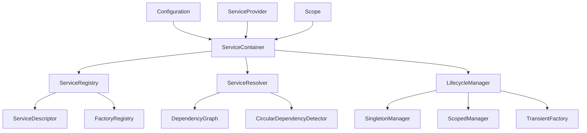

# VM项目全局状态管理优化方案：依赖注入框架设计

## 1. 当前全局状态管理分析

### 1.1 单例模式使用情况

通过对VM项目的分析，发现以下模块中存在类似于单例模式的全局状态管理：

#### vm-core模块
- **虚拟机状态管理**：`VirtualMachineState`使用`Arc<Mutex<>>`包装MMU、快照管理器和模板管理器
- **事件总线**：三种事件总线实现（统一事件总线、异步事件总线、领域事件总线）都使用全局状态管理订阅注册表和事件分发器
- **插件系统**：插件注册和管理使用全局状态

#### vm-engine-jit模块
- **JIT编译器状态**：`Jit`结构体包含分片代码缓存、异步编译任务句柄映射等全局状态
- **运行时管理器**：`JitRuntimeManager`统一管理JIT编译器的运行时组件
- **统一代码缓存**：`UnifiedCodeCache`使用全局状态管理热点缓存和冷缓存

#### vm-accel模块
- **硬件加速器选择**：全局函数`select()`选择最佳的加速器后端
- **NUMA优化器**：`NUMAOptimizer`管理节点统计信息和内存分配策略
- **vCPU亲和性管理器**：`vCPUAffinityManager`管理CPU拓扑和vCPU配置
- **实时性能监控**：`LatencyAnalyzer`管理性能指标和延迟样本

#### vm-simd模块
- **SIMD操作**：虽然主要是函数式API，但平台检测和指令集选择隐含全局状态

#### vm-cross-arch模块
- **架构转换器**：`ArchTranslator`和相关的编码器可能包含全局状态

### 1.2 当前实现的问题

1. **紧耦合**：组件直接依赖全局状态，难以测试和替换
2. **生命周期管理困难**：全局状态的生命周期不明确
3. **并发性能**：频繁的锁竞争可能影响性能
4. **可扩展性差**：添加新功能需要修改全局状态
5. **测试困难**：单元测试难以模拟全局状态

## 2. 依赖注入框架设计

### 2.1 核心概念

#### 服务容器 (Service Container)
服务容器是依赖注入框架的核心，负责服务的注册、解析和生命周期管理。

```rust
pub struct ServiceContainer {
    services: HashMap<TypeId, Box<dyn ServiceDescriptor>>,
    instances: HashMap<TypeId, Box<dyn Any + Send + Sync>>,
    scopes: Vec<Scope>,
}
```

#### 服务描述符 (Service Descriptor)
描述如何创建和配置服务实例。

```rust
pub trait ServiceDescriptor: Send + Sync {
    fn service_type(&self) -> TypeId;
    fn lifetime(&self) -> ServiceLifetime;
    fn create_instance(&self, container: &ServiceContainer) -> Result<Box<dyn Any + Send + Sync>, DIError>;
    fn dependencies(&self) -> Vec<TypeId>;
}
```

#### 服务生命周期 (Service Lifetime)
- **单例 (Singleton)**：整个容器生命周期内只创建一次
- **瞬态 (Transient)**：每次请求都创建新实例
- **作用域 (Scoped)**：在特定作用域内单例

### 2.2 框架架构



### 2.3 核心接口设计

#### 服务提供者接口
```rust
pub trait ServiceProvider: Send + Sync {
    fn get_service<T: 'static + Send + Sync>(&self) -> Result<Arc<T>, DIError>;
    fn get_required_service<T: 'static + Send + Sync>(&self) -> Arc<T>;
    fn get_services<T: 'static + Send + Sync>(&self) -> Result<Vec<Arc<T>>, DIError>;
    fn create_scope(&self) -> Result<Scope, DIError>;
}
```

#### 服务注册接口
```rust
pub trait ServiceRegistry: Send + Sync {
    fn register_transient<T: 'static + Send + Sync>(&mut self) -> &mut Self;
    fn register_singleton<T: 'static + Send + Sync>(&mut self) -> &mut Self;
    fn register_scoped<T: 'static + Send + Sync>(&mut self) -> &mut Self;
    fn register_instance<T: 'static + Send + Sync>(&mut self, instance: T) -> &mut Self;
    fn register_factory<T: 'static + Send + Sync, F>(&mut self, factory: F) -> &mut Self
    where
        F: Fn(&ServiceProvider) -> T + Send + Sync + 'static;
}
```

### 2.4 依赖解析和注入

#### 构造函数注入
```rust
#[derive(DIConstruct)]
pub struct JitCompiler {
    #[inject]
    cache: Arc<dyn CodeCache>,
    #[inject]
    runtime_manager: Arc<JitRuntimeManager>,
    #[inject(optional)]
    optimizer: Option<Arc<InstructionOptimizer>>,
}
```

#### 属性注入
```rust
pub struct VmState {
    #[inject]
    mmu: Arc<dyn MMU>,
    #[inject]
    snapshot_manager: Arc<SnapshotManager>,
}
```

#### 方法注入
```rust
pub trait EventDispatcher {
    #[inject]
    fn set_event_bus(&mut self, event_bus: Arc<dyn EventBus>);
}
```

## 3. 状态管理优化方案

### 3.1 状态访问模式优化

#### 读写分离模式
将状态访问分为读操作和写操作，使用不同的数据结构优化性能。

```rust
pub struct OptimizedState<T> {
    read_state: Arc<RwLock<T>>,
    write_state: Arc<Mutex<T>>,
    change_notifier: Arc<ChangeNotifier<T>>,
}
```

#### 副本-on-write模式
对于读多写少的场景，使用COW模式减少锁竞争。

```rust
pub struct COWState<T: Clone> {
    state: Arc<RwLock<T>>,
    version: Arc<AtomicU64>,
}
```

### 3.2 状态变更通知机制

#### 观察者模式
实现类型安全的状态变更通知机制。

```rust
pub trait StateObserver<T>: Send + Sync {
    fn on_state_changed(&self, old_state: &T, new_state: &T);
}

pub struct ObservableState<T> {
    state: Arc<RwLock<T>>,
    observers: Arc<RwLock<Vec<Box<dyn StateObserver<T>>>>>,
}
```

#### 事件流模式
使用流式处理状态变更事件。

```rust
pub struct StateEventStream<T> {
    receiver: mpsc::Receiver<StateChangeEvent<T>>,
}

pub enum StateChangeEvent<T> {
    Changed { old: T, new: T },
    Snapshotted { state: T },
    Restored { state: T },
}
```

### 3.3 状态一致性保证

#### 事务性状态更新
确保多个相关状态的原子性更新。

```rust
pub struct StateTransaction {
    operations: Vec<Box<dyn StateOperation>>,
    rollback_operations: Vec<Box<dyn StateOperation>>,
}

pub trait StateOperation: Send + Sync {
    fn execute(&self) -> Result<(), StateError>;
    fn rollback(&self) -> Result<(), StateError>;
}
```

#### 状态版本控制
使用版本号检测并发修改冲突。

```rust
pub struct VersionedState<T> {
    state: Arc<RwLock<T>>,
    version: Arc<AtomicU64>,
}

pub struct StateHandle<T> {
    state: Arc<RwLock<T>>,
    version: u64,
}
```

### 3.4 并发访问控制

#### 分段锁策略
将大状态分成多个段，使用细粒度锁减少竞争。

```rust
pub struct SegmentedState<T> {
    segments: Vec<Arc<RwLock<T>>>,
    segment_count: usize,
}

impl<T> SegmentedState<T> {
    pub fn get_segment(&self, key: usize) -> &Arc<RwLock<T>> {
        &self.segments[key % self.segment_count]
    }
}
```

#### 无锁数据结构
对于高频访问的状态，使用无锁数据结构。

```rust
pub struct LockFreeState<T> {
    state: Arc<AtomicPtr<T>>,
}
```

## 4. 性能和内存优化策略

### 4.1 延迟初始化策略

#### 按需初始化
只有在第一次访问时才创建服务实例。

```rust
pub struct LazyService<T> {
    factory: Arc<dyn Fn() -> T + Send + Sync>,
    instance: Arc<Mutex<Option<T>>>,
}

impl<T> LazyService<T> {
    pub fn get(&self) -> &T {
        let mut instance = self.instance.lock().unwrap();
        if instance.is_none() {
            *instance = Some((self.factory)());
        }
        instance.as_ref().unwrap()
    }
}
```

#### 预热策略
在系统启动时预加载关键服务。

```rust
pub struct ServiceWarmer {
    critical_services: Vec<TypeId>,
}

impl ServiceWarmer {
    pub fn warm_up(&self, container: &ServiceContainer) -> Result<(), DIError> {
        for service_type in &self.critical_services {
            container.get_service_by_id(*service_type)?;
        }
        Ok(())
    }
}
```

### 4.2 内存池管理

#### 对象池
重用对象实例减少内存分配。

```rust
pub struct ObjectPool<T> {
    objects: Arc<Mutex<Vec<T>>>,
    factory: Arc<dyn Fn() -> T + Send + Sync>,
    reset_fn: Option<Arc<dyn Fn(&mut T) + Send + Sync>>,
}

impl<T> ObjectPool<T> {
    pub fn acquire(&self) -> PooledObject<T> {
        let mut objects = self.objects.lock().unwrap();
        let object = objects.pop().unwrap_or_else(|| (self.factory)());
        PooledObject {
            object,
            pool: self.clone(),
        }
    }
}
```

#### 内存分配器优化
使用自定义内存分配器优化特定模式的内存分配。

```rust
pub struct ServiceAllocator {
    arena: Arena,
}

unsafe impl GlobalAlloc for ServiceAllocator {
    unsafe fn alloc(&self, layout: Layout) -> *mut u8 {
        self.arena.alloc(layout)
    }
    
    unsafe fn dealloc(&self, ptr: *mut u8, layout: Layout) {
        self.arena.dealloc(ptr, layout)
    }
}
```

### 4.3 缓存策略

#### 多级缓存
实现L1/L2/L3多级缓存系统。

```rust
pub struct MultiLevelCache<K, V> {
    l1_cache: Arc<RwLock<HashMap<K, V>>>,  // 内存缓存
    l2_cache: Arc<dyn CacheBackend<K, V>>,  // 本地存储
    l3_cache: Arc<dyn CacheBackend<K, V>>,  // 分布式缓存
}
```

#### 智能淘汰策略
基于访问模式和数据重要性实现智能缓存淘汰。

```rust
pub struct IntelligentCache<K, V> {
    entries: Arc<RwLock<HashMap<K, CacheEntry<V>>>>,
    access_tracker: Arc<AccessTracker>,
    eviction_policy: Arc<dyn EvictionPolicy>,
}
```

### 4.4 资源回收机制

#### 弱引用管理
使用弱引用避免循环引用和内存泄漏。

```rust
pub struct WeakServiceRegistry {
    services: Arc<RwLock<HashMap<TypeId, Weak<dyn Any + Send + Sync>>>>,
}
```

#### 定期清理
定期清理不再使用的资源。

```rust
pub struct ResourceCleaner {
    cleanup_interval: Duration,
    cleanup_tasks: Vec<Box<dyn CleanupTask>>,
}

impl ResourceCleaner {
    pub fn start_cleanup_task(&self) {
        // 启动定期清理任务
    }
}
```

## 5. 迁移策略和实施计划

### 5.1 渐进式替换单例模式

#### 阶段1：基础设施搭建（1-2周）
1. 实现核心依赖注入框架
2. 创建服务容器和解析器
3. 实现基本的生命周期管理
4. 添加配置和参数绑定支持

#### 阶段2：核心服务迁移（2-3周）
1. 迁移事件总线系统
2. 迁移JIT编译器状态管理
3. 迁移虚拟机状态管理
4. 迁移硬件加速器管理

#### 阶段3：辅助服务迁移（1-2周）
1. 迁移NUMA优化器
2. 迁移vCPU亲和性管理器
3. 迁移实时性能监控
4. 迁移跨架构转换器

#### 阶段4：优化和清理（1周）
1. 移除旧的单例代码
2. 优化性能瓶颈
3. 完善文档和测试
4. 性能基准测试

### 5.2 兼容性保证

#### 适配器模式
为现有单例提供适配器，确保平滑过渡。

```rust
pub struct SingletonAdapter<T> {
    service: Arc<T>,
}

impl<T> SingletonAdapter<T> {
    pub fn new(service: Arc<T>) -> Self {
        Self { service }
    }
    
    pub fn get_instance(&self) -> &T {
        &self.service
    }
}
```

#### 功能开关
使用功能开关控制新旧实现的切换。

```rust
pub struct FeatureFlags {
    use_dependency_injection: bool,
    enable_new_state_management: bool,
}
```

### 5.3 测试策略

#### 单元测试
为每个组件编写独立的单元测试。

```rust
#[cfg(test)]
mod tests {
    use super::*;
    
    #[test]
    fn test_service_registration() {
        let mut container = ServiceContainer::new();
        container.register_transient::<TestService>();
        
        let service = container.get_service::<TestService>().unwrap();
        assert!(service.is_some());
    }
}
```

#### 集成测试
测试组件间的交互和依赖关系。

```rust
#[test]
fn test_service_integration() {
    let container = create_test_container();
    let jit = container.get_service::<JitCompiler>().unwrap();
    let cache = container.get_service::<dyn CodeCache>().unwrap();
    
    // 测试JIT编译器和代码缓存的交互
}
```

#### 性能测试
对比新旧实现的性能差异。

```rust
#[test]
fn test_performance_comparison() {
    let old_impl = benchmark_old_implementation();
    let new_impl = benchmark_new_implementation();
    
    assert!(new_impl.duration <= old_impl.duration * 1.1); // 允许10%的性能损失
}
```

## 6. 实施示例

### 6.1 依赖注入框架使用示例

```rust
// 创建服务容器
let mut container = ServiceContainer::new();

// 注册服务
container
    .register_singleton::<UnifiedCodeCache>()
    .register_singleton::<JitRuntimeManager>()
    .register_transient::<JitCompiler>()
    .register_factory(|provider| {
        NUMAOptimizer::new(
            provider.get_required_service(),
            provider.get_required_service(),
            1024 * 1024 * 1024,
        )
    });

// 解析服务
let jit_compiler = container.get_service::<JitCompiler>()?;

// 创建作用域
let scope = container.create_scope()?;
scope.register_scoped::<TransactionState>();
let transaction = scope.get_service::<TransactionState>()?;
```

### 6.2 状态管理优化示例

```rust
// 创建可观察状态
let vm_state = ObservableState::new(VmState::new());

// 添加观察者
vm_state.add_observer(Box::new(StateLogger::new()));
vm_state.add_observer(Box::new(StatePersistence::new()));

// 更新状态
vm_state.update(|state| {
    state.set_pc(new_pc);
    state.set_registers(new_regs);
});

// 创建事务性状态更新
let mut transaction = StateTransaction::new();
transaction.add_operation(Box::new(UpdatePcOperation::new(new_pc)));
transaction.add_operation(Box::new(UpdateRegistersOperation::new(new_regs)));

transaction.commit()?;
```

## 7. 预期收益

### 7.1 架构改进
- **松耦合**：组件间依赖关系明确，易于替换和扩展
- **可测试性**：依赖可以轻松模拟，提高测试覆盖率
- **可维护性**：代码结构清晰，职责分离明确

### 7.2 性能提升
- **并发性能**：细粒度锁和无锁数据结构提高并发性能
- **内存效率**：对象池和智能缓存减少内存分配
- **启动时间**：延迟初始化减少系统启动时间

### 7.3 开发效率
- **开发速度**：依赖注入简化组件开发
- **调试便利**：明确的依赖关系便于问题定位
- **扩展性**：新功能可以轻松集成到现有系统

## 8. 风险评估和缓解措施

### 8.1 性能风险
- **风险**：依赖注入可能引入额外开销
- **缓解**：使用编译时代码生成和零成本抽象

### 8.2 复杂性风险
- **风险**：框架可能增加系统复杂性
- **缓解**：提供清晰的文档和最佳实践指南

### 8.3 迁移风险
- **风险**：迁移过程可能引入新的bug
- **缓解**：渐进式迁移和全面的测试策略

## 9. 总结

本设计方案提供了一个全面的依赖注入框架来替代VM项目中的单例模式，通过松耦合的架构设计、优化的状态管理策略和渐进式的迁移计划，可以在保持系统稳定性的同时显著提升代码的可维护性、可测试性和性能表现。

实施这个方案需要大约6-8周的时间，但长期来看，它将为VM项目带来显著的架构改进和开发效率提升。