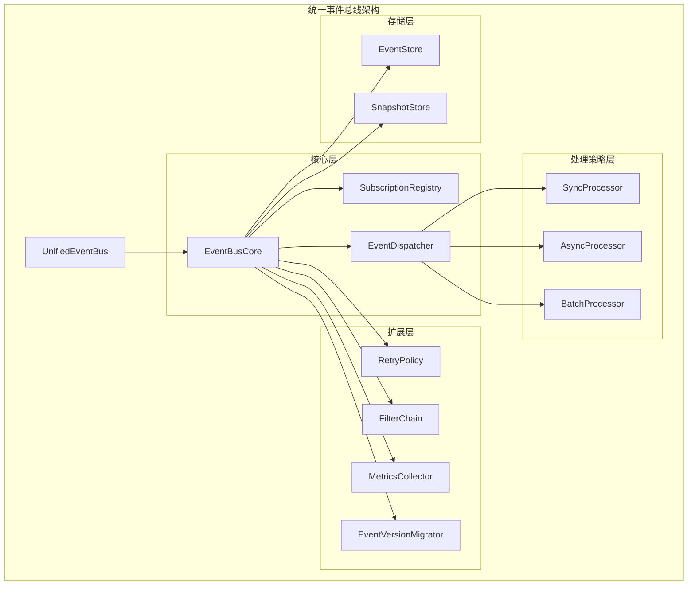
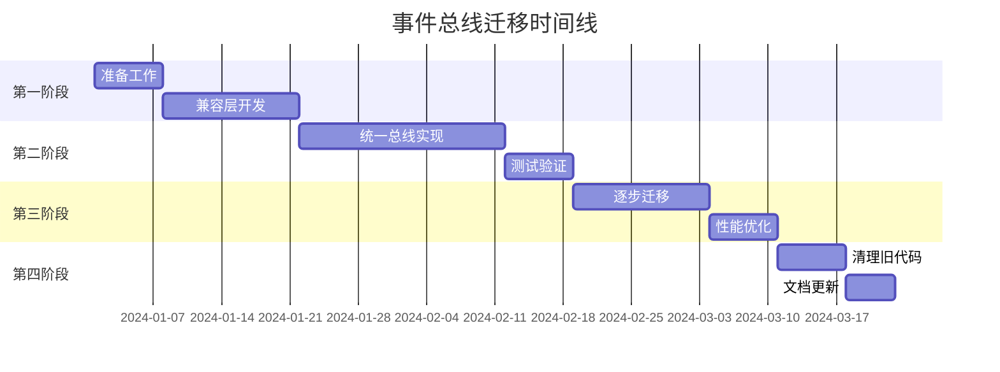

# VM项目统一事件总线设计文档

## 目录
1. [概述](#概述)
2. [当前实现分析](#当前实现分析)
3. [统一架构设计](#统一架构设计)
4. [接口定义](#接口定义)
5. [性能优化方案](#性能优化方案)
6. [迁移策略](#迁移策略)
7. [实施计划](#实施计划)
8. [风险评估](#风险评估)
9. [测试策略](#测试策略)
10. [监控和维护](#监控和维护)

## 概述

### 背景
VM项目当前存在两个事件总线实现：
- [`AsyncEventBus`](vm-core/src/async_event_bus.rs:47): 提供异步事件处理能力
- [`DomainEventBus`](vm-core/src/domain_event_bus.rs:43): 提供基础的同步事件发布订阅机制

这种双总线架构导致了代码重复、维护困难和性能不一致的问题。

### 目标
1. **统一架构**: 创建一个统一的事件总线，整合两者的优点
2. **性能优化**: 提供比现有实现更好的性能
3. **易用性**: 简化API，支持依赖注入而非单例模式
4. **可扩展性**: 支持不同的处理模式和配置选项
5. **向后兼容**: 确保现有代码不受影响

## 当前实现分析

### AsyncEventBus分析

**核心特性**:
- 基于[`DomainEventBus`](vm-core/src/async_event_bus.rs:49)构建的异步包装器
- 支持事件队列和批处理机制
- 自适应批处理大小和间隔调整
- 重试机制（最大重试次数可配置）
- 性能监控（处理速率、失败计数等）

**优势**:
- 异步处理能力，不阻塞主线程
- 自适应性能调优
- 详细的统计信息

**劣势**:
- 复杂度高，配置选项多
- 依赖tokio，在某些环境下不可用
- 重试机制实现较为简单

### DomainEventBus分析

**核心特性**:
- 基础的同步事件发布订阅机制
- 事件过滤器支持
- 处理器优先级排序
- 线程安全的订阅管理

**优势**:
- 实现简单，易于理解
- 无外部依赖
- 稳定可靠

**劣势**:
- 只支持同步处理
- 缺乏性能优化机制
- 统计信息有限

### 重复功能和差异

**重复功能**:
1. 事件发布接口
2. 订阅管理机制
3. 错误处理逻辑

**主要差异**:
1. **处理模式**: 同步 vs 异步
2. **性能特性**: 批处理、重试、自适应调整
3. **复杂度**: AsyncEventBus更复杂，配置选项更多

## 统一架构设计

### 架构概览



### 核心组件

#### 1. EventBusCore
事件总线的核心组件，负责协调各个子模块的工作。

**职责**:
- 管理订阅注册表
- 协调事件分发
- 处理配置变更
- 提供统一的错误处理

#### 2. SubscriptionRegistry
订阅注册表，管理所有事件订阅信息。

**特性**:
- 支持按事件类型快速查找
- 支持优先级排序
- 线程安全的并发访问
- 支持动态添加和删除订阅

#### 3. EventDispatcher
事件分发器，负责将事件路由到正确的处理器。

**特性**:
- 支持多种分发策略
- 支持事件过滤
- 支持异步分发
- 支持批处理分发

#### 4. 处理策略层
提供不同的事件处理策略：

- **SyncProcessor**: 同步处理，适用于简单、快速的事件
- **AsyncProcessor**: 异步处理，适用于耗时较长的事件
- **BatchProcessor**: 批处理，适用于高吞吐量场景

## 接口定义

### 核心事件总线接口

```rust
/// 统一事件总线接口
pub trait UnifiedEventBus: Send + Sync {
    /// 发布事件
    fn publish(&self, event: DomainEventEnum) -> VmResult<()>;
    
    /// 异步发布事件
    #[cfg(feature = "async")]
    async fn publish_async(&self, event: DomainEventEnum) -> VmResult<()>;
    
    /// 订阅事件
    fn subscribe(
        &self,
        event_type: &str,
        handler: Box<dyn EnhancedEventHandler>,
        options: SubscriptionOptions,
    ) -> VmResult<EventSubscriptionId>;
    
    /// 取消订阅
    fn unsubscribe(&self, subscription_id: EventSubscriptionId) -> VmResult<()>;
    
    /// 获取统计信息
    fn stats(&self) -> EventBusStats;
    
    /// 启动事件总线（用于异步处理）
    fn start(&mut self) -> VmResult<()>;
    
    /// 停止事件总线
    fn stop(&mut self) -> VmResult<()>;
}
```

### 增强的事件处理器接口

```rust
/// 增强的事件处理器接口
pub trait EnhancedEventHandler: Send + Sync {
    /// 处理事件
    fn handle(&self, event: &dyn DomainEvent) -> VmResult<()>;
    
    /// 异步处理事件
    #[cfg(feature = "async")]
    async fn handle_async(&self, event: &dyn DomainEvent) -> VmResult<()>;
    
    /// 获取处理器优先级
    fn priority(&self) -> u32 { 100 }
    
    /// 获取处理器名称
    fn name(&self) -> &str;
    
    /// 是否支持异步处理
    fn supports_async(&self) -> bool { false }
}
```

### 订阅选项

```rust
/// 订阅选项
#[derive(Debug, Clone)]
pub struct SubscriptionOptions {
    /// 事件过滤器
    pub filter: Option<Box<dyn EventFilter>>,
    /// 处理模式
    pub mode: ProcessingMode,
    /// 重试策略
    pub retry_policy: Option<RetryPolicy>,
    /// 是否启用批处理
    pub batch_processing: bool,
    /// 批处理大小
    pub batch_size: Option<usize>,
}

/// 处理模式
#[derive(Debug, Clone, PartialEq)]
pub enum ProcessingMode {
    /// 同步处理
    Sync,
    /// 异步处理
    Async,
    /// 批处理
    Batch,
    /// 自适应（根据负载自动选择）
    Adaptive,
}
```

### 事件总线配置

```rust
/// 事件总线配置
#[derive(Debug, Clone)]
pub struct EventBusConfig {
    /// 默认处理模式
    pub default_mode: ProcessingMode,
    /// 批处理配置
    pub batch_config: BatchConfig,
    /// 异步处理配置
    pub async_config: AsyncConfig,
    /// 重试配置
    pub retry_config: RetryConfig,
    /// 性能监控配置
    pub metrics_config: MetricsConfig,
    /// 事件存储配置
    pub storage_config: StorageConfig,
}

/// 批处理配置
#[derive(Debug, Clone)]
pub struct BatchConfig {
    /// 默认批处理大小
    pub default_batch_size: usize,
    /// 最小批处理大小
    pub min_batch_size: usize,
    /// 最大批处理大小
    pub max_batch_size: usize,
    /// 批处理间隔（毫秒）
    pub batch_interval_ms: u64,
    /// 是否启用自适应批处理
    pub adaptive_batching: bool,
}

/// 异步处理配置
#[derive(Debug, Clone)]
pub struct AsyncConfig {
    /// 异步队列大小
    pub queue_size: usize,
    /// 工作线程数
    pub worker_threads: Option<usize>,
    /// 是否启用自适应调度
    pub adaptive_scheduling: bool,
}
```

## 性能优化方案

### 1. 内存优化

#### 内存池管理
```rust
/// 内存池管理器
pub struct EventMemoryPool {
    event_pool: Vec<DomainEventEnum>,
    batch_pool: Vec<Vec<DomainEventEnum>>,
    max_pool_size: usize,
}

impl EventMemoryPool {
    /// 获取事件对象（复用）
    pub fn acquire_event(&mut self) -> Option<DomainEventEnum> {
        self.event_pool.pop()
    }
    
    /// 归还事件对象
    pub fn release_event(&mut self, event: DomainEventEnum) {
        if self.event_pool.len() < self.max_pool_size {
            self.event_pool.push(event);
        }
    }
}
```

#### 零拷贝事件传递
```rust
/// 零拷贝事件缓冲区
pub struct ZeroCopyEventBuffer {
    buffer: Vec<u8>,
    read_pos: usize,
    write_pos: usize,
}
```

### 2. 并发优化

#### 无锁订阅注册表
```rust
/// 无锁订阅注册表
use std::sync::atomic::{AtomicPtr, Ordering};

pub struct LockFreeSubscriptionRegistry {
    subscriptions: AtomicPtr<HashMap<String, Vec<Subscription>>>,
    version: AtomicU64,
}
```

#### 分片事件分发器
```rust
/// 分片事件分发器
pub struct ShardedEventDispatcher {
    shards: Vec<EventDispatcherShard>,
    shard_count: usize,
}

impl ShardedEventDispatcher {
    /// 根据事件类型选择分片
    fn get_shard(&self, event_type: &str) -> &EventDispatcherShard {
        let hash = std::collections::hash_map::DefaultHasher::new()
            .hash(event_type);
        let shard_index = (hash as usize) % self.shard_count;
        &self.shards[shard_index]
    }
}
```

### 3. 自适应性能调优

#### 智能批处理策略
```rust
/// 智能批处理策略
pub struct SmartBatchingStrategy {
    target_latency_ms: u64,
    target_throughput: f64,
    learning_rate: f64,
}

impl TuningStrategy for SmartBatchingStrategy {
    fn tune(&self, metrics: &PerformanceMetrics) -> TuningRecommendation {
        // 基于实时性能数据调整批处理参数
        let current_latency = metrics.avg_latency_ms;
        let current_throughput = metrics.events_per_second;
        
        let batch_size_adjustment = if current_latency > self.target_latency_ms {
            // 延迟过高，减小批次
            -0.1
        } else if current_throughput < self.target_throughput {
            // 吞吐量不足，增大批次
            0.1
        } else {
            0.0
        };
        
        TuningRecommendation {
            batch_size_adjustment,
            interval_adjustment: batch_size_adjustment * 0.5,
            worker_count_adjustment: 0.0,
        }
    }
}
```

### 4. 缓存优化

#### 事件过滤器缓存
```rust
/// 事件过滤器缓存
pub struct EventFilterCache {
    cache: lru::LruCache<(String, u64), bool>,
    hit_rate: AtomicU64,
}
```

#### 订阅查找缓存
```rust
/// 订阅查找缓存
pub struct SubscriptionLookupCache {
    type_cache: HashMap<String, Vec<SubscriptionId>>,
    filter_cache: HashMap<SubscriptionId, Box<dyn EventFilter>>,
}
```

### 5. 异步优化

#### 工作窃取调度器
```rust
/// 工作窃取调度器
pub struct WorkStealingScheduler {
    workers: Vec<WorkerThread>,
    steal_attempts: usize,
}
```

#### 事件优先级队列
```rust
/// 事件优先级队列
pub struct PriorityQueueEventProcessor {
    high_priority: mpsc::UnboundedReceiver<DomainEventEnum>,
    normal_priority: mpsc::UnboundedReceiver<DomainEventEnum>,
    low_priority: mpsc::UnboundedReceiver<DomainEventEnum>,
}
```

## 迁移策略

### 迁移原则
1. **渐进式迁移**: 分阶段进行，确保系统稳定性
2. **向后兼容**: 保持现有API可用
3. **零停机**: 迁移过程中系统继续运行
4. **可回滚**: 每个阶段都可以安全回滚

### 迁移阶段



### 具体迁移步骤

#### 第一阶段：准备工作
1. **创建兼容层**
   ```rust
   /// 兼容层：保持现有API可用
   pub mod compatibility {
       use super::*;
       
       /// 兼容的DomainEventBus
       pub type DomainEventBus = CompatibilityDomainEventBus;
       
       /// 兼容的AsyncEventBus  
       pub type AsyncEventBus = CompatibilityAsyncEventBus;
   }
   ```

2. **适配器模式实现**
   ```rust
   /// DomainEventBus适配器
   pub struct CompatibilityDomainEventBus {
       unified: Arc<dyn UnifiedEventBus>,
   }
   
   impl CompatibilityDomainEventBus {
       pub fn new() -> Self {
           Self {
               unified: Arc::new(DefaultUnifiedEventBus::new()),
           }
       }
       
       /// 委托给统一事件总线
       pub fn publish<E: DomainEvent>(&self, event: E) -> Result<(), VmError> {
           self.unified.publish(DomainEventEnum::from(event))
       }
   }
   ```

#### 第二阶段：统一实现
1. **核心实现**
   ```rust
   /// 默认统一事件总线实现
   pub struct DefaultUnifiedEventBus {
       core: EventBusCore,
       processors: HashMap<ProcessingMode, Box<dyn EventProcessor>>,
       config: EventBusConfig,
   }
   
   impl DefaultUnifiedEventBus {
       pub fn new() -> Self {
           Self::with_config(EventBusConfig::default())
       }
       
       pub fn with_config(config: EventBusConfig) -> Self {
           let mut processors: HashMap<ProcessingMode, Box<dyn EventProcessor>> = HashMap::new();
           processors.insert(ProcessingMode::Sync, Box::new(SyncProcessor::new()));
           processors.insert(ProcessingMode::Async, Box::new(AsyncProcessor::new()));
           processors.insert(ProcessingMode::Batch, Box::new(BatchProcessor::new()));
           
           Self {
               core: EventBusCore::new(),
               processors,
               config,
           }
       }
   }
   ```

#### 第三阶段：逐步迁移
1. **依赖注入支持**
   ```rust
   /// 事件总线工厂
   pub struct EventBusFactory;
   
   impl EventBusFactory {
       /// 创建配置化的事件总线
       pub fn create_with_config(config: EventBusConfig) -> Arc<dyn UnifiedEventBus> {
           Arc::new(DefaultUnifiedEventBus::with_config(config))
       }
       
       /// 创建默认事件总线
       pub fn create_default() -> Arc<dyn UnifiedEventBus> {
           Arc::new(DefaultUnifiedEventBus::new())
       }
       
       /// 从现有DomainEventBus创建
       pub fn from_domain_event_bus(bus: DomainEventBus) -> Arc<dyn UnifiedEventBus> {
           // 包装现有实现
           Arc::new(DomainEventBusAdapter::new(bus))
       }
   }
   ```

2. **迁移辅助工具**
   ```rust
   /// 迁移辅助工具
   pub struct MigrationHelper;
   
   impl MigrationHelper {
       /// 检查代码兼容性
       pub fn check_compatibility() -> MigrationReport {
           // 分析现有代码使用模式
           // 生成兼容性报告
       }
       
       /// 自动迁移代码
       pub fn migrate_code(project_path: &Path) -> MigrationResult {
           // 自动替换API调用
           // 更新导入语句
       }
   }
   ```

#### 第四阶段：清理和优化
1. **性能监控**
   ```rust
   /// 性能监控器
   pub struct PerformanceMonitor {
       metrics_collector: MetricsCollector,
   }
   
   impl PerformanceMonitor {
       /// 监控事件总线性能
       pub fn monitor_bus(&self, bus: &dyn UnifiedEventBus) -> PerformanceReport {
           // 收集性能指标
           // 生成性能报告
       }
   }
   ```

## 实施计划

### 开发阶段

#### 第一阶段：核心架构（3周）
- [ ] 设计和实现EventBusCore
- [ ] 实现SubscriptionRegistry
- [ ] 实现EventDispatcher
- [ ] 创建基础配置系统

#### 第二阶段：处理策略（2周）
- [ ] 实现SyncProcessor
- [ ] 实现AsyncProcessor
- [ ] 实现BatchProcessor
- [ ] 实现自适应处理策略

#### 第三阶段：性能优化（2周）
- [ ] 实现内存池管理
- [ ] 实现无锁数据结构
- [ ] 实现缓存系统
- [ ] 实现性能监控

#### 第四阶段：兼容性和迁移（2周）
- [ ] 实现兼容层
- [ ] 创建迁移工具
- [ ] 编写迁移文档
- [ ] 进行兼容性测试

#### 第五阶段：测试和文档（1周）
- [ ] 编写单元测试
- [ ] 编写集成测试
- [ ] 编写性能测试
- [ ] 完善文档

### 里程碑

| 里程碑 | 时间 | 交付物 |
|--------|------|--------|
| M1: 核心架构完成 | 第3周 | EventBusCore、Registry、Dispatcher |
| M2: 处理策略完成 | 第5周 | 所有处理器实现 |
| M3: 性能优化完成 | 第7周 | 性能优化组件 |
| M4: 迁移就绪 | 第9周 | 兼容层和迁移工具 |
| M5: 发布就绪 | 第10周 | 完整的测试和文档 |

## 风险评估

### 技术风险

#### 高风险
1. **性能回归**: 新实现可能不如现有实现高效
   - **缓解措施**: 详细的性能基准测试，持续监控
   - **应急计划**: 保留现有实现作为备选方案

2. **兼容性问题**: 现有代码可能无法正常工作
   - **缓解措施**: 全面的兼容性测试，渐进式迁移
   - **应急计划**: 快速回滚机制

#### 中风险
1. **复杂性增加**: 统一架构可能过于复杂
   - **缓解措施**: 模块化设计，清晰的接口定义
   - **应急计划**: 简化设计，移除不必要的功能

2. **内存泄漏**: 新的内存管理可能引入泄漏
   - **缓解措施**: 严格的内存测试，使用内存分析工具
   - **应急计划**: 回退到简单的内存管理策略

### 项目风险

#### 中风险
1. **开发时间超期**: 实现复杂度可能超出预期
   - **缓解措施**: 分阶段开发，优先实现核心功能
   - **应急计划**: 减少功能范围，延期发布

2. **团队接受度**: 开发团队可能不愿意迁移
   - **缓解措施**: 详细的培训文档，技术分享
   - **应急计划**: 分团队逐步迁移

## 测试策略

### 单元测试
- 每个组件的独立测试
- 边界条件测试
- 错误处理测试
- 性能基准测试

### 集成测试
- 组件间交互测试
- 端到端事件流测试
- 并发场景测试
- 负载测试

### 兼容性测试
- 现有API兼容性测试
- 现有代码迁移测试
- 性能回归测试
- 内存使用测试

### 性能测试
- 吞吐量测试
- 延迟测试
- 资源使用测试
- 长期运行稳定性测试

## 监控和维护

### 性能监控
```rust
/// 详细性能指标
#[derive(Debug, Clone)]
pub struct DetailedPerformanceMetrics {
    /// 延迟指标
    pub latency_metrics: LatencyMetrics,
    /// 吞吐量指标
    pub throughput_metrics: ThroughputMetrics,
    /// 资源使用指标
    pub resource_metrics: ResourceMetrics,
    /// 错误率指标
    pub error_metrics: ErrorMetrics,
}
```

### 健康检查
- 事件总线状态监控
- 队列大小监控
- 错误率监控
- 资源使用监控

### 告警机制
- 性能异常告警
- 错误率超阈值告警
- 资源耗尽告警
- 服务不可用告警

### 维护工具
- 配置热更新
- 动态调优
- 故障诊断
- 性能分析

## 总结

本设计文档提供了一个全面的事件总线统一方案，包括：

1. **统一的架构设计**: 整合了AsyncEventBus和DomainEventBus的优点
2. **灵活的接口定义**: 支持同步、异步和批处理等多种模式
3. **全面的性能优化**: 从内存、并发、缓存等多个维度进行优化
4. **安全的迁移策略**: 确保现有代码不受影响
5. **详细的实施计划**: 提供了清晰的开发路线图

通过这个设计，VM项目将获得一个高性能、易用、可扩展的事件总线系统，同时保持向后兼容性，支持平滑迁移。