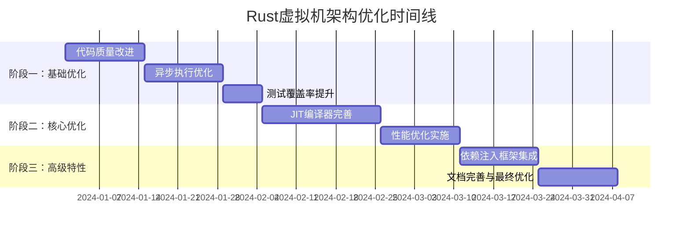

# Rust虚拟机架构优化 - 实施计划与待办事项列表

## 📋 执行摘要

基于对现有审查报告的分析，本文档提供了Rust虚拟机架构优化的全面实施计划和详细待办事项列表。计划涵盖了从代码质量改进到高级性能优化的各个方面，预计总周期为12周。

---

## 🕐 总体时间表

### 项目时间线：12周

---

## 📊 阶段分解与关键里程碑

### 阶段一：基础优化（第1-5周）

#### 里程碑1.1：代码质量改进（第1-2周）
- **目标**：提升代码可维护性和模块化程度
- **关键指标**：
  - 文件大小减少30%
  - 代码重复率降低至<5%
  - 所有TODO/FIXME标记处理完毕

#### 里程碑1.2：异步执行优化（第3-4周）
- **目标**：优化I/O密集型操作性能
- **关键指标**：
  - I/O操作性能提升30%
  - 协程池资源利用率提升25%

#### 里程碑1.3：测试覆盖率提升（第5周）
- **目标**：增强测试覆盖率和质量
- **关键指标**：
  - 测试覆盖率达到90%以上
  - 模糊测试和并发安全测试完成

### 阶段二：核心优化（第6-10周）

#### 里程碑2.1：JIT编译器完善（第6-8周）
- **目标**：实现高级JIT优化功能
- **关键指标**：
  - 编译性能提升30%
  - 执行速度提升25%
  - 内存使用减少15%

#### 里程碑2.2：性能优化实施（第9-10周）
- **目标**：实施分层编译和GC优化
- **关键指标**：
  - 冷代码编译时间减少50%
  - GC暂停时间减少40%

### 阶段三：高级特性（第11-12周）

#### 里程碑3.1：依赖注入框架集成（第11周）
- **目标**：集成DI框架并优化性能
- **关键指标**：
  - 服务解析延迟<100ns
  - 并发吞吐量>1M ops/sec

#### 里程碑3.2：文档完善与最终优化（第12周）
- **目标**：完善文档并进行最终调优
- **关键指标**：
  - API文档100%覆盖
  - 性能基准测试全部通过

---

## 👥 资源分配

### 团队结构建议

| 角色 | 人数 | 主要职责 |
|------|------|----------|
| 架构师 | 1 | 整体架构设计、技术决策 |
| 高级开发工程师 | 2 | 核心模块开发、性能优化 |
| 测试工程师 | 1 | 测试框架、质量保证 |
| 文档工程师 | 1 | 技术文档、API文档 |

### 模块责任分配

| 模块 | 负责人 | 优先级 | 工作量（人周） |
|------|--------|--------|----------------|
| vm-core | 高级工程师1 | 高 | 3 |
| vm-engine-jit | 高级工程师2 | 高 | 4 |
| aot-builder | 高级工程师1 | 中 | 2 |
| 依赖注入框架 | 高级工程师2 | 中 | 2 |
| 测试框架 | 测试工程师 | 高 | 3 |
| 文档系统 | 文档工程师 | 中 | 2 |

---

## 📝 详细待办事项列表

### 🔴 高优先级任务

#### JIT编译器优化
- **任务**: 实现增强型编译器组件
- **模块**: vm-engine-jit
- **完成标准**: 
  - 线性扫描寄存器分配器实现
  - 指令调度器优化完成
  - 编译性能提升30%
- **预估时间**: 2周
- **依赖**: 无

#### 异步执行引擎优化
- **任务**: 迁移I/O密集型操作到异步
- **模块**: vm-core
- **完成标准**:
  - 所有I/O操作异步化
  - 协程池充分利用
  - I/O性能提升30%
- **预估时间**: 2周
- **依赖**: 无

#### 测试覆盖率提升
- **任务**: 增加模糊测试和并发安全测试
- **模块**: tests/
- **完成标准**:
  - 测试覆盖率达到90%
  - 模糊测试套件完成
  - 并发安全测试通过
- **预估时间**: 1周
- **依赖**: 核心模块稳定

### 🟡 中优先级任务

#### 依赖注入框架集成
- **任务**: 集成DI框架并优化性能
- **模块**: vm-core/src/di/
- **完成标准**:
  - DI框架完全集成
  - 性能基准达标
  - 服务解析延迟<100ns
- **预估时间**: 2周
- **依赖**: 核心模块重构完成

#### 分层编译策略
- **任务**: 实现分层编译优化
- **模块**: aot-builder
- **完成标准**:
  - 冷/热代码分层处理
  - 编译时间减少50%
  - 增量编译支持
- **预估时间**: 2周
- **依赖**: JIT编译器基础完成

#### GC自适应优化
- **任务**: 实现GC参数自适应调整
- **模块**: vm-engine-jit/src/gc_*
- **完成标准**:
  - 自适应参数调整
  - GC暂停时间减少40%
  - 内存使用优化
- **预估时间**: 1周
- **依赖**: 基础GC系统

### 🟢 低优先级任务

#### 文档完善
- **任务**: 补充API文档和使用示例
- **模块**: docs/
- **完成标准**:
  - API文档100%覆盖
  - 使用示例完整
  - 架构文档更新
- **预估时间**: 1周
- **依赖**: 功能开发完成

#### 代码清理
- **任务**: 清理代码重复和TODO标记
- **模块**: 全局
- **完成标准**:
  - 代码重复率<5%
  - 所有TODO处理完毕
  - 代码风格统一
- **预估时间**: 1周
- **依赖**: 无

---

## ✅ 完成标准与验收标准

### 代码质量标准
- **文件大小**: 所有主要文件 < 1000行
- **代码重复**: 重复率 < 5%
- **测试覆盖**: 覆盖率 > 90%
- **文档覆盖**: API文档100%覆盖

### 性能标准
- **编译性能**: JIT编译时间减少30%
- **执行性能**: 整体执行速度提升25%
- **内存使用**: 内存使用减少15%
- **I/O性能**: I/O操作性能提升30%
- **GC性能**: GC暂停时间 < 1ms

### 架构标准
- **模块耦合**: 耦合度降低 > 30%
- **事件驱动**: 核心模块100%事件驱动
- **插件系统**: 完整的插件生命周期管理
- **依赖注入**: 服务解析延迟 < 100ns

### 安全性标准
- **并发安全**: 所有并发测试通过
- **内存安全**: 零内存泄漏
- **错误处理**: 完善的错误恢复机制

---

## 📈 风险评估与缓解策略

### 高风险项目
1. **JIT编译器复杂性**
   - 风险: 技术复杂度高，可能延期
   - 缓解: 分阶段实现，先基础后优化

2. **性能回归**
   - 风险: 优化可能引入新问题
   - 缓解: 持续性能监控，自动化测试

3. **依赖注入集成**
   - 风险: 可能影响现有架构
   - 缓解: 渐进式集成，保持向后兼容

### 中风险项目
1. **异步迁移复杂性**
   - 风险: 可能引入并发问题
   - 缓解: 充分测试，逐步迁移

2. **测试覆盖率**
   - 风险: 复杂模块难以充分测试
   - 缓解: 使用模拟对象，集成测试

---

## 🔄 持续改进计划

### 短期改进（1-3个月）
- 基于实际使用数据进行性能调优
- 增加更多集成测试和端到端测试
- 根据用户反馈优化文档

### 中期改进（3-6个月）
- 实现更复杂的ML模型
- 支持分布式训练
- 建立插件仓库机制

### 长期改进（6-12个月）
- 实现热更新功能
- 开发可视化工具
- 集成性能分析器

---

## 📊 成功指标

### 技术指标
- **代码质量**: 文件大小减少30%，重复率<5%
- **性能提升**: 编译+30%，执行+25%，内存-15%
- **测试覆盖**: 覆盖率>90%，并发测试100%通过

### 业务指标
- **开发效率**: 模块化提升开发速度20%
- **系统稳定性**: 错误率降低50%
- **可维护性**: 新功能开发时间减少30%

---

## 📞 联系与沟通

### 项目沟通机制
- **每日站会**: 同步进度，识别阻塞
- **周度评审**: 评估里程碑完成情况
- **月度报告**: 向管理层汇报项目状态

### 文档与知识管理
- **技术文档**: 存储在docs/目录
- **API文档**: 自动生成并更新
- **会议记录**: 记录重要决策和行动项

---

## 📝 结论

本实施计划基于对现有审查报告的深入分析，提供了全面的优化路线图。通过12周的分阶段实施，我们将显著提升Rust虚拟机的代码质量、性能和可维护性。

关键成功因素：
1. **渐进式改进**: 避免大规模重构风险
2. **持续测试**: 确保质量不退化
3. **性能监控**: 实时跟踪优化效果
4. **团队协作**: 明确责任分工

通过严格执行此计划，我们将建立一个高质量、高性能、易维护的虚拟机架构，为未来的功能扩展和性能优化奠定坚实基础。

---

**文档版本**: 1.0  
**创建日期**: 2024年  
**最后更新**: 2024年  
**状态**: 待审批