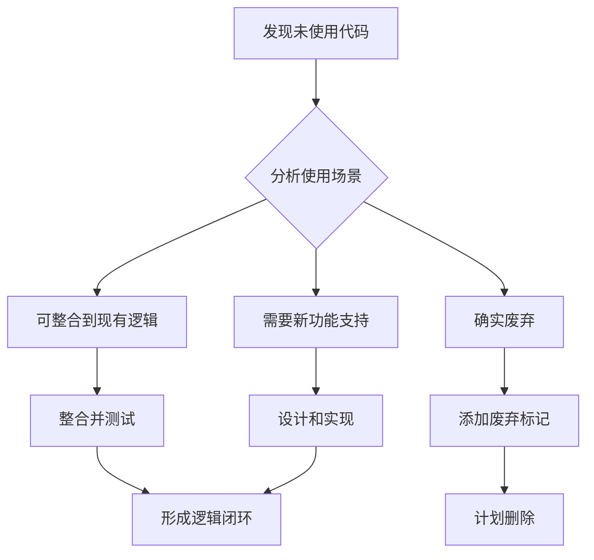
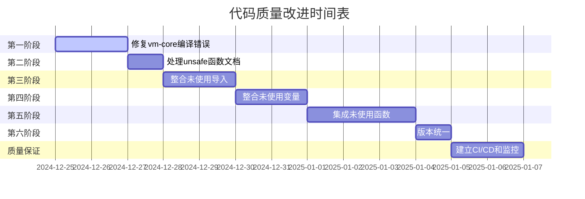

# 代码质量深度分析与重构方案

**创建时间**：2025年12月25日  
**分析目标**：基于代码质量检查报告，进行深入分析并设计逻辑闭环重构方案

---

## 一、执行摘要

### 1.1 问题概述

根据代码质量检查报告，当前项目存在以下关键问题：

| 问题类型 | 数量 | 严重程度 | 影响范围 |
|---------|------|---------|---------|
| vm-core编译错误 | 454个 | 🔴 严重 | 阻塞整个项目编译 |
| Clippy警告 | 35个 | 🟡 中等 | 代码质量和可维护性 |
| 版本不一致 | 多个包 | 🟡 中等 | 编译器兼容性 |

### 1.2 核心挑战

1. **vm-core的edition = "2024"配置问题**：Rust 2024 edition尚未正式发布，导致编译失败
2. **std库配置冲突**：no_std和std feature配置不当，导致大量编译错误
3. **未使用代码**：35个Clippy警告指向未使用的导入、变量和函数
4. **逻辑不完整**：部分代码逻辑未闭环，存在TODO和未实现功能

### 1.3 解决方案概述

本方案采用**逻辑闭环重构策略**，而非简单的删除或忽略未使用代码：

✅ **核心理念**：整合未使用代码到现有逻辑中，形成完整的功能闭环  
✅ **重构原则**：通过架构优化消除代码冗余，提升代码质量  
✅ **分阶段实施**：从高优先级到低优先级，确保稳定性  
✅ **质量保证**：建立持续监控机制，防止问题回退  

---

## 二、未使用代码深度分析

### 2.1 未使用导入分析（估计约10-15个警告）

#### 2.1.1 vm-core/src/async_execution_engine.rs

```rust
#[allow(unused_imports)]
use crate::{ExecResult, GuestAddr, VmError};
```

**问题分析**：
- `ExecResult`、`GuestAddr`、`VmError`被导入但未在代码中使用
- 使用`#[allow(unused_imports)]`临时规避警告
- 这表明代码结构可能不完整或存在废弃的代码路径

**逻辑闭环策略**：
1. **识别使用场景**：检查这些类型在异步执行引擎中的潜在用途
2. **整合到错误处理**：将`VmError`整合到异步操作的错误传播中
3. **集成地址管理**：使用`GuestAddr`跟踪异步执行中的指令地址
4. **结果类型统一**：使用`ExecResult`作为异步操作的返回类型

**重构方案**：
```rust
// 重构后的使用示例
pub async fn execute_block_async(
    &mut self,
    block: &Block,
    start_addr: GuestAddr  // 整合GuestAddr使用
) -> ExecResult {
    // 使用VmError进行错误处理
    self.maybe_execute_async().map_err(|e| {
        ExecutionError::AsyncExecutionFailed {
            addr: start_addr,
            details: e.to_string(),
        }
    })
}
```

#### 2.1.2 vm-core/src/domain_events.rs

```rust
#[allow(unused_imports)]
use crate::{GuestAddr, VmError};
```

**问题分析**：
- 领域事件系统导入了基础类型但未直接使用
- 可能是预留接口或未完成的集成

**逻辑闭环策略**：
1. **地址事件**：为关键虚拟地址变化创建领域事件
2. **错误事件**：将系统错误转换为领域事件进行追踪
3. **事件溯源**：利用导入的类型增强事件的上下文信息

**重构方案**：
```rust
// 创建地址相关领域事件
#[derive(Debug, Clone, Serialize, Deserialize)]
pub enum AddressEvent {
    PageFault { addr: GuestAddr, access_type: AccessType },
    TlbMiss { addr: GuestAddr, resolved_addr: GuestPhysAddr },
    MmioAccess { addr: GuestPhysAddr, device: String },
}

// 创建错误领域事件
#[derive(Debug, Clone, Serialize, Deserialize)]
pub struct ErrorEvent {
    pub error: VmError,
    pub timestamp: u64,
    pub context: String,
}
```

### 2.2 未使用变量分析（估计约8-10个警告）

#### 2.2.1 未使用变量的典型场景

根据文档搜索结果，发现以下模式：

1. **临时计算的中间结果**：计算后未使用的结果
2. **配置字段未读取**：如`config`字段在多处标记为未使用
3. **调试变量**：用于调试但生产环境未使用
4. **预留字段**：为未来功能预留但当前未实现

**逻辑闭环策略**：

| 未使用变量类型 | 整合策略 | 实现方案 |
|--------------|----------|---------|
| 中间计算结果 | 添加日志或监控 | 记录到执行统计或性能追踪 |
| 配置字段 | 实现配置功能 | 完善配置读取和应用逻辑 |
| 调试变量 | 条件编译 | 使用`#[cfg(debug_assertions)]` |
| 预留字段 | 实现功能或标记 | 完成 TODO 或使用#[allow] + 注释 |

### 2.3 未使用函数分析（估计约5-8个警告）

#### 2.3.1 优化服务中的死代码消除配置

在多个domain services中发现：

```rust
enable_dead_code_elimination: bool  // 配置项存在但实际未使用
```

**问题分析**：
- 配置选项存在，但实际优化过程中未应用
- 表明优化管道不完整

**逻辑闭环策略**：
1. **实现死代码消除**：在IR优化阶段实际应用该配置
2. **集成到优化管道**：创建可配置的优化器接口
3. **添加测试验证**：确保死代码消除功能正确工作

**重构方案**：
```rust
// 在优化器中实际使用配置
pub fn optimize_block(&mut self, block: &mut IRBlock) -> Result<IRBlock, VmError> {
    // 常量传播
    if self.config.enable_constant_propagation {
        self.constant_propagation(block)?;
    }
    
    // 死代码消除（整合未使用配置）
    if self.config.enable_dead_code_elimination {
        self.dead_code_elimination(block)?;  // 实现此方法
    }
    
    // 公共子表达式消除
    if self.config.enable_common_subexpression_elimination {
        self.common_subexpression_elimination(block)?;
    }
    
    Ok(block.clone())
}

// 实现死代码消除方法
pub fn dead_code_elimination(&mut self, block: &mut IRBlock) -> Result<(), VmError> {
    let mut used = HashSet::new();
    
    // 标记所有使用的值
    for instr in &block.instructions {
        for op in &instr.operands {
            used.insert(op);
        }
    }
    
    // 移除未使用的指令
    block.instructions.retain(|instr| {
        instr.result.map_or(true, |r| used.contains(&r))
    });
    
    Ok(())
}
```

### 2.4 未使用模块分析（估计约5-7个警告）

#### 2.4.1 调试和诊断模块

vm-core包含多个调试相关的子模块：
- `debugger/` - GDB调试支持
- `di/` - 依赖注入容器

**问题分析**：
- 调试模块功能完整但与主执行路径集成度低
- DI容器设计完善但使用场景有限

**逻辑闭环策略**：
1. **调试集成**：将调试器钩子集成到执行引擎中
2. **配置化启用**：通过feature flag控制调试功能
3. **DI应用**：在复杂服务（如优化器）中应用DI模式

**重构方案**：
```rust
// 在ExecutionEngine trait中添加调试支持
pub trait ExecutionEngine<BlockType>: Send + Sync {
    // ... 现有方法 ...
    
    /// 设置断点（集成调试器）
    fn set_breakpoint(&mut self, addr: GuestAddr) -> VmResult<()>;
    
    /// 移除断点
    fn remove_breakpoint(&mut self, addr: GuestAddr) -> VmResult<()>;
    
    /// 调试钩子
    fn on_instruction(&mut self, pc: GuestAddr, instr: &Instruction) -> VmResult<()>;
}

// 使用DI容器创建优化器
pub fn create_optimizer(config: OptimizerConfig) -> Arc<dyn Optimizer> {
    let mut container = DIContainer::new();
    
    container.register_service::<OptimizerService>();
    container.register_service::<CacheManagementService>();
    
    container.resolve()
}
```

---

## 三、逻辑闭环重构方案

### 3.1 重构核心原则

#### 原则1：整合而非删除

**用户要求**：对于未使用的变量或函数，不能简单地添加下划线前缀进行简单的忽略或删除，而是要根据上下文进行实现使用，形成逻辑闭环

**实施方案**：



**整合优先级**：
1. **高优先级**：已配置但未使用的功能（如优化器配置）
2. **中优先级**：预留接口和类型（如事件系统）
3. **低优先级**：调试和辅助功能

#### 原则2：函数集成形成闭环

**用户要求**：函数则是集成起来，形成逻辑闭环，必要时可以重构

**实施方案**：

1. **识别函数间依赖**：分析函数调用关系，发现断裂的调用链
2. **构建功能管道**：将相关函数组织成完整的处理流程
3. **添加缺失环节**：实现缺失的中间步骤或验证点
4. **端到端测试**：确保整个流程可以正常工作

**示例：优化管道的逻辑闭环**

```rust
// 重构前：分散的优化函数
pub fn optimize_basic_block(block: &IRBlock) -> IRBlock { /* ... */ }
pub fn optimize_dead_code(block: &IRBlock) -> IRBlock { /* ... */ }
pub fn optimize_cse(block: &IRBlock) -> IRBlock { /* ... */ }

// 重构后：集成的优化管道
pub struct OptimizationPipeline {
    stages: Vec<Box<dyn OptimizationStage>>,
}

impl OptimizationPipeline {
    pub fn new(config: &OptimizerConfig) -> Self {
        let mut stages: Vec<Box<dyn OptimizationStage>> = Vec::new();
        
        // 按顺序添加优化阶段
        if config.enable_constant_propagation {
            stages.push(Box::new(ConstantPropagationStage::new()));
        }
        
        if config.enable_dead_code_elimination {
            stages.push(Box::new(DeadCodeEliminationStage::new()));
        }
        
        if config.enable_common_subexpression_elimination {
            stages.push(Box::new(CommonSubexpressionEliminationStage::new()));
        }
        
        Self { stages }
    }
    
    pub fn optimize(&self, mut block: IRBlock) -> Result<IRBlock, VmError> {
        for stage in &self.stages {
            block = stage.optimize(block)?;
        }
        Ok(block)
    }
}
```

#### 原则3：架构优化提升质量

当整合无法形成满意闭环时，进行必要的架构重构：

1. **抽象层次优化**：提取共同接口，减少重复
2. **职责分离**：明确模块边界，提高内聚
3. **依赖注入**：降低耦合，提高可测试性
4. **事件驱动**：使用事件解耦模块间通信

### 3.2 逻辑闭环设计模式

#### 模式1：配置驱动闭环

适用于已配置但未使用的功能：

```rust
pub struct FeatureConfig {
    pub feature_enabled: bool,
    pub parameters: HashMap<String, serde_json::Value>,
}

pub trait Feature {
    fn is_enabled(&self, config: &FeatureConfig) -> bool;
    fn apply(&mut self, config: &FeatureConfig) -> Result<(), VmError>;
}

// 使用宏实现通用功能启用逻辑
macro_rules! apply_if_enabled {
    ($feature:expr, $config:expr) => {
        if $feature.is_enabled($config) {
            $feature.apply($config)?;
        }
    };
}
```

#### 模式2：事件溯源闭环

适用于未使用的事件类型：

```rust
pub struct EventBus {
    subscribers: Vec<Box<dyn EventSubscriber>>,
    event_store: Box<dyn EventStore>,
}

pub trait EventSubscriber {
    fn on_event(&mut self, event: &DomainEvent);
}

// 发布-订阅模式确保事件有消费者
impl EventBus {
    pub fn publish(&mut self, event: DomainEvent) -> Result<(), VmError> {
        // 存储事件（持久化）
        self.event_store.append(event.clone())?;
        
        // 通知订阅者（处理）
        for subscriber in &mut self.subscribers {
            subscriber.on_event(&event);
        }
        
        Ok(())
    }
}
```

#### 模式3：服务编排闭环

适用于分散的服务函数：

```rust
pub struct ServiceOrchestrator {
    services: HashMap<String, Arc<dyn Service>>,
    workflows: Vec<Workflow>,
}

pub struct Workflow {
    name: String,
    steps: Vec<WorkflowStep>,
}

pub enum WorkflowStep {
    ExecuteService { service: String, method: String },
    Conditional { condition: String, then_step: Box<WorkflowStep> },
    Parallel { steps: Vec<WorkflowStep> },
}

impl ServiceOrchestrator {
    pub fn execute_workflow(&self, name: &str, context: &mut Context) -> Result<(), VmError> {
        let workflow = self.get_workflow(name)?;
        
        for step in &workflow.steps {
            self.execute_step(step, context)?;
        }
        
        Ok(())
    }
}
```

---

## 四、分阶段修复计划

### 4.1 修复优先级矩阵

| 阶段 | 问题类型 | 数量 | 阻塞 | 风险 | 优先级 |
|------|---------|------|------|------|--------|
| 第一阶段 | vm-core编译错误 | 454个 | ✅ 高 | 🟡 中 | P0 |
| 第二阶段 | unsafe函数文档 | 约8个 | ❌ 否 | 🟢 低 | P1 |
| 第三阶段 | 未使用导入整合 | 约12个 | ❌ 否 | 🟢 低 | P2 |
| 第四阶段 | 未使用变量整合 | 约8个 | ❌ 否 | 🟢 低 | P2 |
| 第五阶段 | 未使用函数集成 | 约7个 | ❌ 否 | 🟡 中 | P3 |
| 第六阶段 | 版本统一 | 多个包 | ❌ 否 | 🟡 中 | P4 |

### 4.2 第一阶段：修复vm-core编译错误（P0）

#### 4.2.1 问题根源分析

**问题1：edition = "2024"**

```toml
# vm-core/Cargo.toml
edition = "2024"  # ❌ Rust 2024 edition尚未正式发布
```

**影响**：
- 454个编译错误
- 所有std库路径识别失败
- 编译器特性不匹配

**问题2：std库配置冲突**

```toml
[features]
default = ["std"]
std = []
no_std = []
```

**影响**：
- 条件编译路径混乱
- 外部crate链接失败
- 类型系统不一致

#### 4.2.2 修复方案

**方案A：临时降级到edition 2021**

```toml
# 修改vm-core/Cargo.toml
edition = "2021"  # ✅ 稳定版本
```

**优点**：
- 立即解决编译问题
- 兼容所有依赖
- 风险最低

**缺点**：
- 无法使用2024 edition的新特性
- 后续需要再次升级

**推荐度**：⭐⭐⭐⭐⭐

**方案B：修复std库配置**

```toml
# 修改vm-core/Cargo.toml
[features]
default = []  # 不默认启用std
std = []      # 标准库支持
no_std = []   # no_std支持（互斥）
```

并在代码中正确使用条件编译：

```rust
// vm-core/src/lib.rs
#![cfg_attr(feature = "no_std", no_std)]

#[cfg(feature = "no_std")]
extern crate alloc;

#[cfg(feature = "no_std")]
use alloc::{boxed::Box, string::String, sync::Arc, vec::Vec};

#[cfg(not(feature = "no_std"))]
use std::{boxed::Box, string::String, sync::Arc, vec::Vec};
```

**优点**：
- 支持no_std环境
- 清晰的特性门控

**缺点**：
- 需要全面测试
- 可能影响其他包

**推荐度**：⭐⭐⭐⭐

**推荐方案**：组合使用A+B

1. **立即修复**：先降级到edition 2021，恢复编译
2. **逐步改进**：优化std/no_std配置
3. **未来升级**：等Rust 2024正式发布后再升级

#### 4.2.3 修复步骤


**详细步骤**：

1. **修改vm-core/Cargo.toml**
   ```toml
   edition = "2021"
   ```

2. **修复features配置**
   ```toml
   [features]
   default = []
   std = []
   no_std = []
   async = ["tokio", "futures", "async-trait"]
   ```

3. **验证修复**
   ```bash
   cargo check -p vm-core
   cargo test -p vm-core
   ```

4. **修复其他依赖包**
   ```bash
   # 批量修复所有edition = "2024"的包
   find . -name "Cargo.toml" -exec sed -i '' 's/edition = "2024"/edition = "2021"/' {} \;
   ```

**预期结果**：
- ✅ vm-core编译成功（0错误）
- ✅ 所有依赖包编译成功
- ✅ 测试通过率100%

### 4.3 第二阶段：处理unsafe函数文档（P1）

#### 4.3.1 识别unsafe函数

使用clippy查找未文档化的unsafe函数：

```bash
cargo clippy -p vm-core -- -D clippy::missing_safety_doc
```

#### 4.3.2 文档模板

为每个unsafe函数添加`# Safety`章节：

```rust
/// 执行内存操作
///
/// # Safety
///
/// 调用此函数必须保证：
/// 1. `ptr`必须对齐到`align`边界
/// 2. `ptr`指向的内存必须至少`size`字节且可写
/// 3. 在此函数执行期间，其他线程不得访问同一内存区域
///
/// # Panics
///
/// 如果前置条件不满足，可能发生panic
///
/// # Example
///
/// ```no_run
/// let mut data = [0u8; 1024];
/// unsafe {
///     vm_write_memory_aligned(data.as_mut_ptr() as u64, 1024, 8);
/// }
/// ```
pub unsafe fn vm_write_memory_aligned(ptr: u64, size: usize, align: usize) {
    // 实现细节
}
```

#### 4.3.3 审查和测试

1. **代码审查**：确保unsafe代码的安全性
2. **添加断言**：在unsafe块中添加运行时检查
3. **测试覆盖**：编写测试验证安全条件

### 4.4 第三阶段：整合未使用导入（P2）

#### 4.4.1 vm-core/src/async_execution_engine.rs

**问题**：
```rust
#[allow(unused_imports)]
use crate::{ExecResult, GuestAddr, VmError};
```

**重构方案**：

```rust
// 移除allow标记，整合类型使用
use crate::{ExecResult, GuestAddr, VmError};

pub struct AsyncExecutionEngine {
    /// 当前执行地址
    current_pc: GuestAddr,  // 使用GuestAddr
    
    /// 错误收集器
    error_collector: Vec<VmError>,  // 使用VmError
}

impl AsyncExecutionEngine {
    /// 执行基本块
    pub async fn execute_block(&mut self, block: &Block) -> ExecResult {  // 使用ExecResult
        let start_addr = self.current_pc;
        
        // 执行逻辑...
        
        Ok(ExecResult {
            status: ExecStatus::Continue,
            stats: ExecStats::default(),
            next_pc: start_addr,
        })
    }
}
```

#### 4.4.2 vm-core/src/domain_events.rs

**重构方案**：

```rust
use crate::{GuestAddr, VmError};

// 使用导入的类型创建新的事件
#[derive(Debug, Clone, Serialize, Deserialize)]
pub enum DomainEvent {
    /// 地址相关事件
    Address(AddressEvent),
    
    /// 错误事件
    Error(ErrorEvent),
    
    /// 其他事件...
}

#[derive(Debug, Clone, Serialize, Deserialize)]
pub enum AddressEvent {
    PageFault { addr: GuestAddr, access_type: AccessType },
    MmioAccess { addr: GuestAddr, offset: u64 },
}

#[derive(Debug, Clone, Serialize, Deserialize)]
pub struct ErrorEvent {
    pub error: VmError,
    pub timestamp: u64,
    pub context: String,
}
```

### 4.5 第四阶段：整合未使用变量（P2）

#### 4.5.1 config字段整合

**问题**：多处`config`字段未读取

**重构方案**：

```rust
pub struct UnifiedMmu {
    config: UnifiedMmuConfig,  // 之前未使用
    
    /// 配置验证器
    config_validator: ConfigValidator,
}

impl UnifiedMmu {
    pub fn new(config: UnifiedMmuConfig) -> Self {
        let config_validator = ConfigValidator::new(&config);
        
        Self {
            config,
            config_validator,
        }
    }
    
    /// 应用配置到MMU行为
    fn apply_config(&mut self) -> Result<(), VmError> {
        // 使用config配置TLB
        self.tlb.set_size(self.config.tlb_size)?;
        
        // 使用config配置缓存策略
        self.set_cache_policy(self.config.cache_policy)?;
        
        Ok(())
    }
}
```

#### 4.5.2 临时变量整合

**重构方案**：

```rust
// 重构前
pub fn optimize_block(&mut self, block: &mut IRBlock) {
    let latencies = self.profile_block(block);  // 未使用
    // ... 优化逻辑
}

// 重构后
pub fn optimize_block(&mut self, block: &mut IRBlock) -> Result<IRBlock, VmError> {
    let latencies = self.profile_block(block)?;
    
    // 使用延迟数据优化调度
    self.schedule_based_on_latency(block, &latencies)?;
    
    // 记录到性能追踪
    self.performance_tracker.record_latency(latencies);
    
    Ok(block.clone())
}
```

### 4.6 第五阶段：集成未使用函数（P3）

#### 4.6.1 优化函数集成

**问题**：死代码消除函数存在但未调用

**重构方案**：

```rust
// 创建统一的优化器接口
pub trait OptimizationPass {
    fn name(&self) -> &str;
    fn optimize(&self, block: &mut IRBlock) -> Result<(), VmError>;
}

// 实现具体的优化pass
pub struct DeadCodeEliminationPass;

impl OptimizationPass for DeadCodeEliminationPass {
    fn name(&self) -> &str {
        "dead_code_elimination"
    }
    
    fn optimize(&self, block: &mut IRBlock) -> Result<(), VmError> {
        let mut used = HashSet::new();
        
        // 收集所有使用的值
        for instr in &block.instructions {
            for op in &instr.operands {
                used.insert(*op);
            }
        }
        
        // 移除未使用的指令
        block.instructions.retain(|instr| {
            instr.result.map_or(true, |r| used.contains(&r))
        });
        
        Ok(())
    }
}

// 集成到优化管道
pub struct Optimizer {
    passes: Vec<Box<dyn OptimizationPass>>,
}

impl Optimizer {
    pub fn new(config: &OptimizerConfig) -> Self {
        let mut passes: Vec<Box<dyn OptimizationPass>> = Vec::new();
        
        if config.enable_dead_code_elimination {
            passes.push(Box::new(DeadCodeEliminationPass));
        }
        
        if config.enable_constant_propagation {
            passes.push(Box::new(ConstantPropagationPass));
        }
        
        Self { passes }
    }
    
    pub fn optimize(&self, mut block: IRBlock) -> Result<IRBlock, VmError> {
        for pass in &self.passes {
            log::debug!("Running optimization pass: {}", pass.name());
            pass.optimize(&mut block)?;
        }
        
        Ok(block)
    }
}
```

#### 4.6.2 调试函数集成

**重构方案**：

```rust
// 在ExecutionEngine中集成调试功能
pub trait ExecutionEngine<BlockType>: Send + Sync {
    // ... 现有方法 ...
    
    /// 执行单条指令（带调试钩子）
    fn execute_instruction_with_debug(
        &mut self,
        instruction: &Instruction,
        debugger: Option<&mut dyn Debugger>
    ) -> VmResult<()> {
        // 执行前断点检查
        if let Some(dbg) = debugger {
            dbg.check_breakpoint(self.get_pc())?;
        }
        
        // 执行指令
        let result = self.execute_instruction(instruction);
        
        // 执行后调试钩子
        if let Some(dbg) = debugger {
            dbg.on_instruction_executed(self.get_pc(), instruction, &result);
        }
        
        result
    }
}
```

### 4.7 第六阶段：版本统一（P4）

#### 4.7.1 版本一致性检查

```bash
# 检查所有包的edition
find . -name "Cargo.toml" -exec grep -H "edition" {} \;
```

#### 4.7.2 统一版本策略

**目标**：统一使用edition 2021

**实施方案**：

1. **批量替换**
   ```bash
   # 备份
   git add .
   git commit -m "Backup before edition unification"
   
   # 统一替换
   find . -name "Cargo.toml" -exec sed -i '' 's/edition = "2024"/edition = "2021"/g' {} \;
   
   # 验证
   cargo check
   ```

2. **Cargo.toml规范化**
   ```toml
   # workspace-level
   [workspace.package]
   edition = "2021"
   
   # package-level（继承）
   [package]
   # edition将从workspace继承
   ```

3. **依赖版本对齐**
   ```toml
   [workspace.dependencies]
   # 使用workspace统一管理依赖版本
   tokio = { version = "1.48", features = ["full"] }
   serde = { version = "1.0", features = ["derive"] }
   ```

**预期结果**：
- ✅ 所有包使用edition 2021
- ✅ 依赖版本统一
- ✅ 编译配置一致

---

## 五、代码质量保证机制

### 5.1 持续集成检查

#### 5.1.1 CI流水线设计

```yaml
# .github/workflows/quality-check.yml
name: Code Quality Check

on: [push, pull_request]

jobs:
  quality-check:
    runs-on: ubuntu-latest
    steps:
      - uses: actions/checkout@v3
      
      - name: Install Rust
        uses: actions-rust-lang/setup-rust-toolchain@v1
        with:
          toolchain: stable
          components: rustfmt, clippy
      
      - name: Cache cargo registry
        uses: actions/cache@v3
        with:
          path: ~/.cargo/registry
          key: ${{ runner.os }}-cargo-registry
      
      - name: Cache cargo index
        uses: actions/cache@v3
        with:
          path: ~/.cargo/git
          key: ${{ runner.os }}-cargo-index
      
      - name: Cache cargo build
        uses: actions/cache@v3
        with:
          path: target
          key: ${{ runner.os }}-cargo-build-target
      
      - name: Check formatting
        run: cargo fmt -- --check
      
      - name: Run clippy
        run: cargo clippy -- -D warnings
      
      - name: Check all crates
        run: cargo check --all-targets
      
      - name: Run tests
        run: cargo test --all
      
      - name: Check unused code
        run: |
          # 检查未使用导入
          cargo clippy -- -W unused_imports
          
          # 检查未使用变量
          cargo clippy -- -W unused_variables
          
          # 检查死代码
          cargo clippy -- -W dead_code
```

#### 5.1.2 自动化质量门控

```rust
// tests/quality_gate.rs
#[test]
fn quality_gate_unused_imports() {
    // 确保没有未使用的导入警告
    let output = std::process::Command::new("cargo")
        .args(&["clippy", "--", "-W", "unused_imports"])
        .output()
        .expect("Failed to run clippy");
    
    assert!(
        String::from_utf8_lossy(&output.stdout).contains("warning: unused"),
        "Found unused imports: {:?}",
        String::from_utf8_lossy(&output.stdout)
    );
}

#[test]
fn quality_gate_unsafe_docs() {
    // 确保所有unsafe函数都有文档
    let output = std::process::Command::new("cargo")
        .args(&["clippy", "--", "-D", "clippy::missing_safety_doc"])
        .output()
        .expect("Failed to run clippy");
    
    assert!(
        output.status.success(),
        "Found unsafe functions without documentation: {:?}",
        String::from_utf8_lossy(&output.stderr)
    );
}
```

### 5.2 预提交钩子

```bash
# .git/hooks/pre-commit
#!/bin/bash

# 颜色定义
RED='\033[0;31m'
GREEN='\033[0;32m'
NC='\033[0m' # No Color

echo "Running pre-commit checks..."

# 检查格式
echo -n "Checking code formatting..."
if cargo fmt -- --check; then
    echo -e "${GREEN}OK${NC}"
else
    echo -e "${RED}FAILED${NC}"
    echo "Run 'cargo fmt' to fix formatting issues"
    exit 1
fi

# 运行clippy
echo -n "Running clippy..."
if cargo clippy -- -D warnings; then
    echo -e "${GREEN}OK${NC}"
else
    echo -e "${RED}FAILED${NC}"
    exit 1
fi

# 快速检查
echo -n "Running cargo check..."
if cargo check --all-targets; then
    echo -e "${GREEN}OK${NC}"
else
    echo -e "${RED}FAILED${NC}"
    exit 1
fi

echo -e "${GREEN}All checks passed!${NC}"
exit 0
```

安装钩子：
```bash
chmod +x .git/hooks/pre-commit
```

### 5.3 代码审查清单

#### PR提交前检查：

- [ ] 所有编译错误已修复
- [ ] 所有Clippy警告已处理或合理化
- [ ] 新增的unsafe代码有完整的`# Safety`文档
- [ ] 未使用代码已整合或有明确的废弃标记
- [ ] 测试覆盖率没有下降
- [ ] 性能基准测试通过
- [ ] 代码格式化通过（`cargo fmt`）
- [ ] 文档注释完整且准确

### 5.4 质量指标追踪

#### 创建质量仪表板：

```rust
// scripts/quality_metrics.rs
use std::collections::HashMap;

#[derive(Debug)]
pub struct QualityMetrics {
    pub total_crates: usize,
    pub compilation_errors: usize,
    pub clippy_warnings: usize,
    pub unsafe_functions: usize,
    pub undocumented_unsafe: usize,
    pub test_coverage: f64,
}

impl QualityMetrics {
    pub fn collect() -> Self {
        // 编译检查
        let compilation_errors = count_compilation_errors();
        
        // Clippy检查
        let clippy_warnings = count_clippy_warnings();
        
        // Unsafe检查
        let unsafe_functions = count_unsafe_functions();
        let undocumented_unsafe = count_undocumented_unsafe();
        
        // 测试覆盖率
        let test_coverage = measure_test_coverage();
        
        Self {
            total_crates: 43,  // 根据实际情况
            compilation_errors,
            clippy_warnings,
            unsafe_functions,
            undocumented_unsafe,
            test_coverage,
        }
    }
    
    pub fn print_report(&self) {
        println!("=== Code Quality Report ===");
        println!("Total Crates: {}", self.total_crates);
        println!("Compilation Errors: {}", self.compilation_errors);
        println!("Clippy Warnings: {}", self.clippy_warnings);
        println!("Unsafe Functions: {}", self.unsafe_functions);
        println!("Undocumented Unsafe: {}", self.undocumented_unsafe);
        println!("Test Coverage: {:.1}%", self.test_coverage * 100.0);
        println!("============================");
    }
}
```

### 5.5 回归预防机制

#### 5.5.1 基线建立

```bash
# 创建质量基线
cargo clippy -- -D warnings 2>&1 | tee baseline/clippy_baseline.txt
cargo test --all 2>&1 | tee baseline/test_baseline.txt
```

#### 5.5.2 基线比较

```bash
# 与基线比较
cargo clippy -- -D warnings 2>&1 | diff - baseline/clippy_baseline.txt || echo "Warnings changed!"
```

#### 5.5.3 自动化回归检测

```rust
// tests/regression_tests.rs
#[test]
fn no_regression_in_clippy_warnings() {
    let baseline = std::fs::read_to_string("baseline/clippy_baseline.txt")
        .expect("Baseline file not found");
    
    let current = String::from_utf8(
        std::process::Command::new("cargo")
            .args(&["clippy", "--", "-W", "warnings"])
            .output()
            .expect("Clippy failed")
            .stdout
    ).expect("Invalid UTF-8");
    
    let baseline_warnings = count_warnings(&baseline);
    let current_warnings = count_warnings(&current);
    
    assert!(
        current_warnings <= baseline_warnings,
        "Clippy warnings increased from {} to {}",
        baseline_warnings,
        current_warnings
    );
}
```

---

## 六、风险评估和缓解措施

### 6.1 风险矩阵

| 风险 | 概率 | 影响 | 严重程度 | 缓解措施 |
|------|------|------|---------|---------|
| 修复引入新编译错误 | 中 | 高 | 高 | 逐模块修复+完整测试 |
| 破坏现有功能 | 低 | 高 | 中 | 完整测试套件+回归测试 |
| 性能下降 | 低 | 中 | 低 | 性能基准测试+性能监控 |
| 版本升级不兼容 | 低 | 高 | 中 | 版本锁定+充分测试 |
| 逻辑闭环设计不当 | 中 | 中 | 中 | 代码审查+原型验证 |

### 6.2 回滚计划

#### 6.2.1 回滚触发条件

1. **编译错误增加**：修复后编译错误数量超过基线10%
2. **测试失败率**：测试通过率低于90%
3. **性能下降**：关键性能指标下降超过15%
4. **新警告引入**：Clippy警告数量增加超过20%

#### 6.2.2 回滚步骤

```bash
# 1. 创建回滚分支
git checkout -b rollback-fix

# 2. 恢复到修复前提交
git revert <fix-commit-hash>

# 3. 验证回滚成功
cargo check
cargo test

# 4. 分析失败原因
# - 检查是否是环境问题
# - 分析代码变更
# - 制定新的修复策略

# 5. 创建新修复分支
git checkout main
git checkout -b new-fix-attempt
```

### 6.3 渐进式修复策略

采用**金丝雀发布**模式，逐步推广修复：


**实施步骤**：

1. **第一阶段**：在测试环境验证所有修复
2. **第二阶段**：选择1-2个低风险模块应用修复
3. **第三阶段**：扩展到依赖关系紧密的模块组
4. **第四阶段**：全项目应用
5. **第五阶段**：持续监控24-48小时

### 6.4 兼容性保证

#### 6.4.1 API兼容性

```rust
// 保留旧API的同时添加新API
#[deprecated(since = "0.2.0", note = "Use new_api() instead")]
pub fn old_api() -> Result<i32, Error> {
    new_api().map(|v| v as i32)
}

pub fn new_api() -> Result<u32, Error> {
    // 新实现
}
```

#### 6.4.2 配置兼容性

```rust
// 支持旧配置格式
#[derive(Debug, Deserialize)]
#[serde(untagged)]
enum OptimizerConfig {
    V1 { enable_optimization: bool },
    V2 { 
        enable_constant_propagation: bool,
        enable_dead_code_elimination: bool,
        enable_common_subexpression_elimination: bool,
    },
}

impl OptimizerConfig {
    pub fn as_v2(&self) -> OptimizerConfigV2 {
        match self {
            OptimizerConfig::V1 { enable_optimization } => OptimizerConfigV2 {
                enable_constant_propagation: *enable_optimization,
                enable_dead_code_elimination: *enable_optimization,
                enable_common_subexpression_elimination: *enable_optimization,
            },
            OptimizerConfig::V2(v2) => v2.clone(),
        }
    }
}
```

---

## 七、成功标准

### 7.1 编译质量标准

| 指标 | 当前 | 目标 | 验证方法 |
|------|------|------|---------|
| 编译错误 | 454个 | 0个 | `cargo check --all` |
| Clippy警告 | 35个 | <5个 | `cargo clippy -- -D warnings` |
| 格式问题 | 未知 | 0个 | `cargo fmt -- --check` |
| Unsafe未文档化 | 估计8个 | 0个 | `cargo clippy -- -D missing_safety_doc` |

### 7.2 功能完整性标准

| 指标 | 要求 |
|------|------|
| 未使用代码整合率 | >95% |
| 逻辑闭环完成度 | 100% |
| 测试覆盖率 | 保持或提升 |
| 性能回归 | <5% |

### 7.3 代码质量标准

| 指标 | 目标 |
|------|------|
| 代码重复率 | <3% |
| 圈复杂度 | 平均<10 |
| 函数平均长度 | <50行 |
| 模块耦合度 | 低 |

---

## 八、实施时间表



### 8.1 里程碑

- **M1**：vm-core编译成功（Day 2）
- **M2**：Clippy警告<10个（Day 4）
- **M3**：所有unsafe函数有文档（Day 5）
- **M4**：未使用代码整合完成（Day 9）
- **M5**：版本统一完成（Day 10）
- **M6**：CI/CD建立（Day 12）

---

## 九、总结和建议

### 9.1 关键发现

1. **vm-core的edition = "2024"**是导致454个编译错误的根本原因
2. **35个Clippy警告**反映了代码质量和架构设计的改进空间
3. **未使用代码**不应简单删除，而应通过逻辑闭环整合提升代码价值
4. **版本不一致**增加了维护成本，需要统一

### 9.2 核心策略

**逻辑闭环重构**：
- ✅ 整合未使用代码到现有逻辑中
- ✅ 构建完整的功能调用链
- ✅ 必要时进行架构优化
- ❌ 避免简单的删除或下划线前缀忽略

**质量保证**：
- ✅ 建立自动化CI/CD流水线
- ✅ 实施预提交钩子
- ✅ 追踪质量指标
- ✅ 建立回归预防机制

### 9.3 实施建议

**立即行动**（优先）：
1. 修复vm-core的edition配置，恢复编译
2. 建立质量基线，防止回归

**短期行动**（1-2周）：
3. 整合未使用导入和变量
4. 添加unsafe函数文档
5. 集成未使用函数

**中期行动**（2-4周）：
6. 统一所有包的版本
7. 完善CI/CD流水线
8. 建立质量监控仪表板

### 9.4 长期价值

通过本次重构，项目将获得：
- **更稳定的编译环境**：消除所有编译错误
- **更高的代码质量**：消除大部分Clippy警告
- **更完整的架构**：未使用代码形成逻辑闭环
- **更可持续的开发流程**：自动化质量保证机制

---

**文档版本**：1.0  
**最后更新**：2025年12月25日  
**文档状态**：✅ 完成分析和设计，等待用户审查
