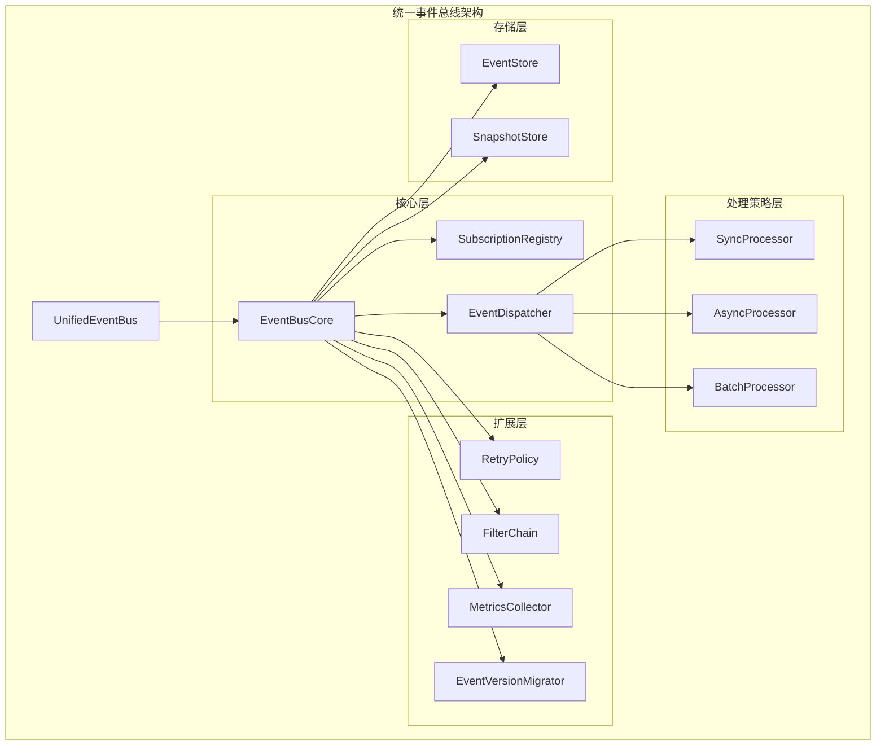
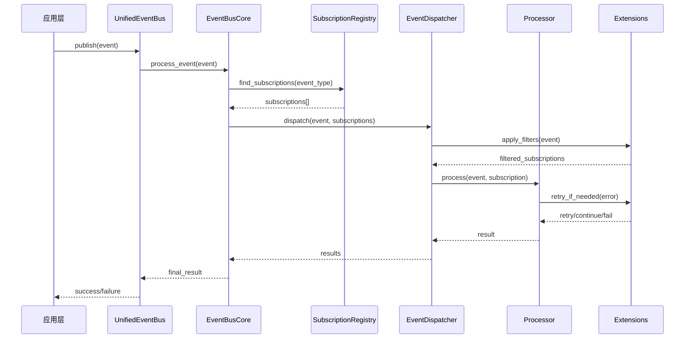

# VM项目统一事件总线架构分析报告

## 1. 整体架构设计和组件关系

### 1.1 架构概览

统一事件总线采用分层架构设计，共分为四个主要层次：

```
┌─────────────────────────────────────────────────────────────┐
│                    应用层 (Application Layer)                │
├─────────────────────────────────────────────────────────────┤
│                    扩展层 (Extension Layer)                   │
│  ┌─────────────┐ ┌─────────────┐ ┌─────────────┐ ┌─────────┐ │
│  │ RetryPolicy │ │ FilterChain │ │ MetricsColl │ │VersionM │ │
│  └─────────────┘ └─────────────┘ └─────────────┘ └─────────┘ │
├─────────────────────────────────────────────────────────────┤
│                   处理策略层 (Processing Layer)              │
│  ┌─────────────┐ ┌─────────────┐ ┌─────────────┐             │
│  │SyncProcessor│ │AsyncProcessor│ │BatchProcessor│             │
│  └─────────────┘ └─────────────┘ └─────────────┘             │
├─────────────────────────────────────────────────────────────┤
│                     核心层 (Core Layer)                      │
│  ┌─────────────┐ ┌─────────────┐ ┌─────────────┐             │
│  │EventBusCore │ │SubscriptionR │ │EventDispatch │             │
│  │             │ │egistry      │ │er           │             │
│  └─────────────┘ └─────────────┘ └─────────────┘             │
├─────────────────────────────────────────────────────────────┤
│                    存储层 (Storage Layer)                    │
│  ┌─────────────┐ ┌─────────────┐                             │
│  │ EventStore  │ │SnapshotStore │                             │
│  └─────────────┘ └─────────────┘                             │
└─────────────────────────────────────────────────────────────┘
```

### 1.2 组件关系图



### 1.3 数据流向

1. **事件发布流程**：
   - 应用层通过 [`UnifiedEventBus::publish()`](docs/unified_event_bus_design.md:174) 发布事件
   - [`EventBusCore`](docs/unified_event_bus_design.md:132) 接收事件并进行预处理
   - [`SubscriptionRegistry`](docs/unified_event_bus_design.md:141) 查找匹配的订阅者
   - [`EventDispatcher`](docs/unified_event_bus_design.md:150) 根据配置选择合适的处理器
   - 处理器（Sync/Async/Batch）执行事件处理
   - 扩展组件（重试、过滤、监控）在处理过程中提供支持

2. **订阅管理流程**：
   - 应用层通过 [`UnifiedEventBus::subscribe()`](docs/unified_event_bus_design.md:181) 订阅事件
   - [`SubscriptionRegistry`](docs/unified_event_bus_design.md:141) 管理订阅信息
   - 支持动态添加/删除订阅
   - 支持优先级排序和过滤

## 2. 核心组件的职责和接口设计

### 2.1 EventBusCore

**职责**：
- 管理订阅注册表
- 协调事件分发
- 处理配置变更
- 提供统一的错误处理

**关键接口设计**：
```rust
pub struct EventBusCore {
    registry: Arc<SubscriptionRegistry>,
    dispatcher: Arc<EventDispatcher>,
    config: EventBusConfig,
    metrics: Arc<MetricsCollector>,
}

impl EventBusCore {
    pub fn new() -> Self { /* ... */ }
    pub fn with_config(config: EventBusConfig) -> Self { /* ... */ }
    
    // 核心事件处理
    pub fn process_event(&self, event: DomainEventEnum) -> VmResult<()> { /* ... */ }
    
    // 订阅管理
    pub fn add_subscription(&self, subscription: Subscription) -> VmResult<EventSubscriptionId> { /* ... */ }
    pub fn remove_subscription(&self, id: EventSubscriptionId) -> VmResult<()> { /* ... */ }
    
    // 配置管理
    pub fn update_config(&mut self, config: EventBusConfig) -> VmResult<()> { /* ... */ }
    
    // 统计信息
    pub fn get_stats(&self) -> EventBusStats { /* ... */ }
}
```

### 2.2 SubscriptionRegistry

**职责**：
- 管理所有事件订阅信息
- 支持按事件类型快速查找
- 支持优先级排序
- 线程安全的并发访问
- 支持动态添加和删除订阅

**关键特性**：
- 使用 [`RwLock<HashMap<String, Vec<Subscription>>>`](vm-core/src/domain_event_bus.rs:44) 存储订阅
- 支持事件过滤器和优先级
- 提供 O(1) 的事件类型查找
- 线程安全的订阅管理

**优化设计**：
```rust
// 无锁订阅注册表（性能优化版本）
pub struct LockFreeSubscriptionRegistry {
    subscriptions: AtomicPtr<HashMap<String, Vec<Subscription>>>,
    version: AtomicU64,
}

// 分片订阅注册表（并发优化版本）
pub struct ShardedSubscriptionRegistry {
    shards: Vec<RwLock<HashMap<String, Vec<Subscription>>>>,
    shard_count: usize,
}
```

### 2.3 EventDispatcher

**职责**：
- 将事件路由到正确的处理器
- 支持多种分发策略
- 支持事件过滤
- 支持异步分发
- 支持批处理分发

**关键接口设计**：
```rust
pub trait EventDispatcher: Send + Sync {
    fn dispatch(&self, event: DomainEventEnum, subscriptions: &[Subscription]) -> VmResult<()>;
    fn dispatch_async(&self, event: DomainEventEnum, subscriptions: &[Subscription]) -> Pin<Box<dyn Future<Output = VmResult<()>> + Send>>;
    fn dispatch_batch(&self, events: Vec<DomainEventEnum>, subscriptions: &[Subscription]) -> VmResult<()>;
}

pub struct DefaultEventDispatcher {
    processors: HashMap<ProcessingMode, Box<dyn EventProcessor>>,
    filter_chain: FilterChain,
    retry_policy: RetryPolicy,
}
```

### 2.4 UnifiedEventBus

**职责**：
- 提供统一的事件总线接口
- 整合所有核心功能
- 支持依赖注入
- 提供向后兼容性

**接口设计**（来自设计文档）：
```rust
pub trait UnifiedEventBus: Send + Sync {
    /// 发布事件
    fn publish(&self, event: DomainEventEnum) -> VmResult<()>;
    
    /// 异步发布事件
    #[cfg(feature = "async")]
    async fn publish_async(&self, event: DomainEventEnum) -> VmResult<()>;
    
    /// 订阅事件
    fn subscribe(
        &self,
        event_type: &str,
        handler: Box<dyn EnhancedEventHandler>,
        options: SubscriptionOptions,
    ) -> VmResult<EventSubscriptionId>;
    
    /// 取消订阅
    fn unsubscribe(&self, subscription_id: EventSubscriptionId) -> VmResult<()>;
    
    /// 获取统计信息
    fn stats(&self) -> EventBusStats;
    
    /// 启动事件总线（用于异步处理）
    fn start(&mut self) -> VmResult<()>;
    
    /// 停止事件总线
    fn stop(&mut self) -> VmResult<()>;
}
```

## 3. 处理策略层的实现细节

### 3.1 SyncProcessor

**职责**：同步处理事件，适用于简单、快速的事件

**实现特点**：
- 直接在发布线程中处理事件
- 无队列，无延迟
- 适用于低延迟场景
- 错误处理简单直接

**关键实现**：
```rust
pub struct SyncProcessor {
    filter_chain: FilterChain,
    retry_policy: RetryPolicy,
}

impl EventProcessor for SyncProcessor {
    fn process(&self, event: &DomainEventEnum, subscription: &Subscription) -> VmResult<()> {
        // 应用过滤器
        if let Some(filter) = &subscription.filter {
            if !filter.matches(event) {
                return Ok(());
            }
        }
        
        // 执行处理器（带重试）
        let mut retry_count = 0;
        loop {
            match subscription.handler.handle(event) {
                Ok(()) => break,
                Err(e) if retry_count < self.retry_policy.max_retries => {
                    retry_count += 1;
                    std::thread::sleep(self.retry_policy.delay(retry_count));
                }
                Err(e) => return Err(e),
            }
        }
        
        Ok(())
    }
}
```

### 3.2 AsyncProcessor

**职责**：异步处理事件，适用于耗时较长的事件

**实现特点**：
- 基于现有 [`AsyncEventBus`](vm-core/src/async_event_bus.rs:47) 的设计
- 使用 tokio 异步运行时
- 支持事件队列和批处理
- 自适应批处理大小和间隔调整
- 重试机制（最大重试次数可配置）

**关键实现**（基于现有代码）：
```rust
pub struct AsyncProcessor {
    event_queue: Arc<Mutex<VecDeque<QueuedEvent>>>,
    batch_size: usize,
    batch_interval_ms: u64,
    max_retries: u32,
    is_running: Arc<AtomicBool>,
    processed_count: Arc<AtomicU64>,
    failed_count: Arc<AtomicU64>,
}

impl AsyncProcessor {
    pub fn start(&mut self) -> VmResult<()> {
        // 启动异步处理任务（参考现有实现）
        tokio::spawn(async move {
            // 自适应批处理逻辑
            // 重试机制
            // 性能监控
        });
        Ok(())
    }
}
```

### 3.3 BatchProcessor

**职责**：批处理事件，适用于高吞吐量场景

**实现特点**：
- 收集多个事件后批量处理
- 可配置批处理大小和间隔
- 支持自适应批处理
- 优化吞吐量而非延迟

**关键实现**：
```rust
pub struct BatchProcessor {
    batch_config: BatchConfig,
    event_buffer: VecDeque<DomainEventEnum>,
    last_flush_time: SystemTime,
}

impl EventProcessor for BatchProcessor {
    fn process(&self, event: &DomainEventEnum, subscription: &Subscription) -> VmResult<()> {
        // 添加到批处理缓冲区
        self.event_buffer.push_back(event.clone());
        
        // 检查是否需要刷新
        let should_flush = self.event_buffer.len() >= self.batch_config.max_batch_size ||
            self.last_flush_time.elapsed().unwrap_or(Duration::ZERO) >= self.batch_config.batch_interval;
            
        if should_flush {
            self.flush_batch(subscription)?;
        }
        
        Ok(())
    }
    
    fn flush_batch(&mut self, subscription: &Subscription) -> VmResult<()> {
        let batch: Vec<DomainEventEnum> = self.event_buffer.drain(..).collect();
        
        // 批量处理事件
        for event in &batch {
            subscription.handler.handle(event)?;
        }
        
        self.last_flush_time = SystemTime::now();
        Ok(())
    }
}
```

## 4. 扩展层的功能和接口

### 4.1 RetryPolicy

**职责**：提供灵活的重试策略

**接口设计**：
```rust
pub trait RetryPolicy: Send + Sync {
    fn should_retry(&self, error: &VmError, attempt: u32) -> bool;
    fn delay(&self, attempt: u32) -> Duration;
    fn max_retries(&self) -> u32;
}

pub struct ExponentialBackoffRetryPolicy {
    max_retries: u32,
    base_delay: Duration,
    max_delay: Duration,
    multiplier: f64,
}

impl RetryPolicy for ExponentialBackoffRetryPolicy {
    fn should_retry(&self, error: &VmError, attempt: u32) -> bool {
        attempt < self.max_retries && self.is_retryable_error(error)
    }
    
    fn delay(&self, attempt: u32) -> Duration {
        let delay = self.base_delay * self.multiplier.powi(attempt as i32);
        delay.min(self.max_delay)
    }
    
    fn max_retries(&self) -> u32 {
        self.max_retries
    }
}
```

### 4.2 FilterChain

**职责**：提供事件过滤功能

**接口设计**：
```rust
pub trait EventFilter: Send + Sync {
    fn matches(&self, event: &dyn DomainEvent) -> bool;
}

pub struct FilterChain {
    filters: Vec<Box<dyn EventFilter>>,
}

impl FilterChain {
    pub fn add_filter(&mut self, filter: Box<dyn EventFilter>) {
        self.filters.push(filter);
    }
    
    pub fn matches(&self, event: &dyn DomainEvent) -> bool {
        self.filters.iter().all(|filter| filter.matches(event))
    }
}

// 具体过滤器实现
pub struct EventTypeFilter {
    allowed_types: HashSet<String>,
}

pub struct VmIdFilter {
    vm_ids: HashSet<String>,
}

pub struct TimeRangeFilter {
    start_time: SystemTime,
    end_time: SystemTime,
}
```

### 4.3 MetricsCollector

**职责**：收集和报告性能指标

**接口设计**：
```rust
pub trait MetricsCollector: Send + Sync {
    fn record_event_processed(&self, event_type: &str, duration: Duration);
    fn record_event_failed(&self, event_type: &str, error: &VmError);
    fn record_batch_processed(&self, batch_size: usize, duration: Duration);
    fn get_metrics(&self) -> EventMetrics;
}

#[derive(Debug, Clone)]
pub struct EventMetrics {
    pub total_events_processed: u64,
    pub total_events_failed: u64,
    pub average_processing_time: Duration,
    pub events_per_second: f64,
    pub error_rate: f64,
    pub queue_size: usize,
    pub processing_latency_p50: Duration,
    pub processing_latency_p95: Duration,
    pub processing_latency_p99: Duration,
}
```

### 4.4 EventVersionMigrator

**职责**：处理事件版本升级和兼容性

**接口设计**（基于现有实现）：
```rust
pub struct EventVersionMigrator;

impl EventVersionMigrator {
    /// 迁移事件到最新版本
    pub fn migrate_to_latest(event: DomainEventEnum) -> Result<DomainEventEnum, String> {
        let current_version = event.version();
        let latest_version = Self::get_latest_version(event.event_type());

        if current_version >= latest_version {
            return Ok(event);
        }

        // 执行版本升级
        let mut upgraded_event = event;
        for version in (current_version + 1)..=latest_version {
            upgraded_event = Self::upgrade_event(upgraded_event, version)?;
        }

        Ok(upgraded_event)
    }
    
    /// 获取事件类型的最新版本
    pub fn get_latest_version(event_type: &str) -> u64 {
        match event_type {
            "vm.created" | "vm.started" | "vm.stopped" => 2,
            "memory.allocated" => 2,
            _ => 1,
        }
    }
}
```

## 5. 依赖注入模式的使用方式

### 5.1 工厂模式实现

**EventBusFactory** 提供多种创建方式：

```rust
pub struct EventBusFactory;

impl EventBusFactory {
    /// 创建配置化的事件总线
    pub fn create_with_config(config: EventBusConfig) -> Arc<dyn UnifiedEventBus> {
        Arc::new(DefaultUnifiedEventBus::with_config(config))
    }
    
    /// 创建默认事件总线
    pub fn create_default() -> Arc<dyn UnifiedEventBus> {
        Arc::new(DefaultUnifiedEventBus::new())
    }
    
    /// 从现有DomainEventBus创建
    pub fn from_domain_event_bus(bus: DomainEventBus) -> Arc<dyn UnifiedEventBus> {
        Arc::new(DomainEventBusAdapter::new(bus))
    }
    
    /// 创建自定义配置的事件总线
    pub fn create_custom<F>(builder: F) -> Arc<dyn UnifiedEventBus>
    where
        F: FnOnce(&mut EventBusBuilder),
    {
        let mut builder = EventBusBuilder::new();
        builder(&mut builder);
        Arc::new(builder.build())
    }
}
```

### 5.2 构建器模式

**EventBusBuilder** 提供灵活的配置方式：

```rust
pub struct EventBusBuilder {
    config: EventBusConfig,
    processors: HashMap<ProcessingMode, Box<dyn EventProcessor>>,
    extensions: Vec<Box<dyn EventBusExtension>>,
}

impl EventBusBuilder {
    pub fn new() -> Self {
        Self {
            config: EventBusConfig::default(),
            processors: HashMap::new(),
            extensions: Vec::new(),
        }
    }
    
    pub fn with_config(mut self, config: EventBusConfig) -> Self {
        self.config = config;
        self
    }
    
    pub fn with_processor(mut self, mode: ProcessingMode, processor: Box<dyn EventProcessor>) -> Self {
        self.processors.insert(mode, processor);
        self
    }
    
    pub fn with_extension(mut self, extension: Box<dyn EventBusExtension>) -> Self {
        self.extensions.push(extension);
        self
    }
    
    pub fn build(self) -> DefaultUnifiedEventBus {
        DefaultUnifiedEventBus {
            core: EventBusCore::new(),
            processors: self.processors,
            config: self.config,
            extensions: self.extensions,
        }
    }
}
```

### 5.3 适配器模式

**兼容性适配器** 确保向后兼容：

```rust
/// DomainEventBus适配器
pub struct CompatibilityDomainEventBus {
    unified: Arc<dyn UnifiedEventBus>,
}

impl CompatibilityDomainEventBus {
    pub fn new() -> Self {
        Self {
            unified: Arc::new(DefaultUnifiedEventBus::new()),
        }
    }
    
    /// 委托给统一事件总线
    pub fn publish<E: DomainEvent>(&self, event: E) -> Result<(), VmError> {
        self.unified.publish(DomainEventEnum::from(event))
    }
    
    pub fn subscribe(
        &self,
        event_type: &str,
        handler: Box<dyn EventHandler>,
        filter: Option<Box<dyn EventFilter>>,
    ) -> Result<EventSubscriptionId, VmError> {
        // 转换为增强的事件处理器
        let enhanced_handler = Box::new(EventHandlerAdapter::new(handler));
        let options = SubscriptionOptions {
            filter,
            mode: ProcessingMode::Sync,
            retry_policy: None,
            batch_processing: false,
            batch_size: None,
        };
        
        self.unified.subscribe(event_type, enhanced_handler, options)
    }
}
```

## 6. 事件处理流程和数据结构

### 6.1 事件发布流程



### 6.2 关键数据结构

**事件数据结构**：
```rust
/// 统一的事件枚举（基于现有实现）
#[derive(Debug, Clone, Serialize, Deserialize)]
pub enum DomainEventEnum {
    VmLifecycle(VmLifecycleEvent),
    Memory(MemoryEvent),
    Execution(ExecutionEvent),
    Device(DeviceEvent),
    Snapshot(SnapshotEvent),
}

/// 增强的事件元数据
#[derive(Debug, Clone)]
pub struct EventMetadata {
    pub event_id: String,
    pub correlation_id: Option<String>,
    pub causation_id: Option<String>,
    pub timestamp: SystemTime,
    pub version: u64,
    pub source: String,
    pub tags: HashMap<String, String>,
}

/// 带元数据的事件包装器
#[derive(Debug, Clone)]
pub struct EventWrapper {
    pub event: DomainEventEnum,
    pub metadata: EventMetadata,
}
```

**订阅数据结构**：
```rust
/// 增强的订阅信息
#[derive(Debug)]
pub struct Subscription {
    pub id: EventSubscriptionId,
    pub event_type: String,
    pub handler: Box<dyn EnhancedEventHandler>,
    pub filter: Option<Box<dyn EventFilter>>,
    pub priority: u32,
    pub mode: ProcessingMode,
    pub retry_policy: Option<RetryPolicy>,
    pub batch_config: Option<BatchConfig>,
    pub created_at: SystemTime,
    pub metadata: SubscriptionMetadata,
}

/// 订阅元数据
#[derive(Debug, Clone)]
pub struct SubscriptionMetadata {
    pub subscriber_name: String,
    pub subscriber_version: String,
    pub supported_event_versions: HashMap<String, u64>,
    pub performance_requirements: PerformanceRequirements,
}
```

### 6.3 事件处理状态

```rust
/// 事件处理状态
#[derive(Debug, Clone, PartialEq)]
pub enum EventProcessingStatus {
    /// 等待处理
    Pending,
    /// 正在处理
    Processing,
    /// 处理成功
    Completed,
    /// 处理失败
    Failed { error: String, retry_count: u32 },
    /// 已重试
    Retrying { attempt: u32, next_retry_at: SystemTime },
    /// 已取消
    Cancelled,
}

/// 事件处理上下文
#[derive(Debug)]
pub struct EventProcessingContext {
    pub event: EventWrapper,
    pub subscription: Subscription,
    pub status: EventProcessingStatus,
    pub started_at: SystemTime,
    pub completed_at: Option<SystemTime>,
    pub attempt_count: u32,
    pub processing_duration: Option<Duration>,
}
```

## 7. 性能要求和监控指标

### 7.1 性能要求

**延迟要求**：
- 同步处理：P99 < 1ms
- 异步处理：P99 < 10ms
- 批处理：P99 < 100ms

**吞吐量要求**：
- 同步处理：> 10,000 events/sec
- 异步处理：> 100,000 events/sec
- 批处理：> 1,000,000 events/sec

**资源使用要求**：
- 内存使用：< 100MB (正常负载)
- CPU 使用：< 10% (空闲时)
- 线程数：可配置，默认 < 20

### 7.2 监控指标

**详细性能指标**：
```rust
#[derive(Debug, Clone)]
pub struct DetailedPerformanceMetrics {
    /// 延迟指标
    pub latency_metrics: LatencyMetrics,
    /// 吞吐量指标
    pub throughput_metrics: ThroughputMetrics,
    /// 资源使用指标
    pub resource_metrics: ResourceMetrics,
    /// 错误率指标
    pub error_metrics: ErrorMetrics,
}

#[derive(Debug, Clone)]
pub struct LatencyMetrics {
    pub p50: Duration,
    pub p90: Duration,
    pub p95: Duration,
    pub p99: Duration,
    pub max: Duration,
    pub average: Duration,
}

#[derive(Debug, Clone)]
pub struct ThroughputMetrics {
    pub events_per_second: f64,
    pub batches_per_second: f64,
    pub peak_throughput: f64,
    pub sustained_throughput: f64,
}

#[derive(Debug, Clone)]
pub struct ResourceMetrics {
    pub memory_usage_bytes: u64,
    pub cpu_usage_percent: f64,
    pub thread_count: usize,
    pub queue_size: usize,
    pub buffer_usage_percent: f64,
}

#[derive(Debug, Clone)]
pub struct ErrorMetrics {
    pub total_errors: u64,
    pub error_rate: f64,
    pub retry_count: u64,
    pub timeout_count: u64,
    pub breakdown_by_error_type: HashMap<String, u64>,
}
```

### 7.3 自适应性能调优

**智能批处理策略**：
```rust
pub struct SmartBatchingStrategy {
    target_latency_ms: u64,
    target_throughput: f64,
    learning_rate: f64,
}

impl TuningStrategy for SmartBatchingStrategy {
    fn tune(&self, metrics: &PerformanceMetrics) -> TuningRecommendation {
        let current_latency = metrics.avg_latency_ms;
        let current_throughput = metrics.events_per_second;
        
        let batch_size_adjustment = if current_latency > self.target_latency_ms {
            // 延迟过高，减小批次
            -0.1
        } else if current_throughput < self.target_throughput {
            // 吞吐量不足，增大批次
            0.1
        } else {
            0.0
        };
        
        TuningRecommendation {
            batch_size_adjustment,
            interval_adjustment: batch_size_adjustment * 0.5,
            worker_count_adjustment: 0.0,
        }
    }
}
```

## 8. 关键接口定义总结

### 8.1 核心接口

```rust
/// 统一事件总线接口
pub trait UnifiedEventBus: Send + Sync {
    fn publish(&self, event: DomainEventEnum) -> VmResult<()>;
    async fn publish_async(&self, event: DomainEventEnum) -> VmResult<()>;
    fn subscribe(&self, event_type: &str, handler: Box<dyn EnhancedEventHandler>, options: SubscriptionOptions) -> VmResult<EventSubscriptionId>;
    fn unsubscribe(&self, subscription_id: EventSubscriptionId) -> VmResult<()>;
    fn stats(&self) -> EventBusStats;
    fn start(&mut self) -> VmResult<()>;
    fn stop(&mut self) -> VmResult<()>;
}

/// 增强的事件处理器接口
pub trait EnhancedEventHandler: Send + Sync {
    fn handle(&self, event: &dyn DomainEvent) -> VmResult<()>;
    async fn handle_async(&self, event: &dyn DomainEvent) -> VmResult<()>;
    fn priority(&self) -> u32 { 100 }
    fn name(&self) -> &str;
    fn supports_async(&self) -> bool { false }
}

/// 事件处理器接口
pub trait EventProcessor: Send + Sync {
    fn process(&self, event: &DomainEventEnum, subscription: &Subscription) -> VmResult<()>;
    fn process_batch(&self, events: &[DomainEventEnum], subscription: &Subscription) -> VmResult<()>;
    fn supports_batch_processing(&self) -> bool { false }
}
```

### 8.2 配置结构

```rust
/// 事件总线配置
#[derive(Debug, Clone)]
pub struct EventBusConfig {
    pub default_mode: ProcessingMode,
    pub batch_config: BatchConfig,
    pub async_config: AsyncConfig,
    pub retry_config: RetryConfig,
    pub metrics_config: MetricsConfig,
    pub storage_config: StorageConfig,
}

/// 订阅选项
#[derive(Debug, Clone)]
pub struct SubscriptionOptions {
    pub filter: Option<Box<dyn EventFilter>>,
    pub mode: ProcessingMode,
    pub retry_policy: Option<RetryPolicy>,
    pub batch_processing: bool,
    pub batch_size: Option<usize>,
}

/// 处理模式
#[derive(Debug, Clone, PartialEq)]
pub enum ProcessingMode {
    Sync,
    Async,
    Batch,
    Adaptive,
}
```

## 9. 实现要点和最佳实践

### 9.1 性能优化要点

1. **内存优化**：
   - 使用对象池减少内存分配
   - 实现零拷贝事件传递
   - 优化事件序列化/反序列化

2. **并发优化**：
   - 使用无锁数据结构减少锁竞争
   - 实现分片处理提高并发性
   - 使用工作窃取调度器

3. **缓存优化**：
   - 缓存事件过滤器结果
   - 缓存订阅查找结果
   - 使用 LRU 缓存策略

### 9.2 可靠性设计

1. **错误处理**：
   - 实现分层错误处理
   - 提供详细的错误信息
   - 支持错误恢复机制

2. **重试策略**：
   - 支持多种重试策略
   - 实现指数退避
   - 避免重试风暴

3. **监控和告警**：
   - 实现全面的性能监控
   - 提供实时告警机制
   - 支持故障诊断

### 9.3 扩展性设计

1. **插件架构**：
   - 支持自定义处理器
   - 支持自定义过滤器
   - 支持自定义监控指标

2. **版本兼容性**：
   - 实现事件版本迁移
   - 支持向后兼容
   - 提供版本升级工具

3. **配置管理**：
   - 支持热配置更新
   - 提供配置验证
   - 支持环境特定配置

## 10. 总结

统一事件总线设计提供了一个全面、高性能、可扩展的事件处理解决方案，主要特点包括：

1. **分层架构**：清晰的分层设计，职责分离
2. **多种处理模式**：同步、异步、批处理和自适应处理
3. **丰富的扩展功能**：重试、过滤、监控、版本迁移
4. **高性能优化**：内存池、无锁数据结构、缓存机制
5. **依赖注入支持**：工厂模式、构建器模式、适配器模式
6. **全面的监控**：详细的性能指标和自适应调优
7. **向后兼容**：确保现有代码平滑迁移

这个设计有效地整合了现有 [`AsyncEventBus`](vm-core/src/async_event_bus.rs:47) 和 [`DomainEventBus`](vm-core/src/domain_event_bus.rs:43) 的优点，同时提供了更好的性能、可扩展性和易用性。