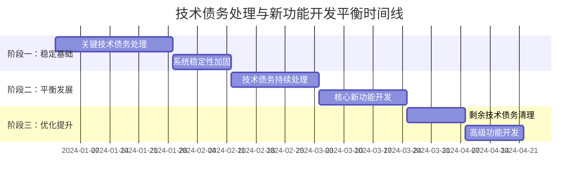
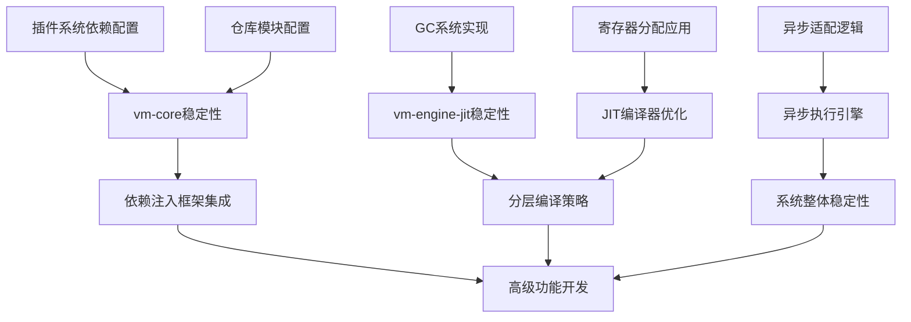
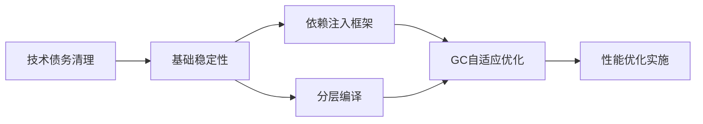

# 技术债务处理与新功能开发平衡实施计划

## 📋 执行摘要

本计划基于对Rust虚拟机项目的深入分析，制定了一个平衡技术债务处理与新功能开发的分阶段实施策略。计划采用"先稳定后发展"的原则，优先解决高优先级技术债务，确保系统稳定性，同时合理安排新功能开发，保持项目向前推进。

**核心原则**：
- 🎯 优先处理影响系统稳定性的技术债务
- ⚖️ 平衡技术债务处理与新功能开发的比例（初期70:30，逐步过渡到50:50）
- 🔄 采用迭代式开发，每个阶段都有明确的交付成果
- 📊 基于数据和指标驱动决策

---

## 🕐 总体时间表与阶段划分

### 项目时间线：16周（4个月）

### 阶段工作重心分配

| 阶段 | 时间 | 技术债务处理 | 新功能开发 | 比例 |
|------|------|-------------|-----------|------|
| 阶段一 | 第1-6周 | 70% | 30% | 7:3 |
| 阶段二 | 第7-12周 | 50% | 50% | 5:5 |
| 阶段三 | 第13-16周 | 30% | 70% | 3:7 |

---

## 🎯 阶段一：稳定基础（第1-6周）

### 里程碑1.1：关键技术债务处理（第1-4周）

#### 高优先级技术债务项
1. **vm-engine-jit/src/unified_gc.rs** - GC系统实现缺失
   - **影响**：系统内存管理和性能
   - **工作量**：2人周
   - **完成标准**：GC功能完整实现并通过测试

2. **vm-core/src/lib.rs** - 插件系统依赖配置
   - **影响**：插件系统无法正常工作
   - **工作量**：1人周
   - **完成标准**：插件系统依赖正确配置并可用

3. **vm-core/src/repository.rs** - 配置和vm_id提取
   - **影响**：仓库模块功能不完整
   - **工作量**：1人周
   - **完成标准**：配置提取和vm_id获取逻辑实现

#### 中优先级技术债务项
1. **vm-engine-jit/src/optimizing_compiler.rs** - 寄存器分配应用
   - **影响**：JIT编译器优化功能
   - **工作量**：1人周
   - **完成标准**：寄存器分配结果正确应用到代码生成

2. **vm-core/src/async_execution_engine.rs** - 异步适配逻辑
   - **影响**：异步执行引擎功能
   - **工作量**：1人周
   - **完成标准**：完整的适配逻辑实现

### 里程碑1.2：系统稳定性加固（第5-6周）

#### 测试覆盖率提升
- **目标**：核心模块测试覆盖率达到90%
- **范围**：vm-core、vm-engine-jit核心组件
- **工作量**：2人周

#### 性能基准建立
- **目标**：建立关键性能指标基线
- **范围**：JIT编译性能、GC效率、内存使用
- **工作量**：1人周

---

## ⚖️ 阶段二：平衡发展（第7-12周）

### 里程碑2.1：技术债务持续处理（第7-9周）

#### 剩余中优先级技术债务
1. **vm-engine-jit/src/unified_cache.rs** - 预编译功能
   - **工作量**：1人周
   - **依赖**：JIT编译器基础完成

2. **vm-frontend-x86_64/src/lib.rs** - 128位操作支持
   - **工作量**：1人周
   - **影响**：x86_64前端功能完整性

#### 低优先级技术债务
1. **vm-monitor模块** - 监控功能实现
   - **工作量**：1人周
   - **影响**：系统监控能力

### 里程碑2.2：核心新功能开发（第10-12周）

#### 依赖注入框架集成
- **目标**：完成DI框架集成并优化性能
- **工作量**：2人周
- **完成标准**：服务解析延迟<100ns，并发吞吐量>1M ops/sec

#### 分层编译策略
- **目标**：实现分层编译优化
- **工作量**：1人周
- **完成标准**：冷代码编译时间减少50%

---

## 🚀 阶段三：优化提升（第13-16周）

### 里程碑3.1：剩余技术债务清理（第13-14周）

#### 代码质量提升
- **目标**：代码重复率<5%，所有TODO处理完毕
- **工作量**：1人周
- **范围**：全局代码清理

#### 文档完善
- **目标**：API文档100%覆盖
- **工作量**：1人周
- **范围**：核心模块API文档

### 里程碑3.2：高级功能开发（第15-16周）

#### GC自适应优化
- **目标**：实现GC参数自适应调整
- **工作量**：1人周
- **完成标准**：GC暂停时间减少40%

#### 性能优化实施
- **目标**：综合性能调优
- **工作量**：1人周
- **完成标准**：整体性能提升25%

---

## 👥 资源配置建议

### 团队结构

| 角色 | 人数 | 主要职责 | 阶段一 | 阶段二 | 阶段三 |
|------|------|----------|--------|--------|--------|
| 架构师 | 1 | 技术决策、架构设计 | 100% | 100% | 100% |
| 高级开发工程师 | 3 | 核心模块开发、技术债务处理 | 100% | 100% | 100% |
| 测试工程师 | 1 | 测试框架、质量保证 | 100% | 100% | 100% |
| 文档工程师 | 1 | 技术文档、API文档 | 50% | 75% | 100% |

### 模块责任分配

| 模块 | 负责人 | 优先级 | 工作量（人周） | 阶段分配 |
|------|--------|--------|----------------|----------|
| vm-core | 高级工程师1 | 高 | 4 | 阶段一(3)、阶段二(1) |
| vm-engine-jit | 高级工程师2 | 高 | 5 | 阶段一(3)、阶段二(2) |
| 依赖注入框架 | 高级工程师3 | 中 | 3 | 阶段二(2)、阶段三(1) |
| 测试框架 | 测试工程师 | 高 | 3 | 阶段一(2)、阶段二(1) |
| 文档系统 | 文档工程师 | 中 | 2 | 阶段二(1)、阶段三(1) |

---

## 🔗 依赖映射关系

### 技术债务依赖图

### 新功能开发依赖

---

## ⚠️ 风险缓释措施

### 高风险项目及缓释策略

| 风险项目 | 风险等级 | 影响 | 缓释措施 |
|----------|----------|------|----------|
| GC系统实现复杂性 | 高 | 系统稳定性 | 分阶段实现，先基础后优化 |
| JIT编译器技术难度 | 高 | 性能目标 | 预研技术方案，专家评审 |
| 依赖注入集成影响 | 中 | 现有架构 | 渐进式集成，保持向后兼容 |
| 测试覆盖率不足 | 中 | 质量保证 | 自动化测试，持续集成 |

### 风险监控机制

1. **每周风险评估**：识别新风险，更新风险状态
2. **技术债务指标监控**：跟踪技术债务减少进度
3. **性能回归检测**：持续监控性能指标
4. **质量门禁**：每个阶段结束前进行质量检查

---

## 📋 定期复盘节点

### 复频次与参与人员

| 复盘类型 | 频率 | 参与人员 | 主要内容 |
|----------|------|----------|----------|
| 每日站会 | 每日 | 开发团队 | 进度同步、阻塞识别 |
| 周度评审 | 每周 | 全体团队 | 里程碑评估、风险分析 |
| 阶段复盘 | 每6周 | 全体团队+管理层 | 阶段总结、下阶段规划 |
| 项目月报 | 每月 | 管理层 | 项目状态、关键指标 |

### 复盘议程

1. **进度评估**
   - 完成工作量 vs 计划工作量
   - 技术债务处理进度
   - 新功能开发进度

2. **质量评估**
   - 代码质量指标
   - 测试覆盖率
   - 性能指标

3. **风险评估**
   - 新识别风险
   - 风险状态更新
   - 缓释措施效果

4. **资源评估**
   - 人力资源使用情况
   - 资源瓶颈识别
   - 资源重新分配建议

5. **下阶段规划**
   - 优先级调整
   - 资源分配优化
   - 风险缓释计划更新

---

## 📊 成功指标与验收标准

### 技术债务处理指标

| 指标 | 当前状态 | 目标状态 | 验收标准 |
|------|----------|----------|----------|
| TODO数量 | 23个 | 0个 | 所有TODO标记处理完毕 |
| FIXME数量 | 3个 | 0个 | 所有FIXME标记修复 |
| 代码重复率 | 未知 | <5% | 静态代码分析结果 |
| 测试覆盖率 | 未知 | >90% | 覆盖率报告 |

### 新功能开发指标

| 指标 | 基线 | 目标 | 验收标准 |
|------|------|------|----------|
| JIT编译性能 | 未知 | 提升30% | 性能基准测试 |
| 执行性能 | 未知 | 提升25% | 性能基准测试 |
| 内存使用 | 未知 | 减少15% | 内存使用分析 |
| GC暂停时间 | 未知 | <1ms | GC性能测试 |

### 系统稳定性指标

| 指标 | 目标 | 验收标准 |
|------|------|----------|
| 编译成功率 | >95% | 持续集成统计 |
| 测试通过率 | 100% | 自动化测试结果 |
| 错误率 | 降低50% | 错误监控统计 |
| 系统可用性 | >99% | 运行监控数据 |

---

## 🔄 持续改进机制

### 短期改进（1-3个月）

1. **基于实际数据的性能调优**
   - 收集真实使用数据
   - 分析性能瓶颈
   - 实施针对性优化

2. **增强测试覆盖**
   - 增加集成测试
   - 实施端到端测试
   - 引入模糊测试

3. **文档持续更新**
   - 根据用户反馈优化文档
   - 增加使用示例
   - 完善API文档

### 中期改进（3-6个月）

1. **高级性能优化**
   - 实现更复杂的优化算法
   - 支持分布式编译
   - 建立性能预测模型

2. **扩展功能开发**
   - 插件生态系统建设
   - 更多架构支持
   - 高级监控功能

### 长期改进（6-12个月）

1. **架构演进**
   - 微服务化改造
   - 云原生支持
   - 热更新功能

2. **智能化特性**
   - ML驱动的优化
   - 自适应性能调优
   - 智能故障预测

---

## 📞 沟通与协作机制

### 内部沟通

1. **技术决策记录**
   - 所有重要技术决策需记录在案
   - 包括决策背景、选项分析、最终决定
   - 存储在共享文档库中

2. **知识分享**
   - 每周技术分享会
   - 代码审查最佳实践分享
   - 新技术学习交流

3. **跨团队协作**
   - 定期跨团队技术交流
   - 统一开发规范和工具链
   - 共享测试环境和数据

### 外部沟通

1. **进度汇报**
   - 周报：详细进度和问题
   - 月报：整体状态和关键指标
   - 季报：战略调整和长期规划

2. **利益相关者管理**
   - 定期收集反馈
   - 需求变更管理
   - 期望值管理

---

## 📝 结论

本实施计划提供了一个平衡技术债务处理与新功能开发的全面框架，通过分阶段实施、风险缓释和持续改进，确保项目在保持系统稳定性的同时持续向前发展。

### 关键成功因素

1. **优先级明确**：优先处理影响系统稳定性的技术债务
2. **平衡发展**：合理安排技术债务和新功能的开发比例
3. **风险管控**：主动识别和缓释技术风险
4. **持续改进**：基于数据和反馈不断优化实施策略
5. **团队协作**：建立有效的沟通和协作机制

### 预期成果

通过16周的分阶段实施，预期将实现：
- ✅ 所有高优先级技术债务清理完毕
- ✅ 系统稳定性显著提升
- ✅ 核心新功能成功交付
- ✅ 性能指标达到预期目标
- ✅ 建立可持续的改进机制

---

**文档版本**: 1.0  
**创建日期**: 2024年  
**最后更新**: 2024年  
**状态**: 待审批  
**审批人**: [待填写]