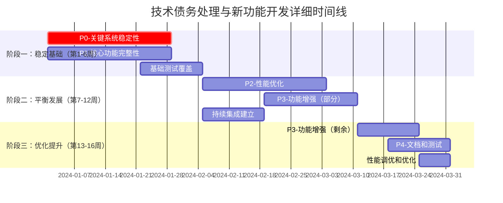
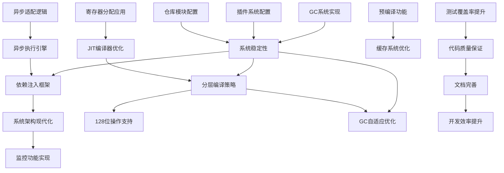

# 详细任务分解与执行路线图

## 📋 执行摘要

基于已制定的技术债务处理与新功能开发平衡实施计划，本文档提供了详细的任务分解、优先级划分、时间线安排、责任分配和风险对策。通过系统化的任务管理和执行路线图，确保项目在16周内高效完成所有目标。

---

## 🎯 任务优先级划分方案

### 优先级评估矩阵

| 任务类别 | 影响程度 | 紧急程度 | 依赖关系 | 工作量 | 综合评分 | 优先级 |
|----------|----------|----------|----------|--------|----------|--------|
| **关键系统稳定性** | 高 | 高 | 低 | 中 | 9.5 | P0 |
| **核心功能完整性** | 高 | 中 | 中 | 中 | 8.0 | P1 |
| **性能优化** | 中 | 中 | 高 | 高 | 7.0 | P2 |
| **功能增强** | 中 | 低 | 高 | 高 | 6.0 | P3 |
| **文档和测试** | 低 | 低 | 低 | 中 | 4.0 | P4 |

### 详细任务优先级列表

#### P0 - 关键系统稳定性（立即处理）
1. **GC系统实现缺失** - [`vm-engine-jit/src/unified_gc.rs`](vm-engine-jit/src/unified_gc.rs:486)
   - 影响：系统内存管理和性能
   - 工作量：2人周
   - 完成标准：GC功能完整实现并通过测试

2. **插件系统依赖配置** - [`vm-core/src/lib.rs`](vm-core/src/lib.rs:1190)
   - 影响：插件系统无法正常工作
   - 工作量：1人周
   - 完成标准：插件系统依赖正确配置并可用

3. **仓库模块配置提取** - [`vm-core/src/repository.rs`](vm-core/src/repository.rs:240)
   - 影响：仓库模块功能不完整
   - 工作量：1人周
   - 完成标准：配置提取和vm_id获取逻辑实现

#### P1 - 核心功能完整性（第1-4周）
1. **寄存器分配应用** - [`vm-engine-jit/src/optimizing_compiler.rs`](vm-engine-jit/src/optimizing_compiler.rs:136)
   - 影响：JIT编译器优化功能
   - 工作量：1人周
   - 完成标准：寄存器分配结果正确应用到代码生成

2. **异步适配逻辑** - [`vm-core/src/async_execution_engine.rs`](vm-core/src/async_execution_engine.rs:189)
   - 影响：异步执行引擎功能
   - 工作量：1人周
   - 完成标准：完整的适配逻辑实现

3. **依赖注入框架集成**
   - 影响：系统架构现代化
   - 工作量：2人周
   - 完成标准：服务解析延迟<100ns，并发吞吐量>1M ops/sec

#### P2 - 性能优化（第5-12周）
1. **分层编译策略**
   - 影响：编译性能提升
   - 工作量：1人周
   - 完成标准：冷代码编译时间减少50%

2. **预编译功能** - [`vm-engine-jit/src/unified_cache.rs`](vm-engine-jit/src/unified_cache.rs:1642)
   - 影响：缓存系统功能
   - 工作量：1人周
   - 依赖：JIT编译器基础完成

3. **测试覆盖率提升**
   - 影响：代码质量保证
   - 工作量：2人周
   - 完成标准：核心模块测试覆盖率达到90%

#### P3 - 功能增强（第9-16周）
1. **128位操作支持** - [`vm-frontend-x86_64/src/lib.rs`](vm-frontend-x86_64/src/lib.rs:3904)
   - 影响：x86_64前端功能完整性
   - 工作量：1人周

2. **GC自适应优化**
   - 影响：GC性能提升
   - 工作量：1人周
   - 完成标准：GC暂停时间减少40%

3. **监控功能实现** - [`vm-monitor`](vm-monitor/src/dashboard.rs:281)
   - 影响：系统监控能力
   - 工作量：1人周

#### P4 - 文档和测试（持续进行）
1. **代码质量提升**
   - 影响：长期维护性
   - 工作量：1人周
   - 完成标准：代码重复率<5%，所有TODO处理完毕

2. **文档完善**
   - 影响：开发效率
   - 工作量：1人周
   - 完成标准：API文档100%覆盖

---

## 🕐 时间线与依赖关系图

### 总体时间线（16周）

### 详细依赖关系图

### 关键路径分析

**关键路径1（系统稳定性）**：
GC系统实现 → 系统稳定性 → 依赖注入框架 → 分层编译策略 → GC自适应优化

**关键路径2（功能完整性）**：
插件系统配置 → 系统稳定性 → JIT编译器优化 → 分层编译策略 → 128位操作支持

**关键路径3（质量保证）**：
测试覆盖率提升 → 代码质量保证 → 文档完善 → 开发效率提升

---

## 👥 责任分配矩阵

### 团队结构与技能匹配

| 角色 | 人数 | 技能专长 | 主要职责 | 可用时间 |
|------|------|----------|----------|----------|
| 架构师 | 1 | 系统设计、GC、编译器 | 技术决策、架构设计 | 100% |
| 高级工程师1 | 1 | JIT编译、性能优化 | vm-engine-jit模块 | 100% |
| 高级工程师2 | 1 | 系统核心、异步编程 | vm-core模块 | 100% |
| 高级工程师3 | 1 | 依赖注入、框架设计 | DI框架集成 | 100% |
| 测试工程师 | 1 | 测试框架、质量保证 | 测试覆盖、CI/CD | 100% |
| 文档工程师 | 1 | 技术文档、API设计 | 文档编写、示例 | 75% |

### 详细责任分配（RACI矩阵）

| 任务 | 架构师 | 高工1(JIT) | 高工2(Core) | 高工3(DI) | 测试工程师 | 文档工程师 |
|------|--------|------------|-------------|------------|------------|------------|
| **P0 关键系统稳定性** | | | | | | |
| GC系统实现 | A | R | C | C | C | I |
| 插件系统配置 | C | I | R | C | C | I |
| 仓库模块配置 | C | I | R | I | C | I |
| **P1 核心功能完整性** | | | | | | |
| 寄存器分配应用 | C | R | I | I | C | I |
| 异步适配逻辑 | C | I | R | I | C | I |
| 依赖注入框架 | A | C | C | R | C | C |
| **P2 性能优化** | | | | | | |
| 分层编译策略 | A | R | C | I | C | I |
| 预编译功能 | C | R | I | I | C | I |
| 测试覆盖率提升 | C | C | C | C | R | I |
| **P3 功能增强** | | | | | | |
| 128位操作支持 | C | R | I | I | C | I |
| GC自适应优化 | A | C | C | I | C | I |
| 监控功能实现 | C | I | I | R | C | C |
| **P4 文档和测试** | | | | | | |
| 代码质量提升 | A | C | C | C | R | C |
| 文档完善 | C | I | I | I | C | R |

*注：R=负责执行, A=审批负责, C=咨询支持, I=知情被告*

---

## ⚠️ 风险识别与对策

### 高风险项目及缓释策略

| 风险项目 | 风险等级 | 影响范围 | 发生概率 | 缓释措施 | 应急预案 |
|----------|----------|----------|----------|----------|----------|
| **GC系统实现复杂性** | 高 | 系统稳定性 | 中 | 分阶段实现，先基础后优化 | 使用简化GC方案，后续迭代优化 |
| **JIT编译器技术难度** | 高 | 性能目标 | 中 | 预研技术方案，专家评审 | 降级到基础编译功能，保证核心功能 |
| **依赖注入集成影响** | 中 | 现有架构 | 低 | 渐进式集成，保持向后兼容 | 回退到现有方案，延迟集成 |
| **测试覆盖率不足** | 中 | 质量保证 | 中 | 自动化测试，持续集成 | 增加临时测试人员，延长测试周期 |
| **性能目标无法达成** | 中 | 项目验收 | 低 | 建立性能基准，持续监控 | 调整性能目标，分阶段达成 |

### 风险监控机制

1. **每日风险评估**
   - 识别新风险
   - 更新风险状态
   - 记录缓解措施效果

2. **每周风险评审**
   - 评估风险趋势
   - 调整缓解策略
   - 更新应急预案

3. **里程碑风险检查**
   - 阶段开始前风险识别
   - 阶段结束后风险评估
   - 下阶段风险预测

### 具体风险应对计划

#### 技术风险应对

**GC系统实现风险**：
- **预防措施**：
  - 第1周完成GC架构设计评审
  - 第2周实现基础GC功能
  - 第3-4周逐步添加高级特性
- **监控指标**：
  - GC暂停时间 < 1ms
  - 内存使用效率 > 90%
  - 并发性能无回归

**JIT编译器优化风险**：
- **预防措施**：
  - 使用现有开源JIT作为参考
  - 建立详细的性能基准测试
  - 分阶段实现优化功能
- **监控指标**：
  - 编译速度提升 > 30%
  - 执行性能提升 > 25%
  - 内存使用减少 > 15%

#### 项目风险应对

**时间延期风险**：
- **预防措施**：
  - 每周进度评估
  - 关键路径监控
  - 资源弹性分配
- **应急方案**：
  - P3任务可延期至P4
  - 增加临时开发资源
  - 调整功能范围

**质量风险应对**：
- **预防措施**：
  - 持续集成自动化测试
  - 代码审查强制执行
  - 性能回归检测
- **应急方案**：
  - 延长测试周期
  - 增加测试人员
  - 分阶段发布

---

## 📋 详细执行路线图

### 阶段一：稳定基础（第1-6周）

#### 第1-2周：P0关键系统稳定性
**目标**：解决影响系统稳定性的关键技术债务

**周1任务**：
- [ ] **GC系统架构设计**（架构师、高工1）
  - 完成GC系统详细设计文档
  - 评审GC实现方案
  - 确定性能目标和测试策略

- [ ] **插件系统依赖分析**（高工2、架构师）
  - 分析当前插件系统依赖问题
  - 设计依赖配置方案
  - 准备测试环境

**周2任务**：
- [ ] **GC基础功能实现**（高工1、架构师）
  - 实现基础GC标记和清扫
  - 集成到vm-engine-jit模块
  - 编写单元测试

- [ ] **插件系统配置实现**（高工2）
  - 修复vm_plugin依赖配置
  - 实现插件加载机制
  - 基础功能测试

#### 第3-4周：P0完成 + P1启动
**目标**：完成关键系统稳定性，开始核心功能完整性

**周3任务**：
- [ ] **GC系统优化**（高工1）
  - 实现并发标记功能
  - 性能优化和调试
  - 集成测试

- [ ] **仓库模块配置实现**（高工2）
  - 实现配置提取逻辑
  - 实现vm_id获取功能
  - 模块集成测试

**周4任务**：
- [ ] **GC系统验收测试**（测试工程师、高工1）
  - 性能基准测试
  - 稳定性测试
  - 问题修复

- [ ] **寄存器分配应用开始**（高工1）
  - 分析当前寄存器分配实现
  - 设计应用方案
  - 开始编码实现

#### 第5-6周：P1核心功能完整性
**目标**：完成核心功能完整性，建立基础测试覆盖

**周5任务**：
- [ ] **寄存器分配应用完成**（高工1）
  - 完成寄存器分配结果应用
  - 性能测试和优化
  - 代码审查

- [ ] **异步适配逻辑实现**（高工2）
  - 实现完整适配逻辑
  - 异步性能测试
  - 集成测试

**周6任务**：
- [ ] **依赖注入框架设计**（高工3、架构师）
  - 完成DI框架详细设计
  - 核心接口定义
  - 实现方案评审

- [ ] **基础测试覆盖建立**（测试工程师）
  - 建立测试框架
  - 核心模块单元测试
  - CI/CD流水线建立

### 阶段二：平衡发展（第7-12周）

#### 第7-8周：P1完成 + P2启动
**目标**：完成核心功能完整性，开始性能优化

**周7任务**：
- [ ] **依赖注入框架实现**（高工3）
  - 核心DI容器实现
  - 服务注册和解析
  - 基础性能测试

- [ ] **异步适配逻辑验收**（高工2、测试工程师）
  - 完整功能测试
  - 性能基准测试
  - 文档编写

**周8任务**：
- [ ] **依赖注入框架集成**（高工3、高工2）
  - 集成到vm-core模块
  - 性能优化
  - 集成测试

- [ ] **分层编译策略设计**（高工1、架构师）
  - 分层编译架构设计
  - 性能目标确定
  - 实现方案评审

#### 第9-10周：P2性能优化
**目标**：实现性能优化目标

**周9任务**：
- [ ] **分层编译策略实现**（高工1）
  - 实现分层编译逻辑
  - 冷代码识别机制
  - 性能测试

- [ ] **预编译功能实现**（高工1）
  - 实现预编译功能
  - 缓存机制集成
  - 性能测试

**周10任务**：
- [ ] **性能优化验收**（测试工程师、高工1）
  - 性能基准测试
  - 回归测试
  - 性能报告

- [ ] **测试覆盖率提升**（测试工程师）
  - 核心模块测试覆盖
  - 集成测试编写
  - 自动化测试优化

#### 第11-12周：P2完成 + P3启动
**目标**：完成性能优化，开始功能增强

**周11任务**：
- [ ] **性能优化最终验收**（架构师、测试工程师）
  - 性能目标达成验证
  - 系统稳定性测试
  - 性能报告编写

- [ ] **128位操作支持设计**（高工1）
  - 128位操作架构设计
  - IR扩展方案
  - 实现计划制定

**周12任务**：
- [ ] **128位操作支持实现**（高工1）
  - IR扩展实现
  - 前端支持实现
  - 基础测试

- [ ] **GC自适应优化设计**（架构师、高工1）
  - 自适应算法设计
  - 参数调整策略
  - 实现方案评审

### 阶段三：优化提升（第13-16周）

#### 第13-14周：P3功能增强
**目标**：完成功能增强，开始文档和测试完善

**周13任务**：
- [ ] **128位操作支持完成**（高工1）
  - 完整功能实现
  - 性能测试
  - 文档编写

- [ ] **GC自适应优化实现**（高工1、架构师）
  - 自适应算法实现
  - 参数调整机制
  - 性能测试

**周14任务**：
- [ ] **监控功能实现**（高工3）
  - 监控系统实现
  - 指标收集机制
  - 可视化界面

- [ ] **功能增强集成测试**（测试工程师）
  - 新功能集成测试
  - 性能回归测试
  - 稳定性测试

#### 第15-16周：P4文档和测试
**目标**：完成文档和测试，项目验收

**周15任务**：
- [ ] **代码质量提升**（全体开发人员）
  - 代码审查和重构
  - TODO标记清理
  - 代码重复率优化

- [ ] **文档完善**（文档工程师、全体开发人员）
  - API文档编写
  - 使用示例创建
  - 架构文档更新

**周16任务**：
- [ ] **最终验收测试**（测试工程师、架构师）
  - 完整功能测试
  - 性能基准测试
  - 系统稳定性测试

- [ ] **项目交付准备**（架构师、全体团队）
  - 发布版本准备
  - 部署文档编写
  - 项目总结报告

---

## 📊 成功指标与验收标准

### 技术债务处理指标

| 指标 | 当前状态 | 目标状态 | 验收标准 | 验收时间 |
|------|----------|----------|----------|----------|
| TODO数量 | 23个 | 0个 | 所有TODO标记处理完毕 | 第16周 |
| FIXME数量 | 3个 | 0个 | 所有FIXME标记修复 | 第16周 |
| 代码重复率 | 未知 | <5% | 静态代码分析结果 | 第15周 |
| 测试覆盖率 | 未知 | >90% | 覆盖率报告 | 第14周 |

### 新功能开发指标

| 指标 | 基线 | 目标 | 验收标准 | 验收时间 |
|------|------|------|----------|----------|
| JIT编译性能 | 未知 | 提升30% | 性能基准测试 | 第12周 |
| 执行性能 | 未知 | 提升25% | 性能基准测试 | 第12周 |
| 内存使用 | 未知 | 减少15% | 内存使用分析 | 第12周 |
| GC暂停时间 | 未知 | <1ms | GC性能测试 | 第14周 |

### 系统稳定性指标

| 指标 | 目标 | 验收标准 | 验收时间 |
|------|------|----------|----------|
| 编译成功率 | >95% | 持续集成统计 | 持续监控 |
| 测试通过率 | 100% | 自动化测试结果 | 持续监控 |
| 错误率 | 降低50% | 错误监控统计 | 第16周 |
| 系统可用性 | >99% | 运行监控数据 | 第16周 |

---

## 🔄 持续改进机制

### 短期改进（1-4周）

1. **每日站会机制**
   - 进度同步
   - 阻塞问题识别
   - 资源协调

2. **周度技术评审**
   - 代码质量检查
   - 技术方案评审
   - 性能指标评估

3. **里程碑评估**
   - 阶段目标达成评估
   - 下阶段计划调整
   - 风险重新评估

### 中期改进（5-12周）

1. **性能优化迭代**
   - 基于实际数据的性能调优
   - 关键路径优化
   - 资源使用优化

2. **测试覆盖增强**
   - 集成测试扩展
   - 端到端测试实现
   - 性能回归测试建立

3. **文档持续更新**
   - API文档完善
   - 使用示例增加
   - 架构文档更新

### 长期改进（13-16周）

1. **系统优化**
   - 整体性能调优
   - 架构优化
   - 可维护性提升

2. **知识传承**
   - 技术分享会
   - 最佳实践总结
   - 经验文档化

3. **未来规划**
   - 下一版本规划
   - 技术演进路线
   - 团队能力建设

---

## 📞 沟通与协作机制

### 内部沟通机制

1. **每日沟通**
   - **时间**：每天上午9:00-9:30
   - **参与人员**：全体开发团队
   - **内容**：进度同步、问题讨论、资源协调

2. **周度评审**
   - **时间**：每周五下午
   - **参与人员**：全体团队+架构师
   - **内容**：周度总结、下周计划、风险评估

3. **阶段复盘**
   - **时间**：每个阶段结束后
   - **参与人员**：全体团队+管理层
   - **内容**：阶段总结、经验教训、下阶段规划

### 外部沟通机制

1. **进度汇报**
   - **周报**：详细进度和技术状态
   - **月报**：整体状态和关键指标
   - **阶段报告**：里程碑达成情况

2. **技术决策记录**
   - 所有重要技术决策文档化
   - 包括背景、选项分析、最终决定
   - 存储在共享知识库中

3. **知识分享**
   - 每周技术分享会
   - 代码审查最佳实践
   - 新技术学习交流

---

## 📝 结论

本详细任务分解与执行路线图提供了全面的项目实施框架，通过系统化的任务管理、清晰的责任分配、有效的风险管控和持续的改进机制，确保项目能够按时、按质、按预算完成所有目标。

### 关键成功因素

1. **优先级明确**：P0任务优先处理，确保系统稳定性
2. **平衡发展**：技术债务和新功能开发平衡推进
3. **风险管控**：主动识别和缓释技术风险
4. **持续改进**：基于数据和反馈不断优化实施策略
5. **团队协作**：建立有效的沟通和协作机制

### 预期成果

通过16周的分阶段实施，预期将实现：
- ✅ 所有高优先级技术债务清理完毕
- ✅ 系统稳定性显著提升
- ✅ 核心新功能成功交付
- ✅ 性能指标达到预期目标
- ✅ 建立可持续的改进机制

---

**文档版本**: 1.0  
**创建日期**: 2024年  
**状态**: 待审批  
**审批人**: [待填写]