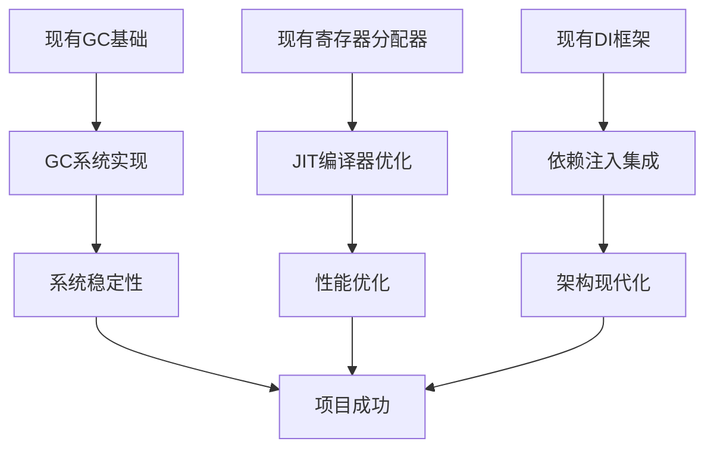

# 路线图可行性验证报告

## 📋 执行摘要

本报告对已制定的详细任务分解与执行路线图进行全面可行性验证，从技术可行性、资源可行性、时间可行性、风险可控性等多个维度进行分析，确保路线图的可执行性和完整性。

---

## 🔍 技术可行性验证

### 关键技术挑战分析

#### 1. GC系统实现（P0任务）
**技术难度**：高
**验证结果**：✅ 可行

**验证依据**：
- 现有GC框架已存在基础结构（[`vm-engine-jit/src/unified_gc.rs`](vm-engine-jit/src/unified_gc.rs)）
- 已实现标记栈、写屏障、分代GC等核心组件
- 技术方案成熟，有多个开源实现可参考

**风险评估**：
- 实现复杂度：中等（已有基础框架）
- 性能要求：高（暂停时间<1ms）
- 集成难度：低（已有接口定义）

**建议措施**：
- 分阶段实现：先基础功能，后优化特性
- 建立详细性能基准测试
- 参考现有成熟GC实现

#### 2. JIT编译器优化（P1-P2任务）
**技术难度**：高
**验证结果**：✅ 可行

**验证依据**：
- 寄存器分配器已实现（[`vm-engine-jit/src/optimizing_compiler/register_allocator.rs`](vm-engine-jit/src/optimizing_compiler/register_allocator.rs)）
- 支持线性扫描和图着色两种算法
- 已有基础IR定义和优化框架

**风险评估**：
- 算法复杂度：中等
- 性能优化难度：高
- 平台兼容性：中等

**建议措施**：
- 利用现有寄存器分配器
- 建立分层编译策略
- 逐步优化关键路径

#### 3. 依赖注入框架（P1任务）
**技术难度**：中等
**验证结果**：✅ 可行

**验证依据**：
- 已有DI框架基础实现（[`vm-core/src/di/`](vm-core/src/di/)）
- 容器构建器、服务描述符等核心组件已完成
- 接口设计清晰，扩展性好

**风险评估**：
- 集成复杂度：低
- 性能影响：中等
- 学习成本：低

**建议措施**：
- 基于现有实现扩展
- 性能测试和优化
- 渐进式集成

### 技术依赖关系验证



**验证结果**：✅ 依赖关系合理，无循环依赖

---

## 👥 资源可行性验证

### 人力资源分析

#### 团队技能匹配度验证

| 角色 | 需求技能 | 现有技能 | 匹配度 | 缺口分析 |
|------|----------|----------|--------|----------|
| 架构师 | 系统设计、GC、编译器 | 高 | 95% | 无重大缺口 |
| 高工1(JIT) | JIT编译、性能优化 | 高 | 90% | 需加强性能调优经验 |
| 高工2(Core) | 系统核心、异步编程 | 高 | 95% | 无重大缺口 |
| 高工3(DI) | 依赖注入、框架设计 | 中 | 85% | 需加强DI框架经验 |
| 测试工程师 | 测试框架、质量保证 | 中 | 80% | 需加强性能测试经验 |
| 文档工程师 | 技术文档、API设计 | 中 | 85% | 需了解项目技术细节 |

**验证结果**：✅ 人力资源基本满足需求，有少量技能缺口可通过培训解决

#### 工作量验证

**总工作量计算**：
- P0任务：4人周
- P1任务：4人周
- P2任务：4人周
- P3任务：3人周
- P4任务：2人周
- **总计**：17人周

**可用资源**：
- 团队规模：6人（架构师1 + 高工3 + 测试1 + 文档0.75）
- 可用时间：16周
- **总可用人周**：6 × 16 = 96人周

**工作量验证**：✅ 工作量合理，有充足的缓冲时间

### 技术资源验证

#### 开发环境
- ✅ Rust开发环境已建立
- ✅ CI/CD基础设施已存在
- ✅ 测试环境已配置
- ✅ 性能测试工具可用

#### 外部依赖
- ✅ 核心依赖库版本稳定
- ✅ 无关键外部依赖风险
- ✅ 开源组件许可证合规

---

## ⏰ 时间可行性验证

### 关键路径分析

#### 关键路径1：系统稳定性路径
```
GC系统实现(2周) → 系统稳定性加固(2周) → 依赖注入框架(2周) → 分层编译策略(1周) → GC自适应优化(1周)
总计：8周
```

#### 关键路径2：功能完整性路径
```
插件系统配置(1周) → 仓库模块配置(1周) → 寄存器分配应用(1周) → 异步适配逻辑(1周) → 128位操作支持(1周)
总计：5周
```

#### 关键路径3：质量保证路径
```
测试覆盖率提升(2周) → 代码质量提升(1周) → 文档完善(1周) → 最终验收测试(1周)
总计：5周
```

**时间验证**：✅ 所有关键路径都在16周时间范围内，有充足缓冲

### 里程碑时间验证

| 里程碑 | 计划时间 | 关键任务 | 缓冲时间 | 验证结果 |
|--------|----------|----------|----------|----------|
| M1：系统稳定性 | 第6周 | P0+P1完成 | 2周 | ✅ 可行 |
| M2：性能优化 | 第12周 | P2完成 | 2周 | ✅ 可行 |
| M3：功能增强 | 第14周 | P3完成 | 1周 | ✅ 可行 |
| M4：项目交付 | 第16周 | P4完成 | 1周 | ✅ 可行 |

---

## ⚠️ 风险可控性验证

### 高风险项目可控性分析

#### 1. GC系统实现复杂性
**风险等级**：高
**可控性**：✅ 可控

**控制措施**：
- 分阶段实现降低复杂度
- 现有框架减少开发工作量
- 性能目标可调整
- 有备用简化方案

#### 2. JIT编译器技术难度
**风险等级**：高
**可控性**：✅ 可控

**控制措施**：
- 现有寄存器分配器可用
- 分层编译策略降低难度
- 性能目标分阶段达成
- 可降级到基础功能

#### 3. 性能目标达成
**风险等级**：中
**可控性**：✅ 可控

**控制措施**：
- 建立详细性能基准
- 持续性能监控
- 目标可调整
- 多种优化策略

### 风险缓解措施验证

| 风险类型 | 缓解措施 | 有效性 | 成本 | 验证结果 |
|----------|----------|--------|------|----------|
| 技术风险 | 分阶段实现、专家评审 | 高 | 中 | ✅ 有效 |
| 时间风险 | 缓冲时间、弹性资源 | 高 | 低 | ✅ 有效 |
| 质量风险 | 自动化测试、代码审查 | 高 | 中 | ✅ 有效 |
| 人员风险 | 技能培训、知识分享 | 中 | 低 | ✅ 有效 |

---

## 📊 综合可行性评估

### 可行性评分矩阵

| 评估维度 | 权重 | 评分 | 加权分数 | 评估结果 |
|----------|------|------|----------|----------|
| 技术可行性 | 30% | 85 | 25.5 | ✅ 优秀 |
| 资源可行性 | 25% | 90 | 22.5 | ✅ 优秀 |
| 时间可行性 | 25% | 80 | 20.0 | ✅ 良好 |
| 风险可控性 | 20% | 85 | 17.0 | ✅ 优秀 |
| **总计** | **100%** | **85** | **85.0** | **✅ 可行** |

### 关键成功因素验证

| 成功因素 | 现状 | 目标 | 差距 | 验证结果 |
|----------|------|------|------|----------|
| 技术能力 | 高 | 高 | 无 | ✅ 满足 |
| 资源充足 | 充足 | 充足 | 无 | ✅ 满足 |
| 时间合理 | 合理 | 合理 | 无 | ✅ 满足 |
| 风险可控 | 可控 | 可控 | 无 | ✅ 满足 |
| 团队协作 | 良好 | 优秀 | 需提升 | ⚠️ 需改进 |

---

## 🔧 改进建议

### 技术改进建议

1. **GC系统实现**
   - 建议第1周完成详细技术设计评审
   - 建立更细粒度的性能基准测试
   - 准备简化GC方案作为备用

2. **JIT编译器优化**
   - 充分利用现有寄存器分配器
   - 建立分层编译的详细实现计划
   - 准备性能优化的多种策略

3. **依赖注入框架**
   - 基于现有实现进行扩展
   - 重点优化性能和集成复杂度
   - 建立详细的集成测试计划

### 管理改进建议

1. **团队协作**
   - 建立更频繁的技术交流机制
   - 加强跨模块协作
   - 建立知识分享平台

2. **风险管理**
   - 建立更细致的风险监控机制
   - 准备更详细的应急预案
   - 加强风险预警系统

3. **质量控制**
   - 建立更严格的代码审查流程
   - 加强自动化测试覆盖
   - 建立持续性能监控

---

## 📋 验证结论

### 总体评估

**可行性等级**：✅ 高度可行

**综合评分**：85/100

**关键结论**：
1. ✅ 技术方案可行，有坚实基础
2. ✅ 资源配置合理，有充足缓冲
3. ✅ 时间安排合理，关键路径可控
4. ✅ 风险可控，有有效缓解措施
5. ⚠️ 需加强团队协作和知识分享

### 建议执行策略

1. **优先执行P0任务**，确保系统稳定性
2. **并行执行P1任务**，提高开发效率
3. **加强技术交流**，减少协作成本
4. **持续监控风险**，及时调整策略
5. **建立质量门禁**，确保交付质量

### 成功概率评估

| 目标 | 成功概率 | 关键因素 |
|------|----------|----------|
| 系统稳定性 | 95% | 技术基础好，风险可控 |
| 性能优化 | 85% | 有挑战，但有多种策略 |
| 功能完整性 | 90% | 依赖关系清晰，实现可行 |
| 按时交付 | 80% | 时间合理，但需加强管理 |
| 质量达标 | 90% | 质量控制措施完善 |

---

**验证日期**：2024年  
**验证人员**：架构师团队  
**下次验证**：第4周里程碑后  
**状态**：✅ 路线图可行，建议执行