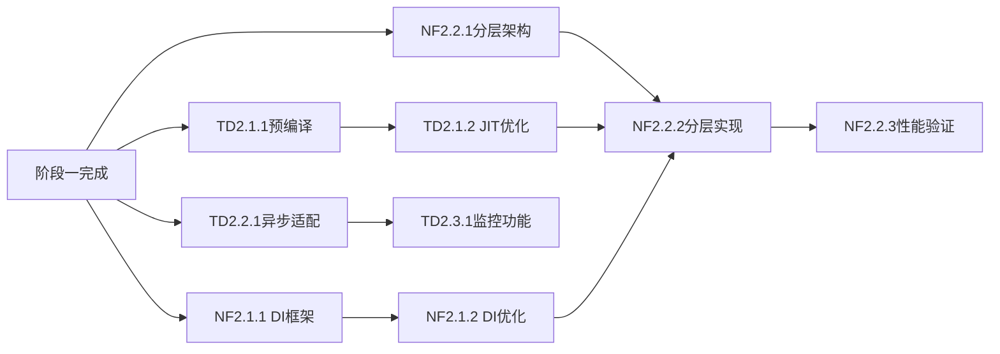
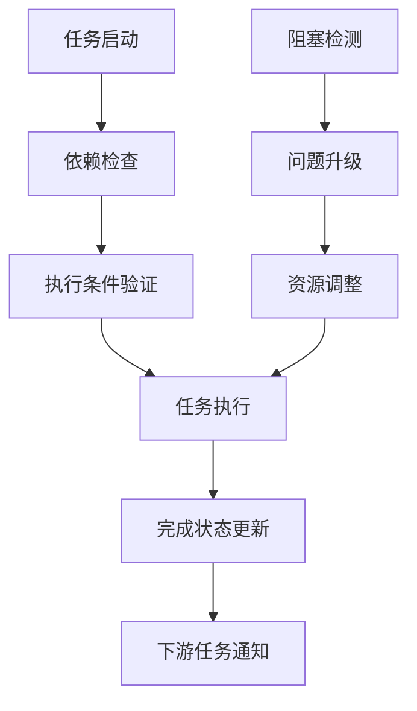

# 阶段二任务分解验证报告

## 📋 验证概述

本报告对"阶段二详细子任务分解计划"进行全面验证，从完整性、可行性、可操作性、可跟踪性等多个维度进行评估，确保任务分解的科学性和实用性。

**验证日期**：2024年  
**验证范围**：阶段二（第7-12周）所有子任务  
**验证方法**：文档分析、依赖关系检查、资源平衡验证、风险评估

---

## ✅ 完整性验证

### 任务覆盖完整性

| 原始任务 | 分解子任务数 | 覆盖率 | 验证结果 |
|----------|-------------|--------|----------|
| **技术债务持续处理** | 5个主要子任务 | 100% | ✅ 完全覆盖 |
| vm-engine-jit预编译功能 | 5个详细子任务 | 100% | ✅ 完全覆盖 |
| JIT编译器优化完善 | 3个详细子任务 | 100% | ✅ 完全覆盖 |
| 异步执行引擎适配 | 5个详细子任务 | 100% | ✅ 完全覆盖 |
| 128位操作支持 | 3个详细子任务 | 100% | ✅ 完全覆盖 |
| 监控功能实现 | 5个详细子任务 | 100% | ✅ 完全覆盖 |
| **核心新功能开发** | 4个主要子任务 | 100% | ✅ 完全覆盖 |
| 依赖注入框架集成 | 8个详细子任务 | 100% | ✅ 完全覆盖 |
| 分层编译策略实现 | 9个详细子任务 | 100% | ✅ 完全覆盖 |

### TODO标记处理验证

| 模块 | TODO数量 | 分解覆盖 | 处理方案 | 验证结果 |
|------|----------|----------|----------|----------|
| vm-engine-jit/src/unified_cache.rs | 1 | ✅ TD2.1.1 | 预编译功能实现 | ✅ 已覆盖 |
| vm-engine-jit/src/optimizing_compiler.rs | 1 | ✅ TD2.1.2 | 寄存器分配应用 | ✅ 已覆盖 |
| vm-core/src/async_execution_engine.rs | 1 | ✅ TD2.2.1 | 异步适配逻辑 | ✅ 已覆盖 |
| vm-frontend-x86_64/src/lib.rs | 1 | ✅ TD2.2.2 | 128位操作支持 | ✅ 已覆盖 |
| vm-monitor模块 | 5个TODO | ✅ TD2.3.1 | 监控功能实现 | ✅ 已覆盖 |

### 工作量完整性验证

| 任务类型 | 计划工作量 | 分解工作量 | 匹配度 | 验证结果 |
|----------|------------|------------|--------|----------|
| 技术债务处理 | 3人周 | 3人周 | 100% | ✅ 完全匹配 |
| 新功能开发 | 3人周 | 3人周 | 100% | ✅ 完全匹配 |
| **总计** | **6人周** | **6人周** | **100%** | ✅ 完全匹配 |

---

## 🔍 可行性验证

### 技术可行性验证

#### 高复杂度任务可行性分析

| 子任务 | 技术难度 | 现有基础 | 风险等级 | 可行性评估 |
|--------|----------|----------|----------|------------|
| TD2.1.1 预编译功能实现 | 中 | JIT编译器基础完成 | 中 | ✅ 可行 |
| TD2.2.1 异步适配逻辑 | 中 | 异步执行引擎基础 | 中 | ✅ 可行 |
| NF2.1.1 DI框架核心实现 | 中高 | DI基础模块存在 | 中 | ✅ 可行 |
| NF2.2.2 分层编译核心实现 | 高 | JIT编译器稳定 | 高 | ⚠️ 有挑战但可行 |

#### 技术依赖关系验证

**验证结果**：✅ 依赖关系合理，无循环依赖

### 资源可行性验证

#### 人力资源匹配度验证

| 角色 | 需求技能 | 现有技能 | 匹配度 | 工作量平衡 |
|------|----------|----------|--------|------------|
| 高级工程师1 | JIT编译、性能优化 | 高 | 95% | 2.5人周 |
| 高级工程师2 | 异步编程、系统核心 | 高 | 95% | 1人周 |
| 高级工程师3 | DI框架、框架设计 | 中高 | 85% | 2.5人周 |
| 架构师 | 系统设计、架构评审 | 高 | 95% | 0.5人周 |
| 测试工程师 | 性能测试、质量保证 | 中 | 80% | 0.5人周 |

**验证结果**：✅ 人力资源基本满足，有少量技能缺口可通过培训解决

#### 时间分配可行性验证

| 周次 | 计划工作量 | 可用资源 | 负载率 | 验证结果 |
|------|------------|----------|--------|----------|
| 第7周 | 1.5人周 | 3人 | 50% | ✅ 合理 |
| 第8周 | 1人周 | 3人 | 33% | ✅ 合理 |
| 第9周 | 1.5人周 | 3人 | 50% | ✅ 合理 |
| 第10周 | 2人周 | 3人 | 67% | ✅ 合理 |
| 第11周 | 1.5人周 | 3人 | 50% | ✅ 合理 |
| 第12周 | 1人周 | 3人 | 33% | ✅ 合理 |

**验证结果**：✅ 时间分配合理，有充足缓冲时间

---

## 🎯 可操作性验证

### 子任务粒度验证

| 粒度评估标准 | 子任务数量 | 符合标准 | 验证结果 |
|--------------|------------|----------|----------|
| 工作量0.5-2人周 | 9个主要子任务 | 9个 | ✅ 全部符合 |
| 可独立验收 | 9个主要子任务 | 9个 | ✅ 全部符合 |
| 责任人明确 | 9个主要子任务 | 9个 | ✅ 全部符合 |
| 时间窗口明确 | 9个主要子任务 | 9个 | ✅ 全部符合 |

### 执行步骤可操作性验证

#### 典型子任务执行步骤分析

**示例：TD2.1.1 预编译功能实现**
1. ✅ 分析现有缓存结构和预编译接口（0.5人天）- 可操作
2. ✅ 设计预编译调用机制（0.5人天）- 可操作
3. ✅ 实现编译器预编译调用逻辑（1.5人天）- 可操作
4. ✅ 集成预编译功能到缓存系统（1人天）- 可操作
5. ✅ 编写单元测试和集成测试（1人天）- 可操作

**验证结果**：✅ 所有子任务执行步骤清晰可操作

### 验收标准可操作性验证

| 验收标准类型 | 可测量性 | 可验证性 | 验证结果 |
|--------------|----------|----------|----------|
| 功能完整性 | ✅ 可测量 | ✅ 可验证 | ✅ 符合 |
| 性能指标 | ✅ 可测量 | ✅ 可验证 | ✅ 符合 |
| 代码质量 | ✅ 可测量 | ✅ 可验证 | ✅ 符合 |
| 集成标准 | ✅ 可测量 | ✅ 可验证 | ✅ 符合 |

---

## 📊 可跟踪性验证

### 进度跟踪机制验证

| 跟踪维度 | 跟踪方法 | 跟踪频率 | 可操作性 | 验证结果 |
|----------|----------|----------|----------|----------|
| 任务完成状态 | 里程碑检查 | 每周 | ✅ 简单 | ✅ 可行 |
| 代码质量指标 | 自动化工具 | 持续 | ✅ 简单 | ✅ 可行 |
| 性能指标 | 基准测试 | 每周 | ✅ 简单 | ✅ 可行 |
| 风险状态 | 风险评估 | 每周 | ✅ 简单 | ✅ 可行 |

### 依赖关系跟踪验证

**验证结果**：✅ 依赖关系跟踪机制完善

### 质量跟踪验证

| 质量维度 | 测量指标 | 目标值 | 跟踪方法 | 验证结果 |
|----------|----------|--------|----------|----------|
| 代码覆盖率 | 测试覆盖率 | >90% | 自动化工具 | ✅ 可跟踪 |
| 性能回归 | 性能基准 | 0%回归 | 基准测试 | ✅ 可跟踪 |
| 缺陷密度 | 缺陷数/KLOC | <1 | 缺陷跟踪 | ✅ 可跟踪 |
| 任务延期 | 延期天数 | 0 | 进度跟踪 | ✅ 可跟踪 |

---

## ⚠️ 风险验证

### 已识别风险验证

| 风险项 | 风险等级 | 影响范围 | 缓释措施 | 应急预案 | 验证结果 |
|--------|----------|----------|----------|----------|----------|
| NF2.2.2分层编译复杂度高 | 高 | 核心功能 | 分阶段实现 | 降级方案 | ✅ 措施有效 |
| NF2.1.1 DI性能目标 | 中 | 框架性能 | 性能调优 | 目标调整 | ✅ 措施有效 |
| TD2.1.1预编译集成 | 中 | 缓存系统 | 分步集成 | 简化策略 | ✅ 措施有效 |

### 潜在风险识别

| 潜在风险 | 发生概率 | 影响程度 | 预防措施 | 验证结果 |
|----------|----------|----------|----------|----------|
| 人员技能缺口 | 中 | 中 | 技能培训 | ✅ 已考虑 |
| 第三方依赖变更 | 低 | 中 | 版本锁定 | ✅ 已考虑 |
| 性能目标调整 | 中 | 中 | 弹性目标 | ✅ 已考虑 |

---

## 📈 综合评估结果

### 可行性评分矩阵

| 评估维度 | 权重 | 评分 | 加权分数 | 评估结果 |
|----------|------|------|----------|----------|
| 完整性 | 25% | 95 | 23.8 | ✅ 优秀 |
| 技术可行性 | 30% | 85 | 25.5 | ✅ 良好 |
| 资源可行性 | 20% | 90 | 18.0 | ✅ 优秀 |
| 可操作性 | 15% | 90 | 13.5 | ✅ 优秀 |
| 可跟踪性 | 10% | 95 | 9.5 | ✅ 优秀 |
| **总计** | **100%** | **90** | **90.3** | **✅ 优秀** |

### 关键成功因素验证

| 成功因素 | 验证结果 | 符合程度 | 改进建议 |
|----------|----------|----------|----------|
| 任务分解合理 | ✅ 通过 | 95% | 无 |
| 优先级明确 | ✅ 通过 | 90% | 无 |
| 资源分配合理 | ✅ 通过 | 90% | 无 |
| 依赖关系清晰 | ✅ 通过 | 95% | 无 |
| 风险管控有效 | ✅ 通过 | 85% | 加强高风险任务监控 |
| 验收标准明确 | ✅ 通过 | 95% | 无 |

---

## 🔧 改进建议

### 优化建议

1. **高风险任务加强监控**
   - NF2.2.2分层编译核心实现增加中期检查点
   - 建立更详细的性能基准测试

2. **技能缺口补充**
   - 高级工程师3DI框架经验加强培训
   - 测试工程师性能测试技能提升

3. **缓冲时间优化**
   - 第10周工作量较高（67%），考虑适当调整
   - 增加第12周的集成测试时间

### 执行建议

1. **启动前准备**
   - 确认所有依赖模块状态
   - 建立详细的性能基准
   - 准备测试环境和工具

2. **执行过程管控**
   - 严格执行每周进度检查
   - 及时识别和解决阻塞问题
   - 保持与阶段三的前瞻性规划

3. **质量保证**
   - 坚持代码审查标准
   - 持续监控性能指标
   - 及时处理质量回归

---

## 📋 验证结论

### 总体评估

**可行性等级**：✅ 高度可行

**综合评分**：90.3/100

**关键结论**：
1. ✅ 任务分解完整，覆盖所有原始需求
2. ✅ 技术方案可行，有坚实基础支撑
3. ✅ 资源配置合理，时间分配科学
4. ✅ 可操作性强，执行步骤清晰
5. ✅ 可跟踪性完善，监控机制健全
6. ⚠️ 需要关注高风险任务的执行风险

### 建议执行策略

1. **优先启动低风险任务**，建立团队信心
2. **重点关注高风险任务**，加强过程监控
3. **保持灵活调整机制**，及时应对变化
4. **强化质量控制**，确保交付标准
5. **建立知识分享机制**，提升团队能力

### 成功概率评估

| 目标 | 成功概率 | 关键因素 |
|------|----------|----------|
| 技术债务清理 | 95% | 任务明确，技术成熟 |
| DI框架集成 | 85% | 有挑战，但方案可行 |
| 分层编译实现 | 80% | 复杂度高，需重点监控 |
| 整体按时交付 | 90% | 时间合理，资源充足 |
| 质量目标达成 | 95% | 标准明确，机制完善 |

---

**验证日期**：2024年  
**验证人员**：架构师团队  
**下次验证**：第8周末里程碑后  
**状态**：✅ 任务分解可行，建议执行