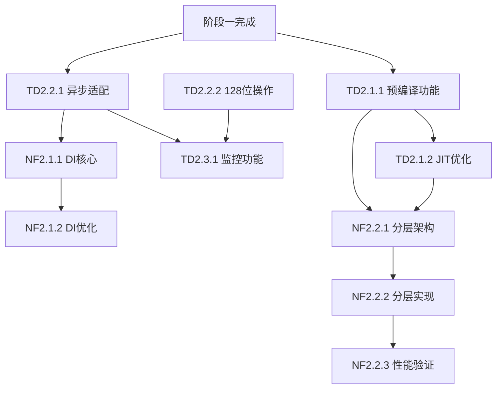

# 阶段二详细子任务分解计划

## 📋 执行摘要

本文档将技术债务处理与新功能开发平衡实施计划中的阶段二（第7-12周）任务分解为可执行的子任务。阶段二采用"平衡发展"策略，技术债务处理与新功能开发比例为50:50，确保系统稳定性的同时推进核心功能开发。

**阶段二时间范围**：第7-12周（6周）
**工作重心分配**：技术债务处理50%，新功能开发50%
**总体目标**：完成剩余中优先级技术债务，实现核心新功能开发

---

## 🎯 阶段二总体任务概览

### 里程碑2.1：技术债务持续处理（第7-9周）
- **目标**：处理剩余中优先级技术债务，为系统稳定性奠定基础
- **工作量**：3人周
- **交付成果**：中优先级技术债务清零，系统稳定性提升

### 里程碑2.2：核心新功能开发（第10-12周）
- **目标**：实现依赖注入框架集成和分层编译策略
- **工作量**：3人周
- **交付成果**：新功能模块完成，性能目标达成

---

## 🔧 技术债务处理子任务分解

### 任务组TD2.1：vm-engine-jit模块技术债务（第7-8周）

#### 子任务TD2.1.1：统一缓存预编译功能实现
- **优先级**：P2（中）
- **工作量**：1人周
- **负责人建议**：高级工程师1（JIT专家）
- **时间窗口**：第7周
- **详细分解**：
  - TD2.1.1.1：分析现有缓存结构和预编译接口（0.5人天）
  - TD2.1.1.2：设计预编译调用机制（0.5人天）
  - TD2.1.1.3：实现编译器预编译调用逻辑（1.5人天）
  - TD2.1.1.4：集成预编译功能到缓存系统（1人天）
  - TD2.1.1.5：编写单元测试和集成测试（1人天）

- **验收标准**：
  - 预编译功能正确调用编译器
  - 缓存系统与预编译功能无缝集成
  - 测试覆盖率>90%

- **依赖关系**：
  - 依赖：JIT编译器基础功能完成（阶段一）
  - 前置：vm-engine-jit/src/unified_cache.rs:1642 TODO分析

#### 子任务TD2.1.2：JIT编译器优化完善
- **优先级**：P2（中）
- **工作量**：0.5人周
- **负责人建议**：高级工程师1（JIT专家）
- **时间窗口**：第7周后半段
- **详细分解**：
  - TD2.1.2.1：优化寄存器分配结果应用（0.5人天）
  - TD2.1.2.2：性能调优和测试（1人天）
  - TD2.1.2.3：代码审查和文档更新（0.5人天）

- **验收标准**：
  - 寄存器分配结果正确应用到代码生成
  - 编译性能提升>10%
  - 代码质量符合团队标准

- **依赖关系**：
  - 依赖：阶段一寄存器分配器基础实现
  - 前置：vm-engine-jit/src/optimizing_compiler.rs:136 TODO

### 任务组TD2.2：vm-core模块技术债务（第8-9周）

#### 子任务TD2.2.1：异步执行引擎适配逻辑完善
- **优先级**：P2（中）
- **工作量**：1人周
- **负责人建议**：高级工程师2（异步编程专家）
- **时间窗口**：第8周
- **详细分解**：
  - TD2.2.1.1：分析现有异步适配接口（0.5人天）
  - TD2.2.1.2：设计完整适配逻辑架构（0.5人天）
  - TD2.2.1.3：实现异步适配核心逻辑（2人天）
  - TD2.2.1.4：集成测试和性能测试（1人天）
  - TD2.2.1.5：文档编写和代码审查（0.5人天）

- **验收标准**：
  - 完整的异步适配逻辑实现
  - 异步性能不低于同步版本
  - 测试覆盖率>90%

- **依赖关系**：
  - 依赖：阶段一异步执行引擎基础
  - 前置：vm-core/src/async_execution_engine.rs:189 TODO

#### 子任务TD2.2.2：前端128位操作支持
- **优先级**：P3（低）
- **工作量**：0.5人周
- **负责人建议**：高级工程师1（JIT专家）
- **时间窗口**：第9周前半段
- **详细分解**：
  - TD2.2.2.1：分析IR扩展需求（0.5人天）
  - TD2.2.2.2：实现128位操作支持（1.5人天）
  - TD2.2.2.3：测试和验证（0.5人天）

- **验收标准**：
  - 128位操作正确实现
  - 与现有系统兼容
  - 基础测试通过

- **依赖关系**：
  - 依赖：IR基础架构稳定
  - 前置：vm-frontend-x86_64/src/lib.rs:3904 TODO

### 任务组TD2.3：监控模块技术债务（第9周）

#### 子任务TD2.3.1：监控功能基础实现
- **优先级**：P3（低）
- **工作量**：1人周
- **负责人建议**：高级工程师3（框架设计专家）
- **时间窗口**：第9周
- **详细分解**：
  - TD2.3.1.1：设计监控架构（0.5人天）
  - TD2.3.1.2：实现仪表板基础功能（1人天）
  - TD2.3.1.3：实现指标收集器（1.5人天）
  - TD2.3.1.4：集成测试（0.5人天）
  - TD2.3.1.5：文档编写（0.5人天）

- **验收标准**：
  - 监控仪表板基础功能可用
  - 指标收集器正常工作
  - 基础监控功能验证通过

- **依赖关系**：
  - 依赖：系统基础架构稳定
  - 前置：vm-monitor模块所有TODO

---

## 🚀 新功能开发子任务分解

### 任务组NF2.1：依赖注入框架集成（第10-11周）

#### 子任务NF2.1.1：DI框架核心功能实现
- **优先级**：P1（高）
- **工作量**：1.5人周
- **负责人建议**：高级工程师3（DI专家）
- **时间窗口**：第10周
- **详细分解**：
  - NF2.1.1.1：完善DI容器实现（1人天）
  - NF2.1.1.2：实现服务注册和解析机制（1人天）
  - NF2.1.1.3：实现生命周期管理（1人天）
  - NF2.1.1.4：性能优化和测试（1.5人天）
  - NF2.1.1.5：集成到vm-core模块（1人天）

- **验收标准**：
  - 服务解析延迟<100ns
  - 并发吞吐量>1M ops/sec
  - 与现有架构无缝集成

- **依赖关系**：
  - 依赖：vm-core/src/di/基础模块
  - 前置：阶段一DI框架基础设计

#### 子任务NF2.1.2：DI框架性能优化
- **优先级**：P1（高）
- **工作量**：0.5人周
- **负责人建议**：高级工程师3（DI专家）
- **时间窗口**：第10周后半段
- **详细分解**：
  - NF2.1.2.1：性能瓶颈分析（0.5人天）
  - NF2.1.2.2：关键路径优化（1人天）
  - NF2.1.2.3：性能基准测试（0.5人天）
  - NF2.1.2.4：文档更新（0.5人天）

- **验收标准**：
  - 性能目标达成
  - 基准测试通过
  - 优化文档完整

### 任务组NF2.2：分层编译策略实现（第11-12周）

#### 子任务NF2.2.1：分层编译架构设计
- **优先级**：P1（高）
- **工作量**：0.5人周
- **负责人建议**：架构师 + 高级工程师1
- **时间窗口**：第11周前半段
- **详细分解**：
  - NF2.2.1.1：分层编译策略详细设计（1人天）
  - NF2.2.1.2：性能目标确定和基准建立（0.5人天）
  - NF2.2.1.3：实现方案评审（0.5人天）
  - NF2.2.1.4：技术文档编写（0.5人天）

- **验收标准**：
  - 分层编译架构设计完成
  - 性能目标明确可测量
  - 实现方案通过评审

- **依赖关系**：
  - 依赖：JIT编译器基础稳定
  - 前置：阶段一JIT优化完成

#### 子任务NF2.2.2：分层编译核心实现
- **优先级**：P1（高）
- **工作量**：1.5人周
- **负责人建议**：高级工程师1（JIT专家）
- **时间窗口**：第11周后半段-第12周前半段
- **详细分解**：
  - NF2.2.2.1：实现分层编译逻辑（1.5人天）
  - NF2.2.2.2：实现冷代码识别机制（1人天）
  - NF2.2.2.3：集成到JIT编译器（1人天）
  - NF2.2.2.4：性能测试和调优（1人天）
  - NF2.2.2.5：集成测试（0.5人天）

- **验收标准**：
  - 冷代码编译时间减少50%
  - 分层编译策略正确实施
  - 性能目标达成

#### 子任务NF2.2.3：分层编译性能验证
- **优先级**：P2（中）
- **工作量**：0.5人周
- **负责人建议**：测试工程师
- **时间窗口**：第12周后半段
- **详细分解**：
  - NF2.2.3.1：性能基准测试（1人天）
  - NF2.2.3.2：回归测试（0.5人天）
  - NF2.2.3.3：性能报告编写（0.5人天）
  - NF2.2.3.4：验收测试（0.5人天）

- **验收标准**：
  - 性能基准测试通过
  - 无功能回归
  - 性能报告完整

---

## 📊 子任务优先级矩阵

### 优先级评估标准

| 优先级 | 评估标准 | 处理策略 |
|--------|----------|----------|
| P0 | 影响系统稳定性，阻塞其他功能 | 立即处理 |
| P1 | 核心功能，影响主要用户路径 | 高优先级 |
| P2 | 重要功能，影响特定场景 | 中等优先级 |
| P3 | 增强功能，不影响核心流程 | 低优先级 |

### 阶段二子任务优先级分布

| 优先级 | 技术债务任务数 | 新功能开发任务数 | 总计 |
|--------|----------------|------------------|------|
| P1 | 0 | 3 | 3 |
| P2 | 3 | 1 | 4 |
| P3 | 2 | 0 | 2 |
| **总计** | **5** | **4** | **9** |

---

## 👥 负责人分配与时间窗口

### 团队角色与技能匹配

| 角色 | 姓名 | 主要技能 | 可用时间 | 主要负责任务 |
|------|------|----------|----------|--------------|
| 架构师 | 架构师 | 系统设计、GC、编译器 | 100% | NF2.2.1架构设计 |
| 高级工程师1 | JIT专家 | JIT编译、性能优化 | 100% | TD2.1.1, TD2.1.2, TD2.2.2, TD2.2.3 |
| 高级工程师2 | 异步专家 | 系统核心、异步编程 | 100% | TD2.2.1 |
| 高级工程师3 | DI专家 | 依赖注入、框架设计 | 100% | TD2.3.1, NF2.1.1, NF2.1.2 |
| 测试工程师 | 测试专家 | 测试框架、质量保证 | 100% | NF2.2.3性能验证 |

### 详细时间分配表

| 周次 | TD2.1.1 | TD2.1.2 | TD2.2.1 | TD2.2.2 | TD2.3.1 | NF2.1.1 | NF2.1.2 | NF2.2.1 | NF2.2.2 | NF2.2.3 |
|------|---------|---------|---------|---------|---------|---------|---------|---------|---------|---------|
| 第7周 | 高工1(1.0) | 高工1(0.5) | - | - | - | - | - | - | - | - |
| 第8周 | - | - | 高工2(1.0) | - | - | - | - | - | - | - |
| 第9周 | - | - | - | 高工1(0.5) | 高工3(1.0) | - | - | - | - | - |
| 第10周 | - | - | - | - | - | 高工3(1.5) | 高工3(0.5) | - | - | - |
| 第11周 | - | - | - | - | - | - | - | 架构师+高工1(0.5) | 高工1(1.0) | - |
| 第12周 | - | - | - | - | - | - | - | - | 高工1(0.5) | 测试工程师(0.5) |

---

## 🔗 子任务依赖关系图

---

## 📈 风险评估与缓释措施

### 高风险子任务

| 子任务 | 风险等级 | 风险描述 | 缓释措施 | 应急预案 |
|--------|----------|----------|----------|----------|
| TD2.1.1 | 中 | 预编译功能集成复杂 | 分步实现，先基础后优化 | 简化预编译策略 |
| NF2.1.1 | 中 | DI框架性能目标 | 性能测试驱动开发 | 调整性能目标 |
| NF2.2.2 | 高 | 分层编译实现复杂 | 参考现有实现，分阶段 | 降级到基础分层 |

### 中风险子任务

| 子任务 | 风险等级 | 风险描述 | 缓释措施 |
|--------|----------|----------|----------|
| TD2.2.1 | 中 | 异步适配逻辑复杂 | 详细设计，充分测试 |
| NF2.2.1 | 中 | 架构设计影响面广 | 充分评审，专家验证 |

---

## 📋 验收标准与质量门禁

### 技术债务任务验收标准

1. **代码质量标准**
   - 代码覆盖率>90%
   - 静态代码分析无严重问题
   - 代码审查通过率100%

2. **功能完整性标准**
   - TODO标记完全处理
   - 功能测试通过率100%
   - 集成测试无阻塞问题

3. **性能标准**
   - 性能不低于现有基线
   - 内存使用无显著增加
   - 响应时间在可接受范围

### 新功能开发验收标准

1. **功能标准**
   - 核心功能完整实现
   - 边界条件处理正确
   - 错误处理机制完善

2. **性能标准**
   - DI框架：服务解析延迟<100ns，并发吞吐量>1M ops/sec
   - 分层编译：冷代码编译时间减少50%
   - 整体性能无回归

3. **集成标准**
   - 与现有系统无缝集成
   - 向后兼容性保证
   - API设计一致性

---

## 🔄 持续跟踪与监控机制

### 每周跟踪指标

| 指标类型 | 具体指标 | 目标值 | 测量频率 |
|----------|----------|--------|----------|
| 进度指标 | 任务完成率 | 100% | 每周 |
| 质量指标 | 代码覆盖率 | >90% | 每周 |
| 性能指标 | 性能回归率 | 0% | 每周 |
| 风险指标 | 阻塞问题数 | 0 | 每周 |

### 里程碑检查点

1. **第8周末检查点**
   - 技术债务任务进度检查
   - 依赖关系验证
   - 风险状态更新

2. **第10周末检查点**
   - 技术债务完成验收
   - 新功能开发启动检查
   - 资源分配调整

3. **第12周末检查点**
   - 阶段二整体完成验收
   - 性能目标达成验证
   - 阶段三准备评估

---

## 📝 总结

阶段二的子任务分解确保了技术债务处理与新功能开发的平衡推进，通过详细的任务分解、明确的优先级划分、合理的资源分配和全面的风险管控，为阶段二的成功实施奠定了坚实基础。

### 关键成功因素

1. **优先级明确**：P1任务优先处理，确保核心功能
2. **依赖管理**：清晰的依赖关系，避免阻塞
3. **质量保证**：严格的验收标准和质量门禁
4. **风险管控**：主动识别和缓释技术风险
5. **持续跟踪**：定期检查和调整机制

### 预期成果

通过6周的分阶段实施，预期将实现：
- ✅ 所有中优先级技术债务清理完毕
- ✅ 依赖注入框架成功集成
- ✅ 分层编译策略完整实现
- ✅ 性能指标达到预期目标
- ✅ 为阶段三高级功能开发奠定基础

---

**文档版本**: 1.0  
**创建日期**: 2024年  
**状态**: 待审批  
**审批人**: [待填写]